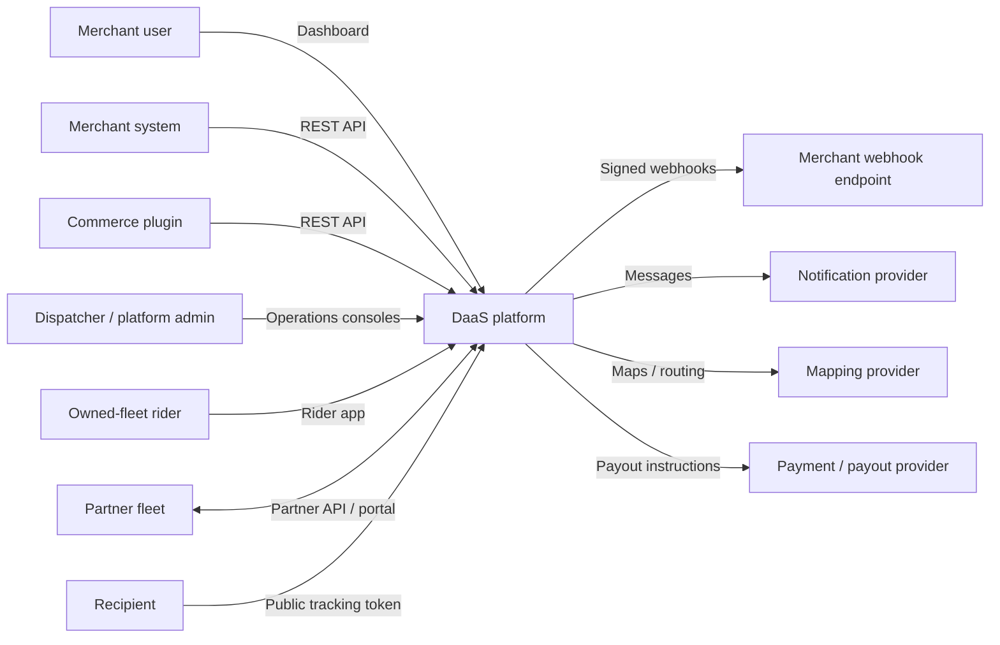
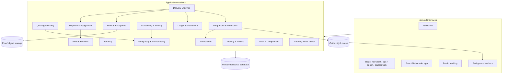
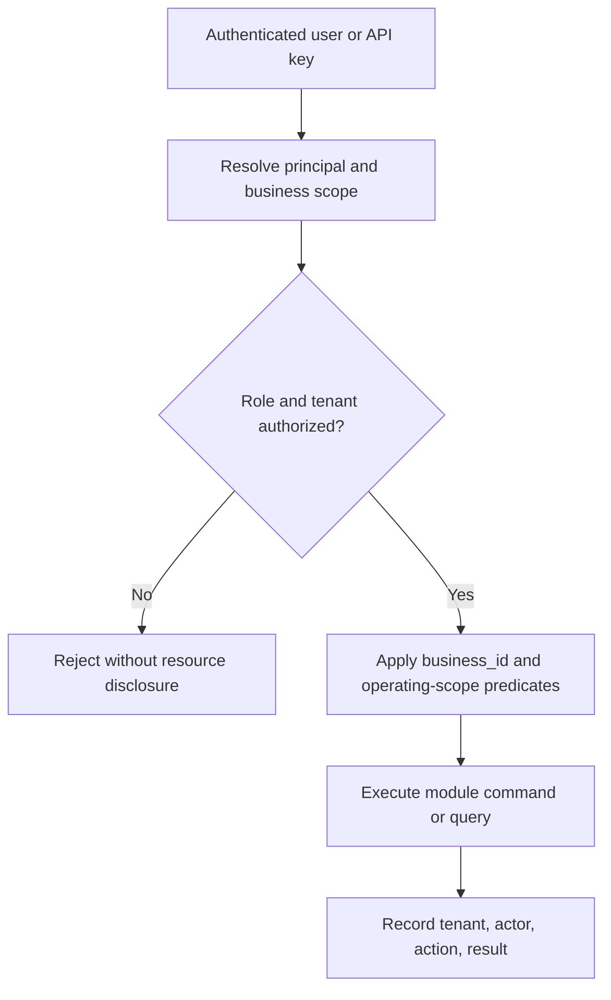
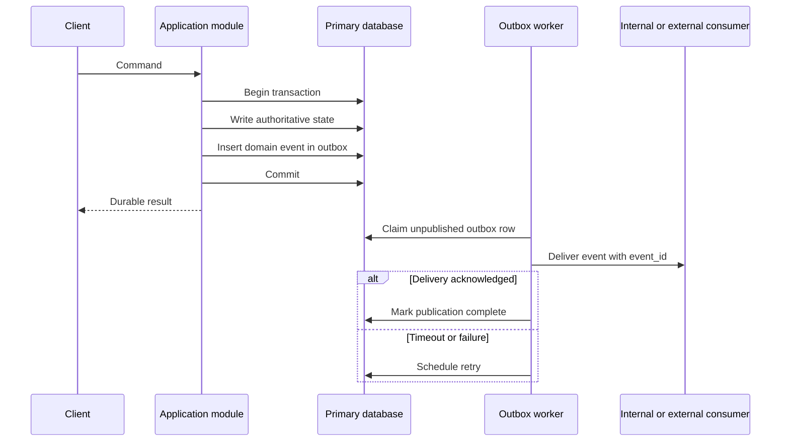
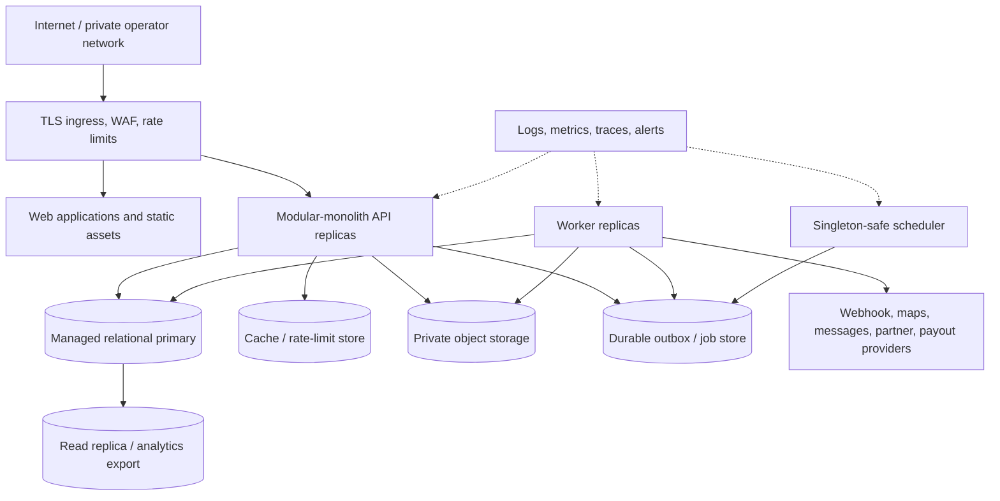

# Delivery-as-a-Service Architecture

**Status:** Target architecture  
**Architecture style:** Multi-tenant modular monolith with asynchronous workers  
**Scope:** Delivery product only; the marketplace application remains a separate system.

This document turns the product decisions in [Product Definition](./product-definition.md) into system boundaries and operating rules. API and state-machine details are defined in [Delivery Contracts](./contracts.md), public endpoint shapes in [OpenAPI](./openapi.yaml), and user-facing surfaces in [Application Interfaces](./app-interfaces.md).

---

## 1. System context

The platform accepts delivery work from merchant users, merchant systems, and commerce plugins. It coordinates owned riders and partner fleets, exposes tracking to recipients, and records delivery charges, COD custody, earnings, and settlements.

The DaaS platform is the authority for delivery execution. A merchant's commerce system remains the authority for the commercial order and identifies it with `external_order_id`; the platform stores that identifier for correlation, not as a replacement order record.

## 2. Architectural principles

1. **One deployable, explicit modules.** Business capabilities live in one application repository and process initially, but module APIs and ownership rules are enforced as if modules could later be extracted.
2. **Tenant scope is mandatory.** Every merchant-owned command and query resolves an authenticated business before accessing data.
3. **The delivery aggregate protects lifecycle invariants.** Status changes are commands checked against the authoritative transition table in [Delivery Contracts](./contracts.md#1-status-state-machine).
4. **Financial and audit history is append-only.** Corrections use compensating entries or events; historical rows are not rewritten.
5. **Local work is synchronous; side effects are asynchronous.** A request commits its authoritative state and outbox records together. Webhooks, notifications, optimization, and provider calls run after commit.
6. **At-least-once delivery is assumed.** Commands exposed to unreliable clients are idempotent, and asynchronous consumers deduplicate.
7. **No shared-table shortcuts between modules.** A module may reference another module's identifier, but only the owning module changes the referenced record.
8. **Phased capability, stable boundaries.** Early stubs for pricing, ETA, or integrations remain behind the same module contracts used by later implementations.

## 3. Modular-monolith boundaries

### 3.1 Module responsibilities

| Module | Owns | Exposes to other modules | Must not own |
|---|---|---|---|
| Identity & Access | Users, credentials, sessions/JWT validation, platform roles | Authenticated principal and platform-level authorization | Business membership policy or merchant API keys |
| Tenancy | Businesses, memberships, branches, merchant API keys, branding | Tenant resolution, membership checks, branch lookup | Delivery state or financial balances |
| Geography & Serviceability | Cities, zones, coverage rules, normalized coordinates | Serviceability and zone resolution | Price calculation or route assignment |
| Quoting & Pricing | Pricing rules, quotes, quote expiry and assumptions | Immutable quote result and price breakdown | Delivery lifecycle or ledger posting |
| Delivery Lifecycle | Delivery, packages, addresses as accepted snapshots, status events, tracking-token association | Create/cancel/transition commands and delivery views | Rider availability, proof blobs, payouts |
| Dispatch & Assignment | Assignment attempts, offers, active assignment, reassignment history | Assign, accept, decline, release, assignment views | Rider identity/profile or delivery status history |
| Fleet & Partners | Rider profile, availability, capability, location, partner fleet and partner riders | Eligible-capacity queries and partner adapters | Delivery ownership or merchant settlement |
| Proof & Exceptions | Proof metadata, pickup/delivery evidence, failure reasons, exception cases | Validate and retrieve proof, open/resolve exception | Lifecycle status itself or object binary storage internals |
| Scheduling & Routing | Service windows, batches, routes, stops, sequence and optimization versions | Release-due work and route plans | Individual delivery status or rider account |
| Ledger & Settlement | Immutable ledger entries, logical accounts, invoices, settlement runs, payout references | Post balanced business events and derive balances | Editing delivery facts or payment-provider truth |
| Integrations & Webhooks | Webhook endpoints/secrets, outbox events, delivery attempts, replay requests, plugin connections | Publish domain events and deliver external notifications | Lifecycle transitions or merchant endpoint behavior |
| Notifications | Templates, recipient preferences, message attempts | Send operational and recipient messages | Webhook contracts or delivery state |
| Audit & Compliance | Append-only audit records and sensitive-action metadata | Searchable audit trail | Domain state used to execute deliveries |
| Tracking Read Model | Recipient-safe delivery projection keyed by opaque token | Public tracking response | Authoritative status transitions or private contact data |

The interfaces listed in [Application Interfaces](./app-interfaces.md) call application commands and queries; they do not bypass modules to manipulate persistence directly. The endpoint inventory and authentication modes are in [OpenAPI](./openapi.yaml).

### 3.2 Dependency and transaction rules

- Interfaces may depend on module application APIs. Domain modules never depend on controllers, web frameworks, or UI code.
- A module can synchronously query another module through a narrow interface when the caller needs an immediate decision, such as pricing asking Geography whether both endpoints are serviceable.
- Cross-module writes are coordinated by one application use case. When invariants require atomicity, it opens one database transaction and invokes module operations without exposing raw repositories.
- Events are emitted only after their source state is durably committed. The source transaction inserts an outbox row so state and publication cannot diverge.
- Event handlers may update their own tables or projections. They must not update the publishing module's tables.
- Cyclic module dependencies are prohibited. Shared value objects such as IDs, money, coordinates, clocks, and event envelopes belong in a small kernel with no business workflows.

### 3.3 Detailed module documents

The module-level ownership, APIs, events, validation, security, and acceptance criteria are expanded in:

- Foundation: [Identity, authentication & RBAC](./modules/01-identity-auth-rbac.md), [Multi-tenancy](./modules/02-multi-tenancy.md), [Businesses & branches](./modules/03-businesses-branches.md), and [Cities & service zones](./modules/04-cities-service-zones.md).
- Delivery operations: [Quoting & pricing](./modules/06-quoting-pricing.md), [Dispatch & assignment](./modules/07-dispatch-assignment.md), [Rider & fleet management](./modules/08-rider-fleet-management.md), [Partner fleet management](./modules/09-partner-fleet-management.md), and [Live tracking & ETA](./modules/10-live-tracking-eta.md).
- Integration platform: [Public API & developer platform](./modules/13-public-api-developer-platform.md), [API keys, idempotency & rate limits](./modules/14-api-keys-idempotency-rate-limits.md), [Webhooks, outbox & retries](./modules/15-webhooks-outbox-retries.md), [Commerce plugins](./modules/16-commerce-plugins.md), [Notifications & communications](./modules/17-notifications-communications.md), [Bulk import & batches](./modules/18-bulk-import-batches.md), and [Scheduling, multi-stop & routing](./modules/19-scheduling-multi-stop-routing.md).
- Finance and control: [Billing & ledger](./modules/21-billing-ledger.md), [COD & cash custody](./modules/22-cod-cash-custody.md), [Invoicing, settlements & payouts](./modules/23-invoicing-settlements-payouts.md), [Platform administration](./modules/24-platform-admin.md), [Reporting & analytics](./modules/25-reporting-analytics.md), [Support & disputes](./modules/26-support-disputes.md), [Configuration & feature flags](./modules/29-configuration-feature-flags.md), and [Fraud & risk controls](./modules/30-fraud-risk-controls.md).

## 4. Tenant and data boundaries

### 4.1 Tenant model

`Business` is the merchant tenant. A business can have branches, users through memberships, API keys, webhook endpoints, deliveries, quotes, and finance accounts. Platform-operated resources—cities, zones, owned riders, and platform configuration—are not merchant-owned but access to them is filtered by role and operating scope. A partner fleet is a separate operational principal, not a merchant tenant and not an implicit platform administrator.

### 4.2 Isolation rules

- Merchant tables carry a non-null `business_id`; child rows inherit tenant ownership through a constrained parent and, where practical, also carry `business_id` for safe indexing and filtering.
- Repositories require a `TenantContext`; accepting a naked delivery ID from a merchant-facing path is insufficient.
- Composite uniqueness is tenant-scoped, for example `(business_id, external_order_id)` according to the chosen duplicate-order policy and `(business_id, idempotency_key)`.
- API-key idempotency scope is the authenticated API key or business as specified in [Delivery Contracts](./contracts.md#4-idempotency). It is never global.
- Platform administrators may cross tenant boundaries only through explicit admin use cases. These accesses are audited.
- Riders see only jobs assigned to them and the minimum contact/address data needed for execution. Partners see only work handed to their fleet.
- Public tracking uses an unguessable, revocable token and a recipient-safe projection. It does not accept a sequential delivery ID and does not expose internal notes, full audit records, COD accounting, or unrelated contact data.
- Database backups, analytics exports, object-store keys, cache keys, queue messages, logs, and metrics preserve tenant identifiers and access policy.
- Webhook endpoint selection is tenant-scoped; an event for one business can never be routed using another business's endpoint or secret.

The first deployment may use a shared schema with row-level application enforcement. Database row-level security can add defense in depth, but does not replace scoped repositories. Higher-isolation tenants can later move to a dedicated schema or database behind the same module repositories.

### 4.3 Sensitive data

Contact details, precise locations, proof images/signatures, API-key material, webhook secrets, and payment references require encryption in transit and at rest. Secrets are stored hashed when only verification is required; retrievable webhook credentials are encrypted with managed keys. Logs and domain events contain identifiers or masked values rather than proof binaries or full credentials. Retention policies may differ for operational location data, proof, financial records, and audit records.

## 5. Synchronous and asynchronous interactions

### 5.1 Interaction policy

| Interaction | Mode | Reason |
|---|---|---|
| Authentication, authorization, tenant resolution | Synchronous | Request cannot proceed without a decision |
| Serviceability and quote calculation | Synchronous | Caller needs an immediate quote or validation error |
| Idempotent delivery creation | Synchronous transaction | Must return the durable delivery and replayable response |
| Manual assignment and rider status command | Synchronous transaction | Operator/rider needs immediate conflict or success |
| Status projection visible in the same response | Synchronous | Read-your-write experience |
| Webhooks and merchant notifications | Asynchronous | Remote availability must not block delivery execution |
| Email/SMS/push | Asynchronous | External provider latency and retry behavior |
| Automatic offers and reassignment | Asynchronous orchestration | Candidate search and timeouts can outlive one request |
| Route optimization and bulk expansion | Asynchronous for large work | Potentially expensive and restartable |
| Partner handoff | Asynchronous state machine | Remote acceptance can be delayed or duplicated |
| Proof media processing | Asynchronous after metadata commit | Virus scan, thumbnailing, and retention work |
| Ledger posting caused by lifecycle events | Asynchronous unless needed for the command invariant | Keeps operational status available while preserving replay |
| Settlement and payout | Asynchronous batch/workflow | Provider calls and reconciliation are long-running |
| Tracking/webhook read projections | Asynchronous, with source version | Optimized recipient/external views can tolerate bounded lag |

### 5.2 Reliable publication

Events have a globally unique `event_id`, tenant ID where applicable, aggregate ID, aggregate version, event type/version, occurrence time, trace ID, and payload. Consumers record processed event IDs or make updates naturally idempotent. Ordering is guaranteed only per aggregate; consumers reject or defer stale projection versions.

## 6. Source-of-truth ownership

| Fact | Authoritative owner | Derived or external copies |
|---|---|---|
| User identity and platform role | Identity & Access | JWT claims, session cache |
| Business, membership, branch, API key | Tenancy | UI projections |
| City/zone serviceability | Geography & Serviceability | Quote assumptions, route cache |
| Offered price and expiry | Quoting & Pricing | Delivery's accepted quote snapshot |
| Delivery addresses/packages accepted at creation | Delivery Lifecycle | Rider and tracking projections |
| Current delivery status | Delivery Lifecycle, derived from ordered status events/current version | Tracking page, merchant projections, webhook payloads |
| Assignment to owned rider or partner | Dispatch & Assignment | Delivery detail projection |
| Rider availability and latest accepted location | Fleet & Partners | Dispatch candidate index, map projection |
| Route/stop order | Scheduling & Routing | Rider route view |
| Proof evidence metadata | Proof & Exceptions | Delivery and tracking summaries |
| Proof binary | Object storage, referenced by Proof metadata | Time-limited download |
| COD collected assertion | Proof & Exceptions plus rider action | Ledger posting input |
| COD custody, merchant payable, earnings and settlement balance | Ledger & Settlement | Finance dashboards and statements |
| Partner's own rider execution detail | Partner system | Platform stores mapped partner references and accepted status events |
| Webhook delivery outcome and replay history | Integrations & Webhooks | Admin health views |
| Recipient-facing tracking representation | Tracking Read Model | Browser cache |
| Merchant order/payment/fulfillment | Merchant commerce system | `external_order_id` correlation and delivery snapshot |

Conflicts are resolved in favor of the authoritative owner. For example, a webhook retry cannot change delivery state, a partner status update must pass the platform state machine, and a payment-provider payout marked successful is not considered settled until Ledger & Settlement records and reconciles the provider reference.

## 7. Consistency, concurrency, and failure handling

- Delivery status and assignment commands carry an expected aggregate version or use row locking. Concurrent stale commands return `409`; they do not silently overwrite.
- Assignment activation validates that the delivery is dispatchable, the rider/partner is eligible, and no other active assignment exists. A unique constraint backs this invariant.
- Quote confirmation validates quote ownership, expiry, service assumptions, and immutable request fields.
- Lifecycle state and its status-event row commit atomically.
- Idempotency records distinguish `processing`, `completed`, and recoverable failure. A request hash mismatch returns `409`; a completed match replays the original status and body.
- Outbox workers lease rows with expiry so crashed workers can be recovered. Dead-lettering preserves payload and diagnostics for controlled replay.
- Ledger entries are immutable and balanced by transaction/reference. Reversal references the original entry.
- External provider circuit breakers and timeouts prevent webhook, map, notification, partner, or payout failures from exhausting request capacity.
- Clocks are stored in UTC; service windows retain their IANA time zone and local interpretation.

## 8. Deployment topology

The initial topology is one application artifact deployed in separate process roles. All roles use the same module code but expose only the entrypoints they require.

### 8.1 Runtime roles

- **API replicas:** stateless REST and web-backend requests; horizontally scalable behind ingress.
- **Workers:** outbox publication, webhooks, notifications, automatic dispatch, partner handoffs, proof processing, route optimization, and settlement.
- **Scheduler:** enqueues due scheduled deliveries, retries, expirations, reconciliation, and settlement runs. Distributed locks or database leases ensure one logical execution.
- **React web/static delivery:** serves merchant, operations, administration, partner, and recipient-tracking surfaces catalogued in [Application Interfaces](./app-interfaces.md).
- **React Native distribution:** signed rider builds and approved update channels deliver native clients; the mobile app communicates only through versioned API and real-time contracts.
- **Primary database:** transactional source for module-owned tables and the initial durable job/outbox mechanism.
- **Object storage:** private proof media accessed through authorized, short-lived URLs.
- **Cache:** optional acceleration only; no lifecycle or ledger fact exists solely in cache.

Production should spread API and worker replicas across failure zones, use managed backups with restore tests, rotate secrets, restrict administrative networks, and define recovery objectives for transactional data and proof objects.

## 9. Scaling and evolution

### 9.1 Scale within the monolith

1. Scale API and worker roles independently.
2. Partition worker queues by workload so webhook backlog cannot delay dispatch or settlement.
3. Add indexes beginning with `business_id`, lifecycle state, due time, assignment state, and event publication state.
4. Use cursor pagination and bounded time ranges for operational screens.
5. Maintain recipient, operations-board, and finance projections for read-heavy queries rather than joining all write tables.
6. Partition high-volume append-only tables—status events, rider locations, audit, outbox, and webhook attempts—by time and, where useful, tenant hash.
7. Move historical location and event data to lower-cost storage according to retention policy.
8. Add read replicas or analytics exports only for stale-tolerant queries; commands always use the primary.

### 9.2 Capability evolution

The phased roadmap in [Product Definition](./product-definition.md#5-phased-scope) expands implementations without collapsing boundaries:

- The Phase 1 distance stub becomes a pricing strategy inside Quoting & Pricing.
- Manual assignment gains offer-based automation inside Dispatch, using Fleet eligibility.
- Tracking gains location/ETA fields through projection updates, not direct access to rider tables.
- CSV import becomes an asynchronous batch command that invokes the same idempotent delivery-creation service as the API.
- Scheduled and multi-stop modes add Routing plans while each delivery retains its lifecycle authority.
- Partner fleets plug into a partner adapter and handoff state machine; they do not become direct writers to delivery tables.
- Settlement automation posts and reconciles through Ledger & Settlement rather than mutating balances.

### 9.3 Extraction criteria

Microservice extraction is an operational decision, not a roadmap milestone. Extract a module only when it has a stable API/event contract and one or more measured needs: distinct scaling, isolation of provider failures, independent release cadence, data residency, or a dedicated team. Likely candidates are webhook delivery, routing optimization, live rider location ingestion, notifications, and settlement orchestration.

Before extraction:

- remove cross-module table reads;
- version commands and events;
- establish idempotent consumers and observable lag;
- define data ownership and migration;
- replace in-process calls with a failure-aware client only where needed;
- preserve tenant, trace, actor, and idempotency context across the boundary.

Delivery Lifecycle and Ledger & Settlement should remain strongly consistent authorities. Splitting either requires explicit workflow compensation and reconciliation, not distributed transactions hidden behind synchronous calls.

## 10. Operability and architectural enforcement

Every request and event carries a trace/correlation ID, tenant ID when applicable, actor, and source. Metrics cover request errors/latency, invalid transition conflicts, dispatch age, unassigned jobs, worker lag, dead letters, webhook success and age, partner acknowledgements, proof-processing failures, COD custody age, settlement imbalance, and projection lag.

Alerts must be actionable by module owner and include runbook context. Audit records cover API-key changes, webhook-secret changes, assignment overrides, status overrides, proof access, COD custody changes, settlement actions, replay actions, and cross-tenant administration.

Architecture tests or lint rules should enforce module import direction. Integration tests should verify tenant isolation, state-machine transitions, idempotent replay, outbox recovery, ledger balancing, and recipient-safe tracking. End-to-end behavior is described in [Delivery Workflows](./workflows.md).
