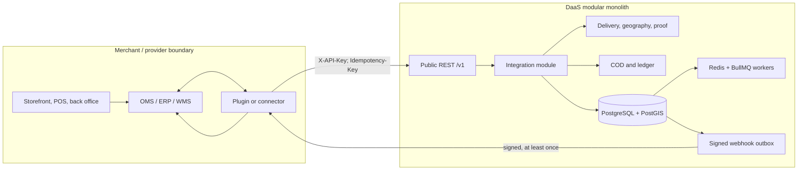
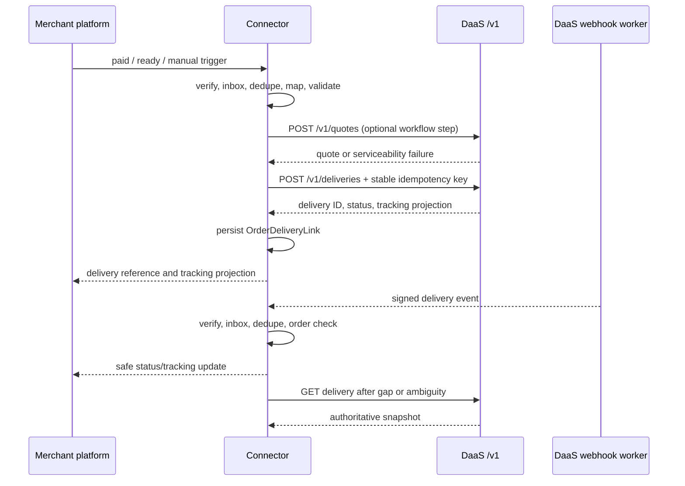
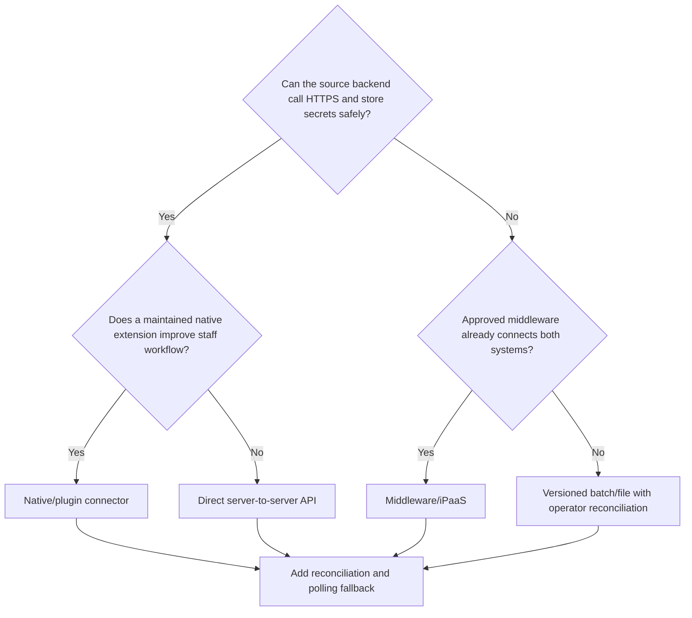
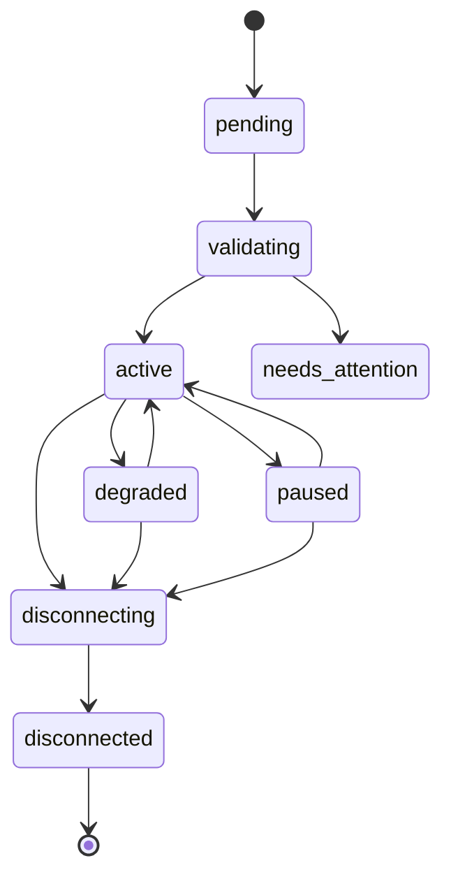
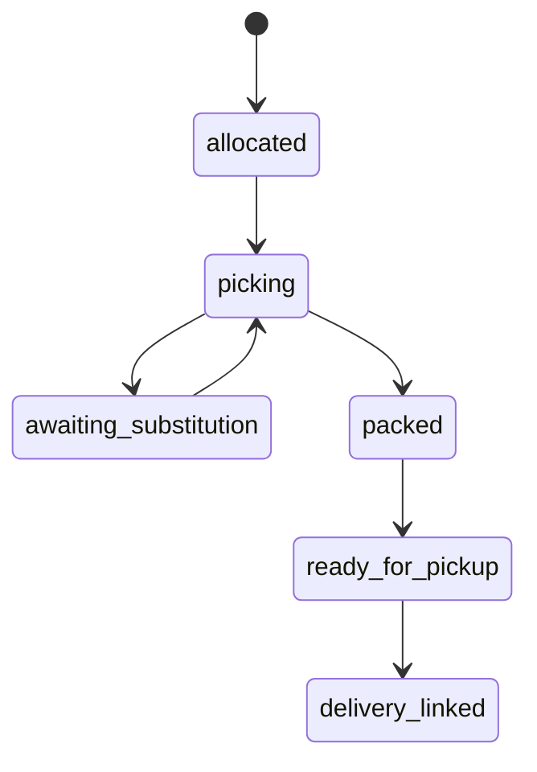
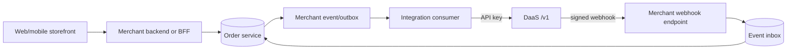

# Platform Integration Handbook

**Status:** Implementation-ready integration specification; released behavior remains bounded by the checked-in OpenAPI and enabled product phase  
**Scope:** Supermarket applications, Shopify, WooCommerce, custom commerce applications, Odoo, and provider-neutral connectors  
**Audience:** Merchant engineering, integration engineers, connector maintainers, solution architects, security, operations, finance, support, and test teams

This handbook defines how external commerce and operations systems integrate with the Delivery-as-a-Service (DaaS) platform. It does not add endpoints, events, provider capabilities, legal rules, service levels, or numeric limits. A capability described as proposed, target, configurable, or phase-gated must not be treated as released until it appears in the authoritative contract and is enabled for the tenant and environment.

## 1. Authority, terminology, and boundaries

### 1.1 Authoritative references

- [OpenAPI](../openapi.yaml) — current public REST `/v1` paths and schemas.
- [Delivery contracts](../contracts.md) — lifecycle, idempotency, webhooks, and ledger rules.
- [Architecture](../architecture.md) and [technology stack](../technical-stack.md) — modular-monolith and runtime boundaries.
- [Businesses and branches](../modules/03-businesses-branches.md) — tenant and reusable origin rules.
- [Cities and service zones](../modules/04-cities-service-zones.md) — canonical, versioned PostGIS-backed coverage decisions.
- [Delivery lifecycle and package model](../modules/05-delivery-job-lifecycle.md) — execution and physical handling-unit semantics.
- [API keys, idempotency, and rate limits](../modules/14-api-keys-idempotency-rate-limits.md).
- [Webhooks, outbox, and retries](../modules/15-webhooks-outbox-retries.md) and [webhook consumer guide](./webhook-consumer-guide.md).
- [Commerce plugins](../modules/16-commerce-plugins.md).
- [COD custody](../modules/22-cod-cash-custody.md), [billing ledger](../modules/21-billing-ledger.md), and [settlements](../modules/23-invoicing-settlements-payouts.md).
- [Returns mode](../modes/06-returns.md), [security](../modules/28-security-privacy-compliance.md), and [testing strategy](../testing-strategy.md).

Where this handbook and OpenAPI differ, OpenAPI governs the callable public interface. Where a target module proposes a future path or event absent from OpenAPI, connector code must capability-gate it rather than call it optimistically.

### 1.2 Terms

| Term | Meaning |
|---|---|
| Provider | External commerce, ERP, POS, OMS, WMS, or middleware platform. |
| Connector | Deployable integration that translates provider behavior to public DaaS contracts. |
| Adapter | Provider-specific implementation behind the canonical connector interface. |
| Installation / connection | One environment-specific authorization and configuration binding between a provider account/site and a DaaS business. |
| Source event | Provider event, hook, message, poll result, or file row received by the connector. |
| Link | Durable association among provider order/fulfillment identifiers and one DaaS delivery. |
| Branch mapping | Provider store, warehouse, or fulfillment location mapped to an active DaaS branch. |
| Handling unit | One physical parcel, bag, box, crate, pallet, or other unit independently handled by a rider. |
| Reconciliation | Comparison of provider facts, connector records, and DaaS authoritative state to find and repair missing or inconsistent projections. |

### 1.3 Source-of-truth contract

The merchant platform owns:

- order identity and commercial state;
- catalog, product, substitutions, inventory, stock moves, and fulfillment preparation;
- checkout, payment authorization/capture/refund, tax, discount, and customer account state;
- merchant return authorization or RMA policy; and
- its user-facing order history.

DaaS owns:

- delivery quote and serviceability decisions it returns;
- delivery execution lifecycle, assignment, tracking, ETA projection, attempts, and exceptions;
- pickup, delivery, return, custody, and proof facts it produces;
- linked return delivery jobs;
- delivery charges and DaaS ledger, COD custody, settlement, and payout facts it produces; and
- its idempotency, event, webhook-delivery, and audit records.

The connector owns only translation and synchronization records. It may project DaaS facts into the merchant platform, but must not claim authority over merchant orders or rewrite DaaS facts from a provider status. No integration, plugin, browser, till, mobile app, iPaaS recipe, or support script may write the DaaS database directly. All changes use authenticated, authorized, versioned interfaces.

## 2. Integration architecture

The implementation baseline is a TypeScript modular monolith: React web, React Native rider app, NestJS/Fastify APIs and workers, TypeORM, PostgreSQL/PostGIS, Redis, and BullMQ. PostgreSQL remains authoritative; Redis/BullMQ provide cache, coordination, and wake-up delivery, rebuilt from durable work/outbox records.



Provider SDKs and platform-specific types stay inside adapters. Domain modules consume canonical commands and records. API requests do not wait for provider callbacks, webhook dispatch, reconciliation, or background provider updates.

### 2.1 Canonical flow



## 3. Pattern selection

### 3.1 Patterns and trade-offs

| Pattern | Best fit | Advantages | Costs and risks |
|---|---|---|---|
| Direct server-to-server REST | Custom backend with engineering ownership | Few components, current `/v1` contract, precise idempotency | Merchant owns retries, secret management, event consumer, mapping, and reconciliation |
| Native/plugin connector | WooCommerce or provider with supported extension model | Embedded merchant workflow and provider-native context | Version/edition compatibility, secure upgrades, duplicate hooks, provider lifecycle |
| Middleware/iPaaS | Existing enterprise integration platform | Central orchestration and monitoring, reusable transformations | Extra failure domain, payload exposure, connector limits, harder exactly-once business effect |
| Batch/file | Legacy ERP/POS, offline sites, controlled migration | Loose coupling and auditable rows | Delayed feedback, stale data, duplicate files, partial failures, weaker interactive quoting |

Batch/file processing must use a versioned schema, stable row key, checksum, environment/tenant binding, per-row result, quarantine, idempotent replay, and reconciliation. It is not a bypass around validation, service zones, package declarations, or authorization.

### 3.2 Decision tree



Choose per deployed capability, not provider name. Mixed patterns are valid—for example, event-driven creation with scheduled reconciliation—but one installation must define precedence and avoid two independent creators for the same fulfillment.

## 4. Canonical integration domain model

These records belong in the integration module and are tenant- and environment-scoped.

| Record | Required purpose and key constraints |
|---|---|
| `IntegrationInstallation` / `Connection` | Provider key, external account/site identity, business, environment, adapter/version, capability manifest version, state, configuration version, credential references, timestamps. Unique active provider identity within the approved scope. |
| `CredentialReference` | Opaque reference to KMS-backed secret storage; type, owner, scope, secret version, rotation state. Never stores or returns raw secret in integration views. |
| `StoreBranchMapping` | Installation, provider store/warehouse/location ID, DaaS branch ID, mapping status/version, effective interval, validation evidence. One provider location cannot silently map to multiple active branches for the same purpose. |
| `OrderDeliveryLink` | Installation, stable provider order ID, optional fulfillment/picking ID, `external_order_id`, DaaS delivery ID, idempotency fingerprint/reference, tracking reference, mode, link type, last observed states/versions. Unique active creation scope. |
| `SourceEventInbox` | Provider event/message/file-row ID or derived fingerprint, exact protected payload reference/hash, observed time, verification result, processing state, attempts, installation, causation/correlation. Claimed durably before acknowledgment. |
| `SyncCommand` | Canonical requested effect such as create, cancel, or provider-status projection; target, mapping version, canonical request hash, state, next attempt. |
| `SyncAttempt` | One bounded external call: command, provider/DaaS request ID, classification, status, timing, redacted response reference, unknown-outcome marker. |
| `MappingProfile` / `MappingVersion` | Immutable provider-to-canonical field/status/trigger/package configuration with schema version, author, approval/effective dates, checksum, predecessor. Links retain the applied version. |
| `ReconciliationRun` | Installation/scope, watermark/window, started/completed state, counts, policy/version, cursor, actor. |
| `ReconciliationItem` | Provider key, DaaS key, expected/observed facts, discrepancy code, repair command, disposition, evidence. |

### 4.1 State machines



An installation authentication failure moves it to `needs_attention` or `paused`; it does not revoke DaaS deliveries already created. Disconnect stops new synchronization, revokes/deletes active credentials and provider subscriptions where supported, and retains only records required by configured audit, finance, security, and legal policy.

```text
SourceEventInbox: received → verified → accepted → processing → processed
                                ↘ rejected
                                            processing → retry_wait → processing
                                            processing → dead_letter

SyncCommand: queued → in_progress → succeeded
                         ↘ retry_wait → in_progress
                         ↘ needs_attention | cancelled
```

Constraints:

1. All records carry or derive `business_id`, `environment`, and installation.
2. A provider event cannot cross installation scope.
3. One source event may create several commands, but each command has one stable business-effect identity.
4. A link is written only after an authoritative DaaS result or reconciliation confirms the delivery.
5. Links and mapping versions are append-only or superseded; support must not rewrite provenance.
6. Provider updates never directly transition a DaaS delivery.

## 5. Canonical mapping

`R` means required by the current create contract, `C` means conditional on workflow/policy, and `D` means derived by the connector from stable configuration or authoritative provider facts.

| Canonical fact | Requirement | Source and rule |
|---|---:|---|
| DaaS business | R/D | Installation binding; never accept an arbitrary tenant from an event payload. |
| DaaS branch | C/D | Active `StoreBranchMapping`; pickup snapshot is copied by DaaS and later branch edits do not rewrite delivery history. |
| Provider account/site/store | R | Immutable provider identity, not display domain/name alone. |
| Provider order ID | R | Stable internal ID; human order number is a label. |
| Fulfillment/picking ID | C | Required when one order can produce several physical fulfillment attempts. |
| `externalOrderId` | R/D | Collision-safe stable value based on provider namespace, installation/store, order, and fulfillment scope. |
| Recipient name/phone | C | Mapped to address contact fields where operationally required; minimized and normalized. |
| Address `line1`, `city`, `lat`, `lng` | R | Current OpenAPI requirements. Resolve coordinates through approved source/geocoding flow and validate city/zone; do not invent coordinates. |
| Address `line2`, region, postal, country | C | Preserve when available and allowed. |
| Branch/city/zone evidence | D | Branch mapping plus DaaS quote/create decision. Provider postal labels do not establish coverage. |
| Packages | R | At least one object; exactly one object per physical handling unit. |
| Package key | R | Stable within delivery, derived from bag/carton/pallet/fulfillment-unit identity. |
| Form and handling declaration | R | Canonical codes and booleans required by OpenAPI. |
| Item count | C | Contents count inside one physical unit; never parcel quantity. |
| Weight/dimensions | C | Integer grams and complete integer millimetres when known; omission means unknown. |
| Size class/container/category/value | C | Versioned approved codes; value includes amount minor/currency object. |
| Goods declaration | R | Status and codes from approved taxonomy/policy. |
| COD amount/currency | C | Current create field is `codAmount`; currency agreement is validated from business/order policy. Do not infer payment state from amount. |
| Notes | C | Minimized operational instructions, sanitized and length-limited; no secrets. |
| Mode | D/C | Current values: `on_demand`, `scheduled`, `bulk_item`, `multi_stop`; use only enabled capability. |
| Window/slot/route/stops | C | Map only through released mode contracts; do not hide unsupported data in notes or metadata. |
| Return lineage/RMA | C | New linked return job and explicit relationship; never rewind the outbound job. |
| Tracking/proof | D | DaaS output projected to provider; raw proof is not copied unless authorized and necessary. |

### 5.1 Package rules

- One bag, carton, crate, tote, pallet, or sealed unit that can be separated in handling is one `packages[]` entry.
- `itemCount` is the number of contents in that unit, not a shortcut for multiple bags.
- Use a stable `clientPackageKey`; preserve provider package/barcode as `merchantPackageReference` or controlled custom reference when released and appropriate.
- Declare `fragile`, `liquid`, `perishable`, `keepUpright`, `stackability`, `sealRequired`, `tamperRequirement`, temperature profile, special handling, and goods status from explicit provider or merchant configuration. Never infer regulated or dangerous-goods clearance.
- Allowed taxonomies, thresholds, limits, and required declarations are configurable and versioned. Unknown values remain unknown or enter review; they do not receive guessed defaults.

## 6. Identity, idempotency, and duplicate semantics

### 6.1 Stable external identity

Use a collision-safe canonical format conceptually equivalent to:

```text
<provider>:<installation-or-store-id>:<order-id>:<fulfillment-scope>
```

The exact encoding and length are versioned. Normalize only documented structural separators; do not lowercase or trim opaque provider IDs unless the provider contract says they are case-insensitive. Never use a mutable order number, email, phone, customer name, or display URL as identity.

One provider order may legitimately produce multiple deliveries for partial fulfillments, backorders, store transfers, replacements, or returns. Add the stable physical fulfillment/picking/transfer scope rather than changing the original link.

### 6.2 Idempotency-key construction

Construct an opaque key from:

```text
HMAC(connector_key_material,
  environment | installation_id | operation |
  provider_order_id | fulfillment_scope | effect_version)
```

Encode it within the contract's accepted printable range. This is a construction principle, not a mandated algorithm or exposed format. The key:

- contains no PII, provider access token, webhook secret, DaaS API key, raw order payload, or guessable credential;
- remains identical across retries of the same business effect;
- changes only for a genuinely new effect, such as a separately authorized fulfillment or linked return; and
- is stored as a reference or non-secret fingerprint in ordinary logs/UI.

Before sending, compute a canonical request hash over method, normalized path, relevant query/content type, and canonical body. Canonicalization defines Unicode, object-key ordering, absent versus null, number representation, arrays, timestamps, and schema version. Persist the mapping version and hash.

Duplicate semantics:

- same key + materially same request: replay the original result (`Idempotency-Replayed` may identify it);
- same key + different request: `409`; stop and investigate;
- an in-progress key: wait/retry according to response guidance;
- timeout/connection loss: unknown outcome; retry the same key and same meaning, then reconcile;
- a new key must never be generated merely to escape uncertainty.

## 7. Trigger policy

Creation is capability-driven and configured per installation, branch, order type, and fulfillment flow.

| Trigger | Required provider evidence | Typical use | Guardrails |
|---|---|---|---|
| Paid | Authoritative provider payment state | Prepaid orders prepared immediately | Payment does not prove physical readiness; combine with readiness if pickup must not arrive early. |
| Fulfillment ready | OMS/WMS release or fulfillment-ready fact | General commerce | Stable fulfillment scope and branch mapping required. |
| Picked/packed | Completed picking/packing unit identities | Grocery and multi-package orders | Preferred ready-for-pickup gate; package facts must be frozen enough for dispatch. |
| Manual | Authorized staff action | Exceptions, pilots, unsupported provider events | Show quote/mapping/conflicts and require idempotent command. |
| Scheduled | Approved slot/window and released scheduled capability | Slot delivery | Timezone, cutoff, slot ownership, and mode contract are versioned/configurable. |

```text
if installation inactive or event unverifiable: reject/hold
else if an active OrderDeliveryLink exists for creation scope: reconcile, do not create
else if configured trigger evidence absent: wait
else if branch/package/address/COD/capability validation fails: needs_attention
else: quote when required, then create idempotently
```

Do not infer “ready” from an arbitrary status label. Mapping versions enumerate accepted source states/events and precedence. If polling and events disagree, provider authoritative read wins for merchant facts; DaaS read wins for delivery facts.

## 8. End-to-end lifecycle

### 8.1 Connect and activate

1. Start from an authenticated merchant admin and bind anti-CSRF state to intended provider account, DaaS business, environment, and short validity.
2. Use provider OAuth where supported; otherwise collect the least-privilege credential server-side into managed secret storage.
3. Discover and persist provider identity, deployed version/edition where available, scopes, modules, webhook/hook/background-job support, fulfillment model, multisite/company behavior, and rate-limit signals.
4. Compare against the connector capability manifest. Unsupported or untested combinations remain inactive with actionable reasons.
5. Provision/reference a dedicated scoped DaaS credential and webhook endpoint for the installation.
6. Map every eligible provider location to an active DaaS branch. Validate pickup snapshot, canonical city, advanced zone eligibility, currency, package/COD policy, and enabled modes.
7. Install provider subscriptions/hooks or configure polling without treating registration success as event-delivery proof.
8. Run signed-event, duplicate, quote, create, read, cancellation-conflict, and reconciliation tests using sandbox/synthetic data.
9. Obtain activation approval and freeze the initial mapping/configuration version.

### 8.2 Quote, create, and link

1. Claim the verified source event from the durable inbox.
2. Read current provider order/fulfillment state if the event is incomplete or stale.
3. Apply the pinned mapping version and validate required/conditional fields.
4. Call `POST /v1/quotes` when the selected workflow requires it. No quote means no guessed price or coverage.
5. Build one canonical create request and stable idempotency key.
6. Call `POST /v1/deliveries`.
7. In one connector transaction, persist the authoritative response, `OrderDeliveryLink`, source-event disposition, and provider-update command.
8. Project the DaaS delivery ID, tracking reference, and safe status into the provider through supported APIs/models.

### 8.3 Status and conflict handling

- DaaS signed webhooks are hints backed by authoritative REST. Verify and durably inbox them before success response.
- Apply only legal provider projections; never force a provider order, stock picking, or payment into an invalid state.
- A merchant address/package edit before pickup creates a proposed change or visible conflict. The current OpenAPI does not expose general delivery edit; cancel/recreate only when lifecycle and policy permit and preserve both links.
- Cancellation requests call the released cancel operation. A `409` or post-pickup state becomes operator attention, not a forced provider cancellation.
- Provider refund or order cancellation does not prove DaaS cancellation. DaaS failure or cancellation does not prove a payment refund.
- On `delivery_failed`, preserve the outbound delivery and open the configured merchant/operations exception.
- A physical return is a new linked return delivery with its own package/address snapshots, lifecycle, tracking, proof, and finance references. Use return APIs only after they are released in OpenAPI.

### 8.4 Reconcile, disconnect, and uninstall

Reconciliation compares provider fulfillment scopes, connector links/commands, DaaS deliveries/events, provider projections, and finance references. Repair uses ordinary idempotent commands. It never edits authoritative tables.

Disconnect/uninstall:

1. mark installation `disconnecting` to stop intake and new creates;
2. revoke provider subscriptions/tokens and DaaS credential where supported;
3. finish or quarantine in-flight commands according to policy;
4. preserve links required to support active deliveries and reconciliation;
5. remove provider-side extension data and credentials according to configured retention/deletion policy;
6. record audit evidence and move to `disconnected`.

Uninstall must not cancel deliveries, erase ledger/custody facts, or make tracking/support references unreachable without an approved handoff.

## 9. Supermarket applications

### 9.1 System boundaries

| System | Authority |
|---|---|
| POS | Sale/tender at a till; may originate an order but does not own delivery execution. |
| OMS | Customer order, allocation, substitutions, fulfillment orchestration. |
| Picking/fulfillment | Pick waves, bags/totes, weights, readiness, shortages, handoff preparation. |
| Inventory | Stock availability and adjustment; DaaS never owns inventory. |
| DaaS | Pickup onward execution, tracking, proof, custody, and DaaS finance facts. |

Each physical store, dark store, warehouse, or transfer point gets a stable provider location ID and explicit `StoreBranchMapping`. Never map by mutable store name alone. Multi-store merchants use one tenant with branch isolation as configured; a source event resolves installation and store before order processing.

### 9.2 Ready-for-pickup gate

Dispatch should normally begin only after the fulfillment authority reports the configured ready state. Payment, allocation, or a pick-list print alone does not prove readiness.



The connector does not copy this state machine into DaaS. It uses the configured gate to issue one create command. If readiness is revoked before pickup, apply the configured hold/cancel/escalation behavior; after pickup, use DaaS exception/return flow.

### 9.3 Grocery mapping

- Substitutions, shortages, and partial fulfillment remain OMS facts. Freeze the accepted physical package snapshot at delivery creation.
- A partial fulfillment creates a distinct stable fulfillment scope where it requires separate physical movement. Never overwrite the first delivery link.
- Every bag/tote/carton handled separately is one package. Preserve stable bag/barcode keys.
- Weighted goods affect order totals and package weight differently. Use measured aggregate handling-unit weight when available; do not send catalog nominal weight as measured fact without an explicit mapping policy.
- Perishable, liquid, fragile, keep-upright, cold/temperature profile, tamper, seal, and special-handling declarations come from explicit fulfillment/configuration facts.
- Age-restricted, regulated, dangerous, and identity-check rules are merchant/platform policy boundaries subject to legal and operational approval. A product category does not automatically authorize carriage or prove recipient eligibility.
- Slot, scheduled, multi-stop, route, and bulk creation are used only when their released contracts and installation capabilities support the fulfillment model.
- Offline tills do not hold DaaS API keys. They write an order/event to the store backend or secure gateway, which queues and synchronizes with stable IDs.
- Store-to-store transfer uses explicit source and destination branches and an enabled delivery/multi-city/transfer model. It is not a customer order rewrite.
- COD at the till/OMS declares expected collection only. DaaS owns collection/custody facts it produces; POS tender, DaaS COD, cash-in-transit, merchant payable, deposits, and settlement are reconciled separately.

### 9.4 Supermarket acceptance cases

Test multi-store routing, wrong-store event rejection, substitution loops, zero fulfilled units, split fulfillment, duplicate pick-complete events, bag count changes, weighed-item changes, cold/perishable declarations, offline replay, store transfer, slot expiry, COD variance, and return-to-store linkage.

## 10. WooCommerce

### 10.1 Extension architecture

The WooCommerce connector is a WordPress extension with:

- an admin configuration UI and capability checks;
- server-side service classes for provider-to-canonical mapping;
- encrypted or otherwise platform-approved server-side credential storage;
- WordPress/WooCommerce hooks that write a durable inbox/command record quickly;
- background jobs, using the supported Action Scheduler/background-processing mechanism selected for the deployed compatibility range;
- REST calls from the server to DaaS; and
- order-side projection through supported WooCommerce extension APIs.

Do not couple to WordPress/WooCommerce database tables directly. Do not rely on undocumented internal classes or a universal endpoint set. The compatibility manifest records tested WordPress, WooCommerce, PHP, extension, HPOS, multisite, hook, REST, and background-runner capabilities without promising unsupported versions.

HPOS compatibility means the extension uses WooCommerce-supported order CRUD/storage abstractions and declares/tests compatibility through the mechanism applicable to the deployed WooCommerce version. It must work without assuming posts/postmeta storage.

### 10.2 Identity and data placement

- Site/store identity is an immutable generated installation identity plus authoritative site/network context; domain URL is a label because it can change.
- Stable order identity uses the supported WooCommerce order identity, installation/site identity, and fulfillment scope.
- Store DaaS delivery ID, tracking reference, sync state, mapping version, and safe diagnostics in dedicated extension records and supported order metadata where appropriate.
- Add human-readable order notes for meaningful staff actions, but do not use notes as machine state or place secrets/PII in diagnostics.

### 10.3 Events and jobs

Hooks may fire more than once, within transactions, from imports, REST requests, admin actions, or background retries. Hook handlers must:

1. identify the installation/order/event;
2. write or claim a dedupe inbox/command;
3. schedule background processing after provider state is durable;
4. return without making a long DaaS request; and
5. re-read the order through supported APIs before creating.

No particular hook name is universal across all fulfillment extensions. The deployed connector selects and tests hooks/capabilities for its supported matrix.

### 10.4 WooCommerce behavior

- Status mapping is configuration, not hardcoded equivalence. “Processing,” “completed,” custom fulfillment states, payment states, and readiness must be evaluated against merchant workflow.
- Optional checkout quoting must be capability-tested, bounded, and nonblocking according to merchant policy. On DaaS timeout/unavailability, use an explicit configured fallback such as hiding delivery, showing unavailable, or deferring the quote; never invent a fee or eligibility.
- Order edits before pickup trigger revalidation/conflict handling. After pickup, they do not mutate DaaS snapshots.
- Order cancellation/refund calls the appropriate independent workflows. Refund does not cancel delivery; delivery cancellation does not refund.
- Returns use merchant RMA/refund facts plus a new linked DaaS return job when released and authorized.
- Multisite records network/site identity and isolates configuration, credentials, jobs, and order IDs. Network activation does not imply one shared branch or tenant.
- Upgrade uses schema migrations, capability revalidation, backward-compatible queued payloads, and rollback instructions. Never auto-rewrite active links.
- Uninstall distinguishes deactivation from destructive removal, stops jobs/webhooks, revokes credentials, and applies configurable retention with explicit admin confirmation.

### 10.5 WordPress security

Enforce WordPress capabilities and nonces on admin actions; validate and escape all settings/output; use prepared APIs; protect REST routes; prevent CSRF, XSS, SQL injection, SSRF, path traversal, arbitrary file upload, and unsafe deserialization; pin dependencies; redact debug logs; and never expose DaaS/provider credentials to storefront JavaScript, HTML, browser storage, order notes, or client-visible REST responses.

## 11. Shopify

Shopify integration uses an installable server-side application/connector. It consumes only Shopify interfaces officially supported by the selected, pinned API version and the public DaaS `/v1` contract. Shopify is the commercial-order and fulfillment-planning authority; DaaS is the delivery-execution authority.

### 11.1 Compatibility and capability rules

Shopify capabilities vary by API version, merchant plan, installed applications, fulfillment workflow, locations, markets, checkout configuration, and granted scopes. Every connector release publishes and tests a capability manifest containing:

- connector build and pinned Shopify API version;
- supported authentication/install flow and required versus optional scopes;
- order, location, fulfillment-order, fulfillment, tracking, return, and webhook capabilities actually used;
- optional checkout-rate/carrier-service eligibility and fallback behavior;
- supported multi-location, development-store, test-mode, and app-embedding behavior;
- provider limits, deprecation dates, and migration status discovered from official Shopify contracts; and
- reduced-mode behavior when an optional capability is unavailable.

Do not assume that every Shopify store or plan exposes the same shipping-rate, checkout, fulfillment, return, or event capability. The connector fails closed or disables only the unsupported optional feature; it never fabricates a rate, fulfillment, or delivery state.

### 11.2 Application architecture and installation

```mermaid
sequenceDiagram
  participant A as Shopify admin
  participant C as Connector backend
  participant S as Shopify supported APIs
  participant D as DaaS API

  A->>C: Begin signed installation
  C->>C: Validate shop identity, state, nonce, callback
  C->>S: Complete supported authorization flow
  S-->>C: Scoped installation credential
  C->>C: Encrypt credential; discover capabilities
  C->>S: Register supported webhook subscriptions
  C->>D: Validate DaaS credential/business/branches
  C-->>A: Map locations, configure triggers, run test
  A->>C: Activate installation
```

The connector backend—not theme code, checkout JavaScript, browser storage, or Shopify order metadata—stores the DaaS credential and Shopify installation credential. Long-lived/offline access required for background synchronization uses the provider-supported credential model and is encrypted with managed KMS keys. Short-lived online user sessions, when used for embedded administration, never replace installation authorization for workers.

Installation must:

1. validate the canonical shop/account identity without trusting a caller-supplied domain alone;
2. bind authorization callbacks to the initiating administrator and DaaS business/environment with signed, expiring state;
3. request the least scopes required for enabled features;
4. discover locations and provider capabilities;
5. map each eligible Shopify location explicitly to one active DaaS branch;
6. register and verify supported webhook subscriptions;
7. validate DaaS serviceability, package/COD policy, and environment separation;
8. run a non-production or controlled test flow; and
9. persist the approved configuration/mapping version before activation.

### 11.3 Shopify-to-DaaS mapping

| Shopify concept | Canonical DaaS treatment |
|---|---|
| Shop/account identity | One environment-scoped `IntegrationInstallation`; shop domain is a mutable label, not sole identity |
| Location | Candidate `StoreBranchMapping`; only an approved physical fulfillment origin maps to a branch |
| Order | Merchant commercial-order authority and human reference; not automatically one delivery |
| Fulfillment order / fulfillment scope | Preferred stable physical-movement scope when available and supported |
| Fulfillment | Shopify-side projection of fulfillment/tracking progress; not DaaS lifecycle authority |
| Line item | Commercial/catalog fact; never assumed to equal one physical package |
| Package/parcel facts | Built from actual packed handling units or explicit mapping policy; one DaaS package per physical unit |
| Shipping/delivery method | Trigger/service mapping input; does not prove DaaS serviceability or price |
| Customer/address | Recipient snapshot source subject to minimization, validation, coordinates, and geography policy |
| Payment/transaction/refund | Shopify authority; distinct from DaaS delivery charge, COD custody, and settlement |
| Return/refund request | Merchant return-policy input; physical reverse movement requires a linked DaaS return job |

A collision-safe external reference follows the canonical identity policy, for example a normalized composition of installation identity, immutable provider order identity, fulfillment scope, and effect version. Human order names/numbers remain display labels. The exact encoded value and length handling are versioned and must fit the released DaaS contract.

### 11.4 Creation trigger and fulfillment flow

Order creation alone is not a universal dispatch trigger. The installation selects one approved trigger based on supported Shopify facts and merchant operations:

- manual staff action;
- approved paid/authorized state plus fulfillment readiness;
- fulfillment-order assignment/readiness;
- warehouse/OMS packed or ready event projected into Shopify; or
- another capability-tested state defined by a mapping version.

The worker then:

1. durably inboxes and deduplicates the provider event or manual command;
2. reloads current order, location, fulfillment scope, recipient, and cancellation/payment facts through supported APIs;
3. resolves the location-to-branch mapping and verifies tenant/environment;
4. builds physical package rows from packed-unit facts—never directly from line-item count unless an approved packing rule explicitly provides physical units;
5. validates address, coordinates, package declarations, mode, COD/currency, and released capability;
6. optionally obtains a DaaS quote and applies the configured quote-honor policy;
7. calls `POST /v1/deliveries` with the stable `externalOrderId`, canonical request hash, and deterministic idempotency key;
8. persists `OrderDeliveryLink` before projecting results;
9. writes the delivery ID, safe tracking reference, sync state, and mapping version using supported Shopify extension/metafield mechanisms where appropriate; and
10. updates fulfillment/tracking only through the supported API operation for the pinned version.

No Shopify webhook, fulfillment mutation, or administrator retry may create a second active link for the same installation/order/fulfillment/effect scope.

### 11.5 Webhooks, polling, and tracking synchronization

Inbound Shopify callbacks are untrusted until the connector verifies the provider-defined signature over the exact required request representation, binds the callback to an active installation/environment, enforces size/type controls, and durably claims the provider event identity/payload hash. Handlers acknowledge quickly and schedule background work; they do not make long DaaS calls inline.

Webhook topics and payloads are selected from the pinned Shopify API version and recorded in the capability manifest; this handbook does not assert one permanent topic list. Duplicate, delayed, coalesced, missing, and out-of-order events are expected. Scheduled reconciliation polls only linked/changed scopes with cursors or watermarks supported by the selected API and obeys provider throttling/cost guidance.

Outbound DaaS webhooks are verified, inboxed, deduplicated, and translated into safe Shopify projections. A projection may attach/update a tracking reference and milestone supported by the merchant workflow, but it must not:

- regress a newer fulfillment projection;
- force an invalid fulfillment-order/fulfillment transition;
- mark payment captured, order paid, refund complete, inventory adjusted, or return received;
- expose DaaS internals, proof media, full recipient data, COD custody, or secrets; or
- treat webhook arrival as stronger authority than a current DaaS read after a gap or conflict.

### 11.6 Checkout rates and buyer-facing behavior

Checkout delivery quoting is optional and enabled only when the merchant account, selected Shopify capability, DaaS quote contract, latency/error budget, currency, branch/location resolution, address completeness, package estimation policy, and legal/commercial approval all support it.

The buyer-facing component never receives a DaaS API key. A server-side connector performs the quote and returns only approved rate/service information. Estimated cart packages must be explicitly labelled as estimates and revalidated against actual packed units before creation. On timeout, invalid address, unsupported zone, stale price, or unavailable optional capability, apply the configured merchant-safe fallback—hide the option, report unavailable, or defer selection. Never invent a zero fee, eligibility, ETA, or package fit.

### 11.7 Changes, cancellation, refunds, returns, and uninstall

- Before DaaS pickup, material recipient, address, location, service, package, or fulfillment changes trigger configured revalidation, cancellation/recreate, or staff conflict handling. They never mutate a confirmed DaaS snapshot silently.
- After pickup, Shopify order edits cannot rewrite DaaS delivery facts. Use delivery exceptions and, when authorized, linked return/replacement flows.
- Shopify cancellation does not prove DaaS cancellation is allowed; DaaS cancellation does not cancel/refund the Shopify order.
- A Shopify refund is not a DaaS refund, COD settlement, inventory receipt, or physical return. Each authoritative workflow is reconciled separately.
- Split fulfillment creates stable distinct fulfillment scopes and delivery links where separate movement is required. Merges never erase historical links.
- Uninstall/revocation immediately disables new provider work, stops/purges eligible subscriptions and credentials, and marks the installation disconnected. Active DaaS deliveries, tracking handoff, links, audit, and finance records remain available according to approved retention/support policy.
- Provider privacy/deletion callbacks and merchant data requests follow verified, audited workflows with legal-hold and immutable financial/audit exceptions; they never cause unscoped deletion.

### 11.8 Shopify security, operations, and tests

Security requires least scopes, encrypted installation credentials, credential rotation/revocation, signed install state, callback verification, tenant/environment binding, SSRF-safe outbound behavior, PII minimization, CSP/frame protections for embedded administration, no secrets in themes/metafields/logs, and audited support access.

Required Shopify tests include:

- install callback tampering, wrong shop/business/environment, denied/missing scope, reauthorization, credential revocation, and uninstall;
- multi-location mapping, inactive/wrong branch, mutable shop domain, duplicate order names across shops, and split fulfillment;
- duplicate/out-of-order/missing callbacks, worker restart, provider throttling, API-version change, schema change, and reconciliation convergence;
- line items versus physical packages, edited addresses, package changes, unsupported service area, COD/currency policy, and checkout quote fallback;
- creation timeout with deterministic retry, two concurrent triggers, existing-link recovery, and no duplicate business effect;
- DaaS status/proof/tracking projection without invalid Shopify order/payment/inventory transitions;
- cancellation after pickup, refund without cancellation, linked return, and finance/COD separation; and
- embedded-admin authorization, webhook forgery/replay, cross-tenant IDOR, log/metafield redaction, and deletion/legal-hold behavior.

A connector is supported only for the provider versions, API version, scopes, capabilities, merchant workflows, and test evidence recorded in its approved manifest. Marketplace listing or external certification is not implied.

## 12. Custom e-commerce applications

### 12.1 Backend-first architecture



The browser and mobile commerce app never hold a DaaS API key or webhook secret. They call the merchant backend/BFF, which authorizes the user and exposes only recipient-safe projections. Mobile deep links use public/revocable tracking tokens as designed, not server credentials.

### 12.2 Illustrative backend pseudocode

```text
onFulfillmentReady(event):
  inbox = claimVerifiedSourceEvent(event.id, event.payloadHash)
  if inbox.alreadyProcessed: return success

  order = merchantOrders.readAuthoritative(event.orderId)
  scope = stableFulfillmentScope(order, event)
  if links.exists(installation, order.id, scope):
    enqueueReconciliation(existingLink)
    return success

  request = mappingVersion.toCreateDelivery(order, scope)
  validateCanonicalRequest(request)
  key = deriveOpaqueIdempotencyKey(installation, "create", order.id, scope)

  result = daas.createDelivery(request, key)
  transaction:
    links.insert(order.id, scope, result.deliveryId, request.hash)
    inbox.markProcessed(event.id)
    outbox.enqueueProjectTracking(result.deliveryId)
```

### 12.3 Webhook consumer

Verify timestamp and HMAC over exact raw bytes, use constant-time comparison, bind endpoint/environment, reject replay outside configured tolerance, persist event ID before acknowledgment, then process asynchronously. Deduplicate by event ID, compare aggregate version/sequence where supplied, and fetch `GET /v1/deliveries/{deliveryId}` after a gap, unknown state, or out-of-order event.

Event-driven integration is preferred for latency, but a scheduled polling fallback reads only linked deliveries with bounded cursors, conditional requests where supported, rate-limit compliance, and a reconciliation watermark. Polling must not enumerate other tenants or create a second delivery.

## 13. Odoo

### 13.1 Compatibility rule

Odoo behavior varies by deployed version, edition, installed modules, localization, customizations, and hosting/access model. During onboarding, discover and record those facts, select supported protocol/module hooks from that deployment, and execute the connector contract suite. There is no universal Odoo endpoint or hook asserted by this handbook.

Supported patterns may include:

- an external integration using APIs officially available in the deployed Odoo version/edition and permitted by its configuration; or
- a reviewed custom Odoo addon exposing/consuming narrowly scoped models, events, and queued jobs through supported Odoo extension mechanisms.

The capability manifest names the tested authentication, API protocol, models, fields, modules, webhook/event substitute, and queue approach for that deployment. Unsupported combinations remain manual or use an approved middleware/batch pattern.

### 13.2 Authority and mapping

| Odoo concept | Canonical treatment |
|---|---|
| Company | Tenant/business mapping; multi-company access rules remain active. |
| Warehouse / stock location | Candidate DaaS branch mapping; only operational physical origins qualify. |
| Sale order | Commercial order authority and customer-facing reference. |
| Stock picking / transfer | Physical fulfillment authority and preferred trigger/link scope. |
| Carrier/delivery method | Configuration/projection point, not DaaS delivery authority. |
| Product | Catalog fact used to derive explicit package/handling declarations; DaaS does not own stock. |
| Package/quant packaging | Map to one physical DaaS package per handling unit after capability-tested interpretation. |
| Partner/contact/address | Recipient source, minimized and snapshotted for delivery. |
| Payment/accounting | Odoo authority for merchant invoice/payment/refund; DaaS authority for its COD custody/ledger facts. |

Sale order confirmation alone may not mean goods are ready. Trigger from the configured validated/assigned/ready stock movement state supported by the deployed workflow. Backorders and partial pickings use distinct stable picking/fulfillment scopes; do not overwrite a prior link.

### 13.3 Dedicated addon model

Store the integration relationship in a dedicated model conceptually containing installation/company, sale order, stock picking, DaaS delivery ID, `external_order_id`, idempotency fingerprint, tracking URL/reference, DaaS state/version, sync state, mapping version, and timestamps. Do not overload a carrier tracking string as the only link.

Use supported chatter/message APIs to add safe milestones and tracking links when appropriate. Chatter is a human projection, not synchronization state, and must contain no credentials or unrestricted proof.

### 13.4 Odoo flow and conflicts

1. Resolve active company and warehouse/branch under the current user's/service account's allowed companies.
2. Wait for the tested ready stock-picking condition.
3. Freeze picking/package/recipient facts through a mapping version.
4. Quote/create idempotently and persist the dedicated link.
5. Project tracking and safe status without forcing a sale order, picking, invoice, or payment to a state that violates Odoo rules.
6. On cancellation, check both picking and DaaS lifecycle; surface conflicts.
7. Backorder/partial picking creates a new scope; return picking/RMA may request a separately linked DaaS return job.
8. DaaS COD collection/custody is reconciled to Odoo accounting only through approved balanced accounting mappings. Do not mark an invoice paid merely because a DaaS webhook says COD was collected.

Multi-company security requires company predicates on every model/query/job, least-privilege service users, no `sudo`-style bypass except narrow audited operations, and environment-separated credentials. Queue jobs must be durable, deduplicated, bounded, visible, and safe across addon upgrades. Provider/API failures never hold an Odoo database transaction open.

## 14. Other platforms and provider-neutral connectors

The same model supports Magento-style stores, generic ERP/POS/OMS/WMS products, marketplaces, and iPaaS recipes. Names indicate ecosystem shape, not promised support or universal endpoints.

### 14.1 Capability manifest

Every adapter publishes a versioned manifest:

```text
provider identity and connector version
tested provider versions/editions/modules
auth: oauth | api credential | custom addon | middleware | batch
events: signed webhook | hook | message bus | polling | file
order and fulfillment identity model
multi-store/company/site behavior
readiness and cancellation capabilities
package, COD, return, tracking, and proof projection capabilities
background jobs and rate-limit behavior
data deletion/uninstall behavior
known gaps and required configuration
```

### 14.2 Adapter interface

```text
discoverCapabilities(connection) -> CapabilityManifest
verifyInboundEvent(rawRequest, connection) -> VerifiedSourceEvent
fetchAuthoritativeOrder(sourceRef) -> ProviderOrderSnapshot
mapToCanonical(snapshot, mappingVersion) -> DeliveryIntent | ValidationIssues
projectDeliveryLink(link, providerContext) -> ProviderWriteResult
projectDeliveryStatus(eventOrSnapshot, link) -> ProviderWriteResult
requestProviderCancellation(context) -> ProviderWriteResult
disconnect(connection) -> DisconnectResult
reconcile(cursor, watermark) -> ReconciliationPage
classifyError(error) -> stable error category
```

Adapters do not call repositories outside the integration module, emit provider-specific types into delivery modules, or implement DaaS lifecycle rules.

### 14.3 Connector qualification and lifecycle

The test kit contains provider fixtures/fakes, sandbox tests where available, contract tests, mapping golden files, security tests, duplicate/out-of-order tests, rate-limit/failure injection, uninstall tests, and redacted support-bundle validation. “Certified” or marketplace-approved wording may be used only when an actual, scoped, current approval program supplies evidence; this handbook makes no such claim.

Connector states include preview, supported, maintenance, deprecated, and retired under an owned version policy. Deprecation identifies affected installations, replacement path, migration/reconciliation plan, communication owner, and configurable dates. Never silently stop active delivery webhooks or delete links because a connector version aged out.

## 15. Public API operations and illustrative request

### 15.1 Currently declared in OpenAPI

Connector-critical operations currently declared are:

- `POST /v1/quotes`;
- `POST /v1/deliveries` with required `Idempotency-Key`;
- `GET /v1/deliveries/{deliveryId}`;
- `POST /v1/deliveries/{deliveryId}/cancel`;
- business branch, API-key, and webhook creation operations; and
- public `GET /v1/track/{token}`.

Some module documents describe target list, search-by-external-order, integration-management, return, batch, route, webhook-log, or finance operations not yet present in the checked-in OpenAPI. Do not call them until the contract is updated and released.

### 15.2 Illustrative current-shape create

The payload below is illustrative and follows the current `CreateDeliveryRequest` package shape. Values, taxonomy codes, dimensions, weights, amount, coordinates, and policies are placeholders—not production defaults or limits.

```json
{
  "businessId": "<BUSINESS_ID>",
  "branchId": "<BRANCH_ID>",
  "externalOrderId": "woocommerce:<SITE_ID>:<ORDER_ID>:<FULFILLMENT_SCOPE>",
  "mode": "on_demand",
  "pickup": {
    "line1": "<PICKUP_LINE_1>",
    "line2": "<OPTIONAL_LINE_2>",
    "city": "<CANONICAL_CITY_LABEL>",
    "region": "<OPTIONAL_REGION>",
    "postalCode": "<OPTIONAL_POSTAL_CODE>",
    "country": "<COUNTRY_CODE>",
    "lat": 0,
    "lng": 0,
    "contactName": "<PICKUP_CONTACT>",
    "contactPhone": "<PICKUP_PHONE>"
  },
  "dropoff": {
    "line1": "<DROPOFF_LINE_1>",
    "city": "<CITY>",
    "lat": 0,
    "lng": 0,
    "contactName": "<RECIPIENT_NAME>",
    "contactPhone": "<RECIPIENT_PHONE>"
  },
  "packages": [
    {
      "clientPackageKey": "<STABLE_PHYSICAL_UNIT_KEY>",
      "merchantPackageReference": "<OPTIONAL_PROVIDER_PACKAGE_REF>",
      "description": "<MINIMIZED_DESCRIPTION>",
      "contentsCategoryCode": "<APPROVED_CATEGORY_CODE>",
      "itemCount": 1,
      "form": "bag",
      "containerCode": "<OPTIONAL_CONTAINER_CODE>",
      "declaredSizeClass": "<ACTIVE_SIZE_CLASS_CODE>",
      "weightGrams": 1000,
      "dimensionsMm": {
        "length": 300,
        "width": 200,
        "height": 100
      },
      "measurementStatus": "complete",
      "declaredValue": {
        "amountMinor": 0,
        "currency": "<ISO_CURRENCY>"
      },
      "handling": {
        "fragile": false,
        "liquid": false,
        "perishable": true,
        "keepUpright": false,
        "stackability": "unknown",
        "temperatureProfileCode": "<APPROVED_PROFILE_CODE>",
        "tamperRequirement": "<ACTIVE_POLICY_CODE>",
        "sealRequired": false,
        "specialHandlingCodes": []
      },
      "goodsDeclaration": {
        "status": "declared_clear",
        "codes": []
      },
      "sensitiveContents": false,
      "customReferences": {
        "fulfillmentUnit": "<OPAQUE_REFERENCE>"
      },
      "metadata": {
        "mappingVersion": "<VERSION>"
      }
    }
  ],
  "codAmount": 0,
  "notes": "<MINIMIZED_OPERATIONAL_NOTE>"
}
```

The current OpenAPI models `codAmount` as a number, while financial domain specifications require integer minor-unit/fixed-precision handling and explicit currency context. Implementations must follow the released contract plus tenant currency/COD policy and must not use binary floating-point internally for money. Contract evolution should remove this ambiguity compatibly.

## 16. Event verification and ordering

### 16.1 Inbound provider events

For each deployed provider/version:

1. capture exact raw request bytes before parsing;
2. identify installation without trusting an unsigned body field;
3. verify the provider-supported signature/token, timestamp/nonce, method/path, and key version as applicable;
4. enforce configured replay window and constant-time comparisons;
5. reject wrong environment/site/company and unsupported event types;
6. persist event ID or collision-resistant fingerprint, payload hash/protected payload reference, and verification result;
7. acknowledge only after durable inboxing; and
8. process asynchronously with a current authoritative provider read when event content is insufficient.

If a provider offers no verifiable event mechanism, use authenticated polling with watermarks rather than presenting unsigned callbacks as trustworthy.

### 16.2 Outbound DaaS webhooks

Verify `X-DaaS-Timestamp` and `X-DaaS-Signature` over exact raw bytes using the released signing contract. Current documents show legacy `sha256=<hmac>` and the versioned event specification shows `v1=<hex-hmac>`; consumers must implement the header format actually released for their endpoint/event contract, support controlled key-version overlap, and reject unknown formats rather than guessing.

Deduplicate on immutable event ID. Store last aggregate version/sequence where provided. Never regress a projection because an older event arrived later. When sequence is absent, gapped, duplicated, or semantically incompatible, fetch the delivery. Webhooks are at least once and best-effort ordered; REST is authoritative.

## 17. Status translation and conflict policy

### 17.1 Translation classes

| DaaS status | Canonical provider projection | Must not imply |
|---|---|---|
| `draft`, `quoted` | Delivery preparation/quote only | Fulfillment dispatched |
| `awaiting_dispatch` | Delivery requested | Rider assigned or goods picked up |
| `assigned`, `rider_arriving_pickup` | Carrier assigned/approaching pickup | Stock handed over |
| `picked_up`, `in_transit` | Fulfillment handed to carrier/in transit | Order paid or delivered |
| `delivered` | Delivery completed | Payment refund, return acceptance, or COD settlement |
| `delivery_failed` | Delivery exception/failure | Merchant order cancelled |
| `cancelled` | Delivery execution cancelled | Order/refund cancelled/completed |
| `returned` | Original finalized under authorized linked-return semantics | Inventory receipt or customer refund |

Provider mappings select a valid provider-native projection or add a note/custom field without forcing illegal state. Unmapped states remain visible in the connector/DaaS link.

### 17.2 Precedence

1. DaaS wins for delivery execution, proof, tracking, custody, and DaaS finance facts.
2. Provider wins for order, inventory, fulfillment preparation, and merchant payment/refund facts.
3. A connector link wins only for correlation/projection progress.
4. Events never override a newer authoritative read.
5. Manual overrides require scoped permission, reason, expected version, and audit; hard tenant, lifecycle, ledger, and custody invariants cannot be overridden.

Conflict examples:

- Provider order cancelled but DaaS already picked up: preserve both facts, block automatic cancel, escalate return/exception.
- Provider address edited after delivery creation: preserve DaaS snapshot; propose pre-pickup cancel/recreate only if allowed.
- DaaS delivered but provider status update fails: keep DaaS delivered, retry provider projection, reconcile.
- Provider says refunded while COD remains in custody: record provider refund reference separately; finance resolves through ledger workflow.

## 18. Reliability and reconciliation

### 18.1 Delivery guarantees

Transport is at least once. The target is exactly-once business effect through:

- durable inbox/outbox records;
- stable source-event and command IDs;
- DaaS idempotency keys plus canonical request hashes;
- provider idempotency facilities where actually supported;
- unique link constraints;
- state/version checks;
- idempotent projections; and
- periodic reconciliation.

Do not claim exactly-once message delivery.

### 18.2 Failure controls

- Classify invalid request, authentication, authorization, rate limit, timeout, temporary unavailable, permanent rejection, duplicate/known result, and unknown outcome.
- Retry only transient/unknown outcomes with bounded exponential backoff and jitter; honor bounded `Retry-After`.
- Partition concurrency by provider, installation/tenant, operation class, and endpoint; preserve per-order/delivery ordering where needed.
- Apply backpressure before queue/database/provider exhaustion. Interactive API work must not wait behind bulk reconciliation.
- Open circuit breakers on measured provider failure and permit controlled half-open probes. Do not use a breaker to discard durable work.
- Move exhausted/permanent commands to operator-visible dead letter with redacted evidence and replay authorization.
- Replay uses the original business-effect identity unless an operator intentionally creates a new effect.
- Polling fallback uses a bounded lookback overlap plus stable watermark to tolerate late changes without duplicating effects.

### 18.3 Reconciliation algorithm

```text
for each installation and bounded watermark/window:
  read provider orders/fulfillments changed in scope
  read connector links and commands in scope
  read linked DaaS delivery snapshots/events

  emit discrepancy items:
    provider scope eligible but no command/link
    ambiguous create command but delivery/link unknown
    link points to missing or unauthorized resource
    duplicate active links for one physical scope
    DaaS state newer than provider projection
    provider cancellation/edit conflicts with DaaS lifecycle
    webhook/inbox sequence gap
    package/branch/mapping provenance missing
    linked return or COD/ledger reference inconsistent

  classify each as auto-repairable, review-required, accepted exception, or blocked
  repair only by normal idempotent API/provider commands
  advance watermark after item results are durable
```

Reconciliation is tenant-safe, cursor-bounded, resumable, and repeatable. It never manufactures financial balance, proof, delivery completion, inventory movement, or refund.

## 19. Security, privacy, and compliance

- Prefer OAuth when the deployed provider supports a suitable flow; otherwise use least-privilege API/service credentials.
- Keep DaaS API keys and provider credentials in KMS-backed encrypted secret storage. Store only opaque references in integration records; display no raw values after entry.
- Separate sandbox/production, tenant, provider account, company/site, credentials, webhook secrets, queues, caches, object paths, and idempotency scope.
- Rotate credentials with versioned overlap only where the protocol supports it; test old/new key behavior and revoke promptly.
- Scope DaaS credentials to required operations and provider credentials to required order/fulfillment projections.
- Validate callback URLs and outbound webhook destinations against SSRF: block loopback, link-local, private/internal and metadata ranges, unsafe redirects, DNS rebinding, oversized responses, and credential-bearing URLs.
- Verify all webhook signatures before parsing for business use; enforce replay controls and payload limits.
- Minimize recipient address/contact, product description, coordinates, notes, proof, and finance data. Use controlled codes over free text.
- Never log authorization headers, API keys, OAuth tokens, webhook secrets/signatures, raw payment payloads, proof artifacts, presigned URLs, full addresses/phones, or unrestricted provider responses.
- Apply configured retention, access, export, deletion, legal hold, data-subject, and uninstall policy. Provider deletion requests do not authorize deletion of immutable ledger/audit facts.
- Audit connect, consent/scope grant, mapping/version changes, activation/pause, credential rotation/revocation, manual create/cancel/replay, conflict resolution, reconciliation repair, export/support access, and disconnect.
- Legal restrictions, age checks, privacy notices, COD custody, tax/accounting treatment, data residency, retention, and service targets are jurisdiction/configuration decisions requiring accountable approval.

## 20. Observability and support

Carry `request_id`, `correlation_id`, `trace_id`, installation ID, source-event ID, command ID, provider order/fulfillment reference or safe fingerprint, `external_order_id`, DaaS delivery ID, mapping version, and causation ID across API, jobs, and provider calls. Do not put raw high-cardinality or sensitive values in metric labels.

Metrics:

- installation/connect/validation/activation outcomes and capability/version distribution;
- inbox verification, duplicates, lag, rejection, and dead letters;
- commands by operation/state/error class, retry age, queue age, and unknown outcomes;
- quote/create/cancel/read results, idempotency replay/conflict, and rate limiting;
- links created, duplicate prevention, mapping failures, branch/zone/package/COD validation;
- provider and DaaS latency, circuit state, backpressure, polling watermark, and reconciliation discrepancies;
- projection lag and webhook gap/out-of-order recovery; and
- credential expiry/revocation, uninstall, redaction, and cross-tenant denial signals.

Dashboards segment by bounded provider/connector/version/environment/health class and provide tenant drill-down under authorization. Alerts have owners and runbooks for auth loss, elevated create uncertainty, dead-letter growth, provider outage, webhook verification failure, reconciliation lag, duplicate attempts, and tenant-boundary violations. Thresholds and SLOs are configurable and versioned.

A support bundle contains manifest/configuration versions, non-secret credential IDs/prefixes, installation/mapping health, redacted event/command timeline, request IDs, error classes, queue/reconciliation state, and checksums. It excludes raw secrets, signature material, unrestricted payloads, recipient PII, proof, and payment data.

## 21. Onboarding, deployment, rollout, and rollback

### 21.1 Onboarding checklist

- [ ] Confirm merchant owner, systems of record, provider identity, deployed version/edition/modules, environment, and data flows.
- [ ] Choose integration pattern and document capability manifest/known gaps.
- [ ] Approve source-of-truth, trigger, branch, package, status, COD, return, and conflict mappings.
- [ ] Provision least-privilege provider and DaaS credentials; record rotation/revocation owners.
- [ ] Map every store/warehouse/company/site to the correct tenant and branch.
- [ ] Validate address coordinates, canonical city, advanced service zones, currency, mode, package, and COD policy.
- [ ] Configure and verify inbound provider events and signed DaaS webhooks or approved polling fallback.
- [ ] Test sandbox with synthetic data and no production secrets/PII.
- [ ] Approve reconciliation, support, incident, deletion/uninstall, and finance procedures.

### 21.2 Deployment checklist

- [ ] Pin connector build/dependencies and manifest; run schema migrations through reviewed expand/migrate/contract steps.
- [ ] Validate configuration and secret references without printing values.
- [ ] Register callbacks/subscriptions idempotently and confirm endpoint identity.
- [ ] Ensure old and new workers understand queued payload/schema versions.
- [ ] Deploy API/plugin/addon and workers in compatible order; do not hold provider/database transactions across network calls.
- [ ] Run smoke tests for connect, event inbox, quote, idempotent create, link projection, webhook verify, REST reconciliation, and redaction.
- [ ] Confirm dashboards, alerts, dead-letter/replay controls, support bundle, and uninstall path.

### 21.3 Rollout and rollback

- [ ] Start with selected stores/order classes and manual or shadow evaluation.
- [ ] Compare provider, connector, DaaS, and finance records before increasing scope.
- [ ] Activate with a versioned feature/configuration flag and named stop conditions.
- [ ] Monitor duplicate prevention, unknown outcomes, mapping failures, webhook lag, and reconciliation.
- [ ] Roll back connector code by compatible immutable build; pause new create triggers if semantics are unsafe.
- [ ] Preserve inbox, commands, links, audit, and queued work; do not delete or regenerate identities.
- [ ] Use forward corrective schema migrations. Reconcile in-flight ambiguous calls after rollback.
- [ ] Revoke compromised credentials and provider subscriptions independently of application rollback.

## 22. Test matrix

| Area | Required evidence |
|---|---|
| Contract | Generated/client requests validate against current OpenAPI; unsupported target endpoints are capability-gated; backward compatibility is checked. |
| Mapping | Golden fixtures cover required/conditional/derived fields, Unicode/opaque IDs, null/absent, units, money, every physical package, handling/goods codes, and version changes. |
| Idempotency | Concurrent same-key creates one delivery; same key/body replays; changed body conflicts; timeout preserves key/hash; duplicate hooks/events create one effect. |
| Ordering | Duplicated, delayed, reversed, gapped, and replayed provider/DaaS events never regress state and trigger authoritative reads. |
| Lifecycle | Every enabled normal/failed/cancelled/return path, illegal transition, post-pickup conflict, partial fulfillment, and linked return is exercised. |
| Geography/branch | Wrong tenant/store/branch, inactive branch, city mismatch, inclusion/exclusion/boundary, stale mapping, and zone version change fail safely. |
| Packages | Zero/multiple bags, stable keys, missing/partial measurement, weighted goods, dimensions, perishables/cold, seals, restricted review, and package edits. |
| COD/finance | COD/non-COD, wrong currency, collection exception, duplicate finance event, custody/settlement projection, refund separation, and reconciliation variance. |
| Security | OAuth/state/CSRF, key scope/rotation/revocation, signature/replay, SSRF/DNS rebinding, injection/XSS, malicious file/payload, IDOR, log/support-bundle redaction. |
| Multi-tenant | Two tenants with colliding provider order/store IDs remain isolated through API, cache, queue, events, reconciliation, exports, and support. |
| Provider compatibility | Every supported version/edition/module/capability combination runs the contract suite; unknown combinations fail closed or use documented reduced mode. |
| Shopify | Installation/auth tampering, scope/capability differences, API-version compatibility, multi-location and split fulfillment, duplicate callbacks, provider throttling, checkout fallback, tracking projection, uninstall/privacy, and reconciliation. |
| WooCommerce | Duplicate hooks, HPOS/non-legacy assumptions, multisite, custom statuses, Action Scheduler restart, upgrade/deactivate/uninstall, checkout timeout fallback. |
| Odoo | Multi-company, warehouse mapping, partial/backorder picking, custom modules, job restart, invalid state projection prevention, return/COD/accounting boundary. |
| Supermarket | Multi-store, offline till replay, substitutions, partial picking, bag count/weight changes, slots/routes/bulk, transfer, cold handling, COD reconciliation. |
| Load/backpressure | Representative event bursts, polling overlap, provider/DaaS rate limits, queue saturation, slow installation, noisy tenant, and bounded resource use. |
| Recovery | Worker kill, Redis loss/rebuild, provider outage, DaaS timeout, unknown create, webhook loss, dead-letter replay, database restore, rollback, and reconciliation convergence. |
| Privacy/deletion | Data minimization, retention, uninstall/disconnect, provider deletion request, legal hold, and immutable finance/audit exceptions. |

No numeric performance or recovery threshold is defined here. Test configuration, datasets, provider versions, limits, and acceptance thresholds must be approved and recorded with results.

## 23. Acceptance criteria

An integration is ready only when:

1. Its provider/version/edition/module capability manifest and mapping version are approved and reproducible.
2. Source-of-truth boundaries are enforced; neither side writes the other's database or fabricates authoritative states.
3. One eligible physical fulfillment produces one DaaS delivery under duplicates, concurrency, timeouts, retries, worker restarts, and reconciliation.
4. Tenant, environment, company/site/store, branch, credential, event, cache, queue, and support boundaries pass isolation tests.
5. Required address and package fields match the current OpenAPI; every physical handling unit is represented separately.
6. Idempotency key, canonical request hash, `external_order_id`, provider scope, delivery ID, mapping version, and correlation IDs provide end-to-end traceability without exposing secrets.
7. Provider and DaaS events are verified, durably inboxed, deduplicated, order-tolerant, and recoverable by authoritative reads.
8. Lifecycle/status projection cannot force invalid provider states or mutate DaaS snapshots; cancellation/edit/refund/failure conflicts are visible and recoverable.
9. Returns create linked jobs and preserve outbound history; COD, refunds, inventory, DaaS ledger, custody, and settlement remain distinct.
10. Retries, rate limits, backpressure, breakers, dead letters, replay, polling fallback, and reconciliation are operator-visible and tested.
11. Secrets/PII/proof/payment data are minimized, encrypted, scoped, rotated, redacted, audited, and deleted/retained under approved policy.
12. Dashboards, alerts, runbooks, redacted support bundles, rollout stop conditions, rollback, and uninstall are exercised.

## 24. Open and configurable decisions

The accountable owners must approve and version:

- supported providers, connector builds, versions/editions/modules, protocols, hooks, extensions, HPOS/multisite/multi-company combinations, and support/deprecation windows;
- authentication method, scopes, credential ownership, rotation overlap, callback verification, replay tolerance, and polling fallback;
- provider account/site/company/store/warehouse to business/branch mapping and effective-date rules;
- trigger precedence, readiness state, manual controls, auto-create eligibility, payment/COD gates, cutoff, and post-edit/cancel behavior;
- order/fulfillment identity, `external_order_id` encoding, idempotency effect version, request canonicalization, and reconciliation windows;
- address/geocoding source, city/zone behavior, quote requirement/honor, and unsupported-location handling;
- package defaults versus required declarations, taxonomies, size/weight/measurement/handling policy, and restricted-goods review;
- enabled modes, scheduled windows, routes, multi-stop/bulk, multi-city/store transfer, returns, and phase gating;
- provider status projections, order notes/metadata, tracking/proof visibility, conflict precedence, and manual override approval;
- COD currency/availability, collection/custody/accounting mapping, refund/return/settlement separation, and finance review;
- retry classes, backoff, attempt age, rate/concurrency limits, queue partitions, breaker/backpressure, dead letters, replay permissions, and load targets;
- retention/deletion/legal hold, PII/proof/support access, data residency, audit, uninstall behavior, and compliance/legal decisions;
- telemetry/SLO/alert thresholds, support ownership, rollout cohorts, stop conditions, rollback criteria, and acceptance evidence.

Absence of an approved value means the affected automated capability remains disabled or review-required.

## 25. Anti-patterns

Never:

- write DaaS tables directly or let a plugin, ERP addon, iPaaS, browser, mobile app, or till connect to the DaaS database;
- treat provider order status as DaaS lifecycle authority, or DaaS delivery status as payment, inventory, refund, or accounting authority;
- embed DaaS keys in storefront/mobile code, tills, order notes, URLs, logs, files, or plugin JavaScript;
- identify orders/stores by mutable display number, name, email, phone, or domain alone;
- create a fresh idempotency key after a timeout, or deduplicate only in memory/Redis;
- represent several physical bags as `itemCount` on one package;
- guess coordinates, serviceability, quote, currency, dimensions, weight, handling, dangerous/restricted status, or COD policy;
- hardcode WooCommerce database tables/hooks or claim all versions/HPOS configurations behave alike;
- claim one universal Odoo API, endpoint, model, hook, or edition capability;
- perform network calls inside WordPress/Odoo/provider database transactions or synchronous UI hooks;
- let unsigned/unverified callbacks trigger delivery creation;
- assume webhook ordering/exactly-once delivery or update state before durable inboxing;
- regress a provider projection from an older webhook or force an invalid provider workflow state;
- cancel a picked-up delivery because an order was refunded/cancelled, or mark a refund/stock receipt because a delivery returned;
- mutate the original delivery into a return, edit ledger/custody history, or silently replace links;
- run unbounded retries, polling, files, queries, queues, payloads, concurrency, logs, or metric labels;
- delete active links/audit/finance facts during plugin uninstall or connector upgrade;
- claim provider certification, marketplace approval, legal compliance, numeric SLA, limit, or version promise without current scoped evidence.
