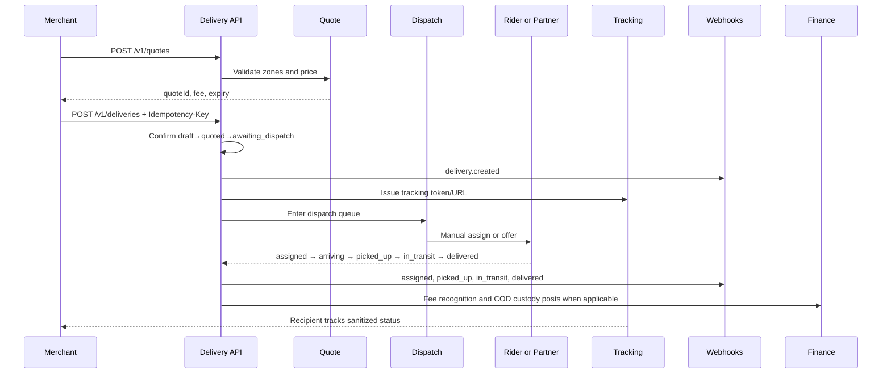

# Mode 01 — On-demand Delivery

**Status:** End-to-end implementation specification  
**Delivery mode:** `on_demand`  
**Primary phase:** Phase 1 foundation; reliability upgrades in Phase 2

## 1. Purpose, use cases, and boundaries

On-demand delivery is the default same-city execution mode. A merchant confirms a job for dispatch as soon as eligible capacity is available. Each on-demand job is independently quoted, created, assigned, tracked, proved, billed, and settled.

### In scope

- Immediate serviceability and quote
- Idempotent job creation
- Manual and later automatic dispatch to owned riders or partner fleets
- Pickup, transit, delivery, proof, COD collection evidence
- Public tracking and signed webhooks
- Cancellation before pickup, failure, and linked returns
- Finance posting hooks for delivery fee and COD custody

### Out of scope

- Future service-window commitment (scheduled mode)
- CSV/batch ingestion (bulk mode)
- Ordered multi-stop route planning (multi-stop mode)
- Inter-city lane products (multi-city capability)
- Guaranteeing traffic or recipient availability

All fees, timeouts, offer TTLs, radius limits, COD ceilings, proof requirements, and SLA thresholds are **configurable**.

## 2. Actors and permissions

| Actor | Actions |
|---|---|
| Merchant owner/admin/dispatcher | Quote, create, cancel (allowed states), read |
| Merchant finance/viewer | Read according to role |
| Ops dispatcher | Assign/reassign, fail/cancel under policy, exception handling |
| Rider | Advance assigned statuses, capture proof/COD evidence |
| Partner fleet (Phase 4) | Accept eligible offers and publish platform-valid events |
| Recipient | View sanitized tracking only |
| System | Idempotency, outbox/webhooks, auto-dispatch when enabled |

## 3. End-to-end swimlane

## 4. Preconditions

1. Business is active and permitted to create live (or sandbox) deliveries.
2. Pickup and dropoff coordinates resolve to active service zones under configured endpoint policy.
3. Packages satisfy size/weight/prohibited-goods policy.
4. COD amount, if present, is within configured limits and currency matches quote currency.
5. Quote is unexpired and input hash matches the create request when quote acceptance is required.
6. Actor has business-scoped permission or a valid API key for that business.

## 5. Full flow

### 5.1 Quote

1. Merchant submits pickup, dropoff, packages, optional COD, and `mode=on_demand`.
2. Coverage module evaluates cities/zones.
3. Maps adapter returns distance/duration or Phase 1 stub distance with explicit source.
4. Pricing returns fee breakdown, currency, assumptions, and `expires_at`.
5. Unserviceable requests return machine-readable errors (`OUTSIDE_SERVICE_AREA`, unsupported package, etc.).

### 5.2 Create (idempotent)

1. Require `Idempotency-Key`.
2. Canonicalize body and hash.
3. Same key + same hash replays response.
4. Same key + different hash returns `409`.
5. Persist delivery snapshots: addresses, packages, quote amount, COD, mode, tracking token.
6. Append status events for atomic progression through `draft → quoted → awaiting_dispatch` when confirmation is single-step.
7. Write outbox `delivery.created`.
8. Post configurable quote/fee commitment ledger entry when policy requires it on confirmation.

### 5.3 Dispatch

Phase 1:

1. Job appears on ops unassigned board.
2. Ops assigns eligible online rider.
3. Status becomes `assigned`; active assignment created; webhook `delivery.assigned`.

Phase 2+:

1. Auto-offer to eligible riders/partners by distance, capacity, vehicle, KYC, and workload.
2. Offer TTL and retry budget are configurable.
3. Ops may always override.

### 5.4 Execution

1. Rider sets `rider_arriving_pickup`.
2. Pickup requires configured proof; then `picked_up`.
3. Rider sets `in_transit`.
4. Delivery requires configured proof and COD evidence when COD > 0; then `delivered`.
5. Each transition appends immutable event with actor/time/optional location/reason.
6. Public tracking updates from projection of safe fields only.

### 5.5 Finance hooks

- Delivery fee recognition event is configurable (on confirmation, pickup, or delivery).
- COD: on successful collection evidence, custody moves into `cash_in_transit_cod` / merchant payable according to COD module.
- Rider/partner earnings post from completion/settlement rules (later phases).
- No balance field is mutated without a ledger entry.

### 5.6 Cancellation, failure, return

- Cancel allowed from `awaiting_dispatch`, `assigned`, `rider_arriving_pickup` under policy.
- Fail allowed from `assigned` through `in_transit` with reason.
- Return creates a linked new job; original history stays intact.

## 6. Data fields specific to on-demand

| Field | Notes |
|---|---|
| `mode` | Must be `on_demand` |
| `scheduled_window_*` | Null |
| `release_at` | Null or equal to `confirmed_at` |
| `batch_id` | Null unless created through bulk as `bulk_item` with on-demand timing |
| `route_id` | Null unless later attached to a route under explicit policy |

## 7. APIs and events

Primary:

- `POST /v1/quotes`
- `POST /v1/deliveries`
- `GET /v1/deliveries/{id}`
- `POST /v1/deliveries/{id}/cancel`
- `POST /v1/ops/deliveries/{id}/assign`
- `POST /v1/riders/jobs/{id}/status`
- `GET /v1/track/{token}`

Webhooks: `delivery.created`, `assigned`, `picked_up`, `in_transit`, `delivered`, `failed`, `cancelled`, and later `returned` / COD / settlement events.

## 8. UI touchpoints

- Merchant create form defaults to on-demand.
- Delivery detail shows tracking URL, timeline, cancel when allowed.
- Ops board prioritizes awaiting/unassigned on-demand jobs.
- Rider job list shows actionable next status only.
- Tracking page shows customer-safe status/ETA stub.

## 9. Concurrency and retries

- Exactly one active assignment.
- Optimistic version or row lock on transitions.
- Idempotent create and webhook consumer dedupe required.
- Replaced rider loses mutation rights immediately.

## 10. Observability

Metrics: create rate, quote→create conversion, time-to-assign, time-to-pickup, time-to-deliver, cancel/fail rates, webhook success, stuck `awaiting_dispatch` age.

Alerts: assignment SLA breach (configurable), outbox backlog, transition conflict spikes.

## 11. Acceptance criteria

1. Merchant can quote and create an on-demand job once under retries.
2. Illegal status transitions return `409`.
3. Tracking URL works without login and hides internal fields.
4. Assignment and status history are append-only and auditable.
5. COD/fee effects create immutable ledger references when configured.
6. Failure/cancel/return follow shared lifecycle and linked-return rules.

## 12. Test scenarios

- Happy path create → assign → deliver
- Idempotent replay and body mismatch
- Out-of-zone quote rejection
- Concurrent double assignment
- Cancel before pickup / reject after pickup
- Required proof blocks `delivered`
- Webhook retry after endpoint 500
- Tenant isolation on get/cancel/assign
