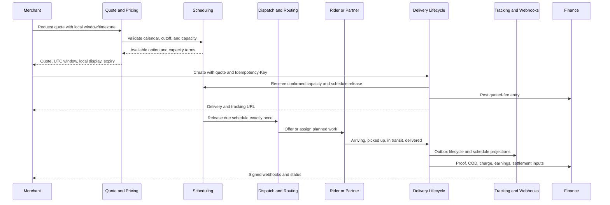
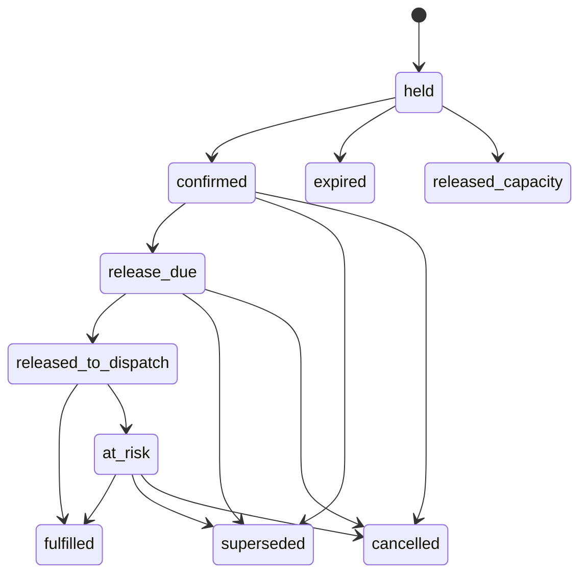

# Mode 02 — Scheduled Delivery

**Status:** End-to-end implementation specification  
**Delivery mode:** `scheduled`  
**Primary phase:** Phase 4, with data and validation groundwork in earlier phases

## 1. Purpose, use cases, and boundaries

Scheduled delivery lets a merchant request pickup and/or delivery during a published local-time window instead of requesting immediate dispatch. It is appropriate for planned store collections, recipient-selected slots, recurring branch operations, inter-city departure windows, and deliveries that must be coordinated with owned or partner capacity.

This mode extends the normal delivery contract. Each scheduled job remains an independently quoted, created, assigned, tracked, proved, billed, and settled delivery. Scheduling never introduces a second delivery lifecycle or permits a lifecycle transition to be skipped.

### In scope

- Tenant-, branch-, city-, zone-, product-, fleet-, and date-specific service windows.
- Local calendar, blackout, holiday, cutoff, lead-time, horizon, capacity, and overbooking policy.
- Quote-time availability and price implications.
- Confirmation-time capacity reservation.
- Rescheduling and cancellation before and after release.
- Lease-protected release into dispatch at a calculated time.
- Pre-dispatch planning, route membership, owned-fleet and partner assignment.
- Pickup and delivery promise monitoring, ETA, proof, COD, finance, exceptions, and returns.
- Merchant, operations, rider, partner, tracking, API, event, audit, and reporting surfaces.

### Out of scope

- A guarantee that traffic or recipient behavior will match an estimate.
- Route optimization internals; this mode may hand work to the route module.
- Partner internal scheduling, payroll, or routing.
- Warehouse picking and inventory reservations.
- Rewriting an accepted quote, historical schedule version, lifecycle event, proof, or ledger entry.
- Cross-tenant pooling unless a separately approved product and privacy policy explicitly enables it.

All time limits, window sizes, horizons, cutoffs, capacity units, tolerances, retry budgets, SLA thresholds, fees, and notification timing in this specification are **configurable**, effective-dated, scoped, versioned, and auditable. No example value is product policy.

## 2. Actors and permissions

| Actor | Allowed actions |
|---|---|
| Merchant owner/admin/dispatcher | View available windows, quote, create, reschedule, and cancel own-business jobs within policy |
| Merchant viewer/finance | Read scheduled job or financial projection according to role; cannot mutate schedule by implication |
| Recipient | View the recipient-safe promised window and tracking; may choose a slot only through a merchant-authorized flow |
| Scheduler system | Reserve capacity, release due schedules idempotently, expire holds, detect risk, and emit domain events |
| Ops dispatcher | Plan, route, assign, reassign, reschedule, override soft constraints, and resolve exceptions with audit |
| Rider | See assigned window and execute only valid lifecycle actions |
| Partner fleet | Accept eligible scheduled work and publish platform-valid events within contract |
| Platform admin | Configure calendars, capacity, cutoffs, products, policies, and provider health |
| Finance operator | Reconcile charges, COD, earnings, settlements, adjustments, and refunds |

Cross-tenant planning access is restricted to explicit platform operations roles. Hard serviceability, tenant, legal, safety, custody, and compliance constraints cannot be overridden.

## 3. Actor swimlane



## 4. Prerequisite configuration

Scheduled quoting must be unavailable until all required configuration resolves to one active version:

- Business status, branch ownership, default IANA timezone, and allowed scheduling roles.
- City/zone activation, city timezone, local service calendar, holidays, blackout intervals, and exceptional closures.
- Scheduled product activation by origin/destination city and zone; explicit lane for multi-city.
- Pickup and delivery window templates, slot granularity, minimum/maximum width, booking horizon, minimum lead time, same-day cutoff, reschedule cutoff, cancellation cutoff, grace periods, and release lead-time rules.
- Capacity dimensions and pools: jobs, stops, package weight/volume, vehicle type, route duration, rider shifts, partner allotment, depot, zone, and/or lane.
- Capacity reservation policy: hard reservation, soft reservation, controlled overbooking, waitlist, hold expiry, and concurrency strategy.
- Pricing rules for scheduled, after-hours, multi-city, package, COD, cancellation, reschedule, failed attempt, and return charges.
- Owned-versus-partner dispatch strategy, partner contract capability, event/proof/location obligations, and fallback order.
- Proof requirements, COD limits/currency/custody rules, prohibited goods, contact requirements, risk controls, and return policy.
- Notification templates and recipient consent/channel policy.
- Scheduler, maps, routing, outbox, webhook, object storage, scanner, and finance worker health.

Configuration precedence is deterministic and follows the pricing/tenant hierarchy. The accepted quote and confirmed schedule store configuration versions used for the decision.

## 5. Data model

### 5.1 `ServiceWindowTemplate`

| Field | Constraints |
|---|---|
| `id`, `version` | Opaque ID and immutable version |
| `scope_type`, `scope_id` | Platform, business, city, zone, branch, product, fleet, or lane |
| `window_type` | `pickup`, `delivery`, or paired promise |
| `timezone` | Valid IANA identifier |
| `local_start_time`, `local_end_time` | Local wall-clock template; ordered under overnight policy |
| `days_of_week`, `effective_from`, `effective_to` | Non-overlapping effective schedule |
| `slot_granularity`, `min_width`, `max_width` | Configurable positive durations |
| `lead_time`, `booking_horizon`, `booking_cutoff` | Configurable duration/local-time rules |
| `release_rule` | Offset or calculated release policy |
| `status` | `draft`, `published`, `retired` |

Published versions are immutable. Overlap at equal precedence is rejected.

### 5.2 `ServiceCalendarException`

Stores scoped local date/interval, timezone, type (`closure`, `blackout`, `extended_hours`, `capacity_override`), reason, precedence, effective version, actor, and audit reference. Conflicting exceptions at the same precedence are rejected.

### 5.3 `CapacityBucket`

| Field | Constraints |
|---|---|
| `id`, `business_id` | Tenant scope; platform/shared pools use an explicit platform owner |
| `scope` | City, zone, branch, depot, product, fleet, partner, vehicle, or lane |
| `window_start_at`, `window_end_at` | UTC bucket bounds plus authoritative timezone |
| `dimension`, `limit` | Configured unit and non-negative capacity |
| `reserved`, `committed`, `released` | Derived counters; cannot exceed policy-adjusted limit |
| `overbooking_limit` | Optional explicit policy, never implicit |
| `configuration_version`, `version` | Snapshot and optimistic-concurrency version |

Counter updates occur atomically or are rebuilt from immutable reservations. Capacity is never inferred only from a stale cached count.

### 5.4 `ScheduleReservation`

| Field | Constraints |
|---|---|
| `id`, `business_id`, `delivery_id` | Same-tenant references; one active confirmed reservation per schedule version |
| `schedule_version` | Increasing integer unique per delivery |
| `window_type` | Pickup/delivery/paired |
| `start_at`, `end_at` | UTC instants, `start_at < end_at` |
| `timezone` | IANA timezone used for interpretation/display |
| `local_start`, `local_end` | Original normalized local values for audit |
| `fold` | Required when local time is ambiguous and policy allows explicit disambiguation |
| `capacity_units` | Versioned dimensions and quantities |
| `capacity_bucket_ids` | All buckets reserved atomically |
| `state` | Schedule state defined below |
| `hold_expires_at` | Required for temporary holds |
| `release_at`, `released_at` | Calculated UTC release and actual release |
| `configuration_version`, `quote_id` | Decision snapshots |
| `supersedes_id`, `reason_code` | Required for reschedule/correction |
| `created_by`, `created_at`, `updated_at`, `version` | Audit and concurrency fields |

Historical reservations are immutable except for guarded state transitions. Rescheduling creates a new version and releases/supersedes the prior reservation atomically.

### 5.5 `ScheduleEvent`

Append-only event with schedule/delivery/version, sequence, from/to state, server time, actor, reason, capacity delta references, request/correlation IDs, and optional safe metadata. Unique `(schedule_reservation_id, sequence)`.

### 5.6 Delivery and planning links

The base `Delivery` stores `mode=scheduled`, accepted `quote_id`, schedule reservation/version, pickup and delivery window UTC bounds, authoritative timezone, immutable address/package snapshots, COD, current lifecycle status, and optimistic version.

Optional planning links include `route_id`, pickup/drop-off `route_stop_id`, dispatch request, assignment, partner handoff, exception case, and linked return job. A delivery belongs to at most one active route plan. Route membership never hides its independent lifecycle, tracking, proof, finance, or reconciliation keys.

## 6. State machines

### 6.1 Delivery lifecycle

```text
draft → quoted → awaiting_dispatch → assigned → rider_arriving_pickup
      → picked_up → in_transit → delivered
```

Exceptions remain `cancelled`, `delivery_failed`, and `returned` under the authoritative transition matrix. A future scheduled window does not add `scheduled` as a delivery status: while confirmed and unreleased, the delivery is `awaiting_dispatch` and its schedule state explains why it is not yet dispatching.

### 6.2 Schedule reservation



- `held` is optional and time-bounded during quote/checkout.
- `confirmed` means capacity is committed to the accepted delivery.
- `release_due` may be logical; a scheduler claim performs release.
- `released_to_dispatch` records exactly one accepted release command for a schedule version.
- `fulfilled` is derived when the relevant pickup/delivery promise has completed; it does not replace `delivered`.
- `at_risk` is operational, not terminal.
- `superseded`, `cancelled`, `expired`, and `released_capacity` are terminal for that schedule version.

### 6.3 Pre-dispatch plan

Planning uses the Route state machine when grouped: `draft → optimizing → planned → locked → assigned → active → completed`, with `cancelled` and versioned replanning. A standalone scheduled job may omit a Route and proceed directly through Dispatch.

## 7. End-to-end flow

### 7.1 Discover and quote

1. Merchant submits branch, addresses, packages, mode, desired pickup/delivery local window, explicit timezone where required, COD, and optional service product.
2. The API resolves tenant, branch, cities, zones, lane, canonical timezone, package policy, COD policy, and calendar versions.
3. Local times are parsed under the named IANA timezone. Nonexistent local times are rejected; ambiguous times require a configured deterministic policy or explicit fold/offset.
4. Scheduling applies horizon, lead time, cutoff, opening hours, blackout, window width, capacity, and product constraints.
5. Maps supplies route distance/duration. Pricing produces a scheduled option and immutable line-item breakdown.
6. Capacity may be checked only or held according to policy. A quote must state whether capacity is guaranteed, hold expiry, schedule assumptions, UTC bounds, local display, timezone, quote expiry, and alternatives.
7. Unavailable requests return machine-readable causes and, when policy permits, alternative windows without exposing other tenants' demand.

### 7.2 Create and confirm

1. `POST /v1/deliveries` requires the accepted `quoteId`, `Idempotency-Key`, `externalOrderId`, and matching schedule fields.
2. In one transaction, the service reserves the idempotency key, verifies quote ownership/input/expiry, locks capacity buckets in stable order, confirms capacity, creates delivery/package/address/tracking snapshots, records schedule/version/events, transitions `draft → quoted → awaiting_dispatch`, posts the fee ledger instruction, writes audit/outbox, and stores the response.
3. If capacity was merely checked at quote time and is now unavailable, creation fails with `409 capacity_unavailable`; it never silently moves the customer to another window.
4. Retry with the same key/body replays the original result. Same key/different canonical body returns `409`.

### 7.3 Pre-dispatch planning

1. Confirmed work appears on the city/date planning board but is excluded from active candidate offering until release policy permits.
2. Planning may reserve a route/depot/fleet/partner capacity pool, construct route stops, estimate pickup/drop-off ETA, and identify hard/soft constraint risk.
3. Optimization output is a proposal tied to route and delivery schedule versions. It must be explicitly applied; stale output cannot mutate a newer plan.
4. Ops may manually sequence, lock, or replan. Hard constraints are rejected; approved soft overrides require reason.
5. Schedule changes invalidate affected plan versions and capacity assumptions.

### 7.4 Release and dispatch

1. A scheduler claims due schedules with a lease and emits an idempotent release command keyed by delivery and schedule version.
2. Recovery scans find overdue, unreleased schedules. Duplicate claims replay and cannot create duplicate dispatch requests.
3. Dispatch evaluates current city/zone/lane, promised window, current capacity, package/vehicle, rider shift, route, partner capability, KYC/compliance, location freshness, load, and priority.
4. Manual, automatic, or hybrid dispatch creates exactly one active assignment and changes `awaiting_dispatch → assigned`.
5. No candidates leaves the delivery awaiting dispatch, marks schedule risk, retries by policy, and alerts ops before configurable breach thresholds.

### 7.5 Pickup, tracking, and delivery

1. Owned rider or authenticated partner invokes the same guarded lifecycle commands as on-demand work.
2. Pickup arrival and completion are measured against the promised pickup interval and configured tolerance; proof and package checks gate `picked_up`.
3. Tracking displays the recipient-safe window, current state, and ETA confidence. It never exposes the route, other stops, internal capacity, or partner diagnostics.
4. ETA updates do not rewrite the promised window. A predicted miss creates a risk signal and notification according to policy.
5. At drop-off, proof and COD collection conditions gate `delivered`. Offline operations use unique client action IDs and reconcile against current assignment/status versions.

### 7.6 Finance and reconciliation

- Confirmation posts exactly one quoted-fee ledger transaction or instruction linked to quote and delivery.
- Reschedule, cancellation, waiting, after-hours, partner, failed-attempt, and return amounts use separate immutable adjustment entries according to accepted policy.
- COD collection is separate from delivery charge and partner/rider earnings. Collection creates one idempotent custody/payable transaction and must satisfy proof policy before delivery.
- Partner and rider earnings reference assignment, schedule/product, and completion facts; they never net silently against cash custody.
- Invoice, merchant COD settlement, and partner/rider payout source entries are frozen and independently reproducible.
- Reconciliation detects confirmed reservations without deliveries, released schedules without dispatch requests, delivered jobs without required proof/COD posting, duplicate charges, route/delivery disagreement, and schedule versions whose capacity was not released.

## 8. APIs

### Merchant/public API

| Method | Path | Behavior |
|---|---|---|
| `GET` | `/v1/service-windows` | Returns eligible local/UTC windows, timezone, capacity status, and product references for tenant/branch/date |
| `POST` | `/v1/quotes` | Accepts `mode=scheduled`, requested window, packages, route, and COD |
| `POST` | `/v1/deliveries` | Confirms scheduled delivery idempotently |
| `GET` | `/v1/deliveries/{id}` | Includes schedule version, promised window, status, quote, and safe planning data |
| `POST` | `/v1/deliveries/{id}/reschedule` | Requires idempotency key, expected delivery/schedule versions, desired window, and reason |
| `POST` | `/v1/deliveries/{id}/cancel` | Applies state, cutoff, charge/refund, capacity release, and assignment rules |
| `GET` | `/v1/track/{token}` | Recipient-safe window, timeline, and ETA |

### Operations/admin

- `GET /v1/ops/schedules` with tenant/city/zone/date/state/risk/route/fleet filters.
- `POST /v1/ops/deliveries/{id}/release`, `/reschedule`, and `/override` with reason and expected versions.
- Route operations from Module 19 for create, optimize, apply, lock, assign, start, stop status, replan, and complete.
- Admin CRUD/publish/retire APIs for calendars, window templates, capacity policies, and cutoff/release rules.

### Error contract

- `409 capacity_unavailable`, `quote_expired`, `schedule_version_conflict`, `delivery_version_conflict`, `cutoff_passed`, `already_released`, `route_locked`, or `rider_schedule_conflict`.
- `422 invalid_timezone`, `nonexistent_local_time`, `ambiguous_local_time`, `window_unserviceable`, `window_outside_calendar`, `lead_time_violation`, `unsupported_lane`, or `constraint_unsatisfied`.
- `503 scheduling_unavailable`, `routing_unavailable`, or dependency-specific retryable errors.

Errors include safe field paths, current versions, retryability, and alternative-window link where appropriate.

## 9. Events and webhooks

Internal domain events may include:

- `schedule.held`, `schedule.confirmed`, `schedule.rescheduled`, `schedule.release_due`, `schedule.released`, `schedule.at_risk`, `schedule.fulfilled`, `schedule.cancelled`.
- `delivery.scheduled` as the Phase 4 integration event defined by Module 19.
- Route and lifecycle events defined by their owning modules.

The approved merchant lifecycle webhooks remain `delivery.created`, `delivery.assigned`, `delivery.picked_up`, `delivery.in_transit`, `delivery.delivered`, `delivery.failed`, `delivery.cancelled`, and `delivery.returned`, plus COD/settlement events. Schedule-specific merchant webhook names must be added to the versioned webhook/OpenAPI contract before external use; internal event names must not be exposed accidentally.

All external webhooks are tenant-routed, versioned, signed over `timestamp.body`, timestamp checked, at-least-once, deduplicable by event ID, retried with configurable backoff, and dead-lettered after a configurable budget. Payloads include delivery ID, external order ID, aggregate version, UTC window, timezone, and safe status; they omit capacity internals and unrelated route data.

## 10. UI requirements

### Merchant

- Delivery form shows only eligible windows in branch/city local time, timezone label, date, fee/capacity implications, quote expiry, and refresh.
- Confirmation repeats local and UTC-equivalent promise where useful and warns about cutoff/cancellation terms.
- Detail page shows current schedule version, reschedule/cancel actions allowed by the server, quote/adjustments, assignment, timeline, tracking, proof, and finance links.
- Calendar/list view filters by local service date, city, branch, status, risk, route, partner, COD, and batch source.

### Operations

- Date/city board shows unreleased, due, released, unplanned, assigned, at-risk, breached, cancelled, and completed work.
- Capacity heatmap shows configured units, reserved/committed/remaining/overbooked values, version/freshness, and drill-down without exposing tenant data improperly.
- Route planner supports map/list, constraint warnings, compare/apply optimization, lock, assign, replan, and schedule version history.
- Overrides show hard versus soft constraints and require reason/approval as configured.

### Rider/partner/tracking/admin

- Rider and partner views show local window, timezone, countdown, route order, proof/COD requirements, and offline sync state.
- Public tracking uses customer-safe language and never reveals other stops or operational blame.
- Admin provides effective-dated calendars, exceptions, capacity pools, products, cutoffs, thresholds, providers, audit, and preview tools.

## 11. Validation, timezone, cutoff, and capacity rules

- APIs accept ISO 8601 UTC instants. When local input is supported, it must include an IANA timezone and explicit ambiguity handling; bare local timestamps are rejected.
- Store UTC start/end, authoritative timezone, original normalized local representation, and schedule configuration version.
- City timezone is authoritative by default; a branch override must be explicitly allowed. Recipient device timezone never changes the contractual promise.
- `start < end`; width, lead time, horizon, opening hours, blackout, cutoff, and past-time rules are configurable.
- DST gaps are invalid. DST overlaps require an explicit offset/fold or a documented configured choice returned to the caller.
- Cross-city windows define which city/timezone governs pickup, delivery, release, cutoff, and reporting. Each promise retains its own timezone when they differ.
- Coordinates resolve deterministically to active cities/zones; scheduled multi-city requires an enabled lane and pricing/dispatch/partner support.
- Capacity units derive from normalized package, stops, route duration, vehicle, COD risk, and policy. Missing data cannot be treated as zero unless configuration explicitly provides a conservative default.
- Confirmation locks all affected buckets in a stable order and atomically checks/reserves them. Reschedule reserves new capacity before releasing old capacity where possible; transaction/saga compensation prevents double reservation.
- Cache may support discovery but not authoritative confirmation. A stale cache never overrules the capacity store.
- Overbooking, waitlisting, emergency release, and privileged override are disabled unless configured, permissioned, reasoned, versioned, and audited.

## 12. Cancellations, failures, rescheduling, and returns

- Before release: cancellation terminates schedule work, releases capacity, applies configured fee/refund, cancels notifications, appends lifecycle/audit/outbox events.
- After release but before pickup: cancel or reschedule withdraws offers, closes/replaces assignments as permitted, versions the schedule, and notifies affected rider/partner.
- After pickup: ordinary cancellation/reschedule is denied. Use a failed-attempt, exception, custody handoff, reattempt, or linked return workflow.
- Missed pickup/delivery window does not silently terminalize a job. It opens/escalates an exception and requires a configured continue, reschedule, cancel, fail, or return decision.
- Merchant-caused, recipient-caused, fleet-caused, weather, capacity, platform, and partner failures use controlled reason codes and may have different charge/notification rules.
- A return is a separately quoted, idempotently created linked delivery with its own schedule, assignment, proof, tracking, and ledger effects. The original reaches `returned` only under the authoritative policy.

## 13. Security, privacy, and audit

- Every schedule, route, reservation, capacity allocation, and lookup is tenant-scoped or explicitly platform-owned.
- Recipient details are not needed for slot discovery and should not be persisted in quotes beyond the minimum.
- Precise addresses, contact data, route plans, rider location, COD, proof, and free text are sensitive. Encrypt in transit/at rest and enforce purpose-based access and retention.
- Public tracking tokens are high entropy, revocable, rate-limited, and disclose one delivery only.
- Partners receive minimum details before acceptance and only fulfillment-required details afterward under active contract.
- Admin configuration publish, capacity override, manual release, reschedule, assignment/reassignment, cancellation, route edit, proof override, COD exception, and financial adjustment are audited with actor, versions, reason, and correlation ID.
- Logs and metrics exclude raw contacts, full addresses, exact coordinates, tokens, secrets, and proof content.

## 14. Retries, concurrency, and recovery

- Quote calculation is side-effect free except an explicit idempotent capacity hold.
- Delivery creation, reschedule, cancellation, manual release, route commands, partner acceptance, proof/COD actions, and finance commands use idempotency keys or stable operation IDs.
- Capacity reservation uses row/advisory locking or compare-and-swap with a uniqueness constraint; concurrent confirmations cannot exceed the configured policy.
- Schedule workers claim with leases, record checkpoints, and deduplicate by delivery/schedule version. Lease expiry permits recovery without duplicate release.
- Outbox workers retry transient failures with configurable exponential backoff and jitter. User validation failures do not retry.
- Provider timeout leaves state explicit (`pending`, `unknown`, or failed run); it never silently applies a route or duplicates a payment/partner job.
- Reconciliation uses normal idempotent commands to repair stuck holds, due releases, orphan dispatch requests, stale projections, unreleased capacity, and partial finance sagas.

## 15. Metrics and alerts

Measure by tenant/product/city/zone/lane/fleet without high-cardinality PII:

- Window searches, availability rate, rejection reasons, quote conversion, hold expiry, and confirmation conflict rate.
- Demand, reserved/committed/remaining capacity, controlled overbooking, forecast error, and utilization.
- Time from confirmation to release, release lateness, unplanned work near cutoff, assignment latency, and no-candidate rate.
- On-time pickup/delivery, early/late distribution, ETA error, missed windows, reschedules, cancellations, failures, returns, and reasons.
- Route planned-versus-actual duration/distance/stops, replans, optimization failure, provider latency/cost.
- Owned/partner split, partner response/binding/event delay, proof compliance, COD reconciliation, charge/earnings/settlement exceptions.
- Scheduler lease/retry/dead-letter counts, outbox backlog, webhook dead letters, concurrency conflicts, and reconciliation defects.

Alert thresholds are configurable. Alerts cover scheduler outage or release lag, capacity oversell/inconsistent counters, unplanned work approaching cutoff, route/provider degradation, high missed-window rate, partner lane degradation, stale ETA/location, COD/proof defects, finance posting gaps, and webhook/outbox backlog.

## 16. Phased rollout

1. **Groundwork:** persist UTC plus IANA timezone and schedule versions; calendar/window discovery; quote validation; manual capacity placeholder; tracking display; feature flag with no automatic release.
2. **Controlled city pilot:** hard capacity reservations, lease-protected release, manual planning/dispatch, merchant reschedule/cancel, alerts, owned fleet only, selected tenants/cities/products.
3. **Operational reliability:** automatic dispatch, route builder, proof/COD integration, recovery/reconciliation, notifications, finance adjustments, SLO dashboards.
4. **Scale:** optimization, partner fleet, inter-city lanes, multi-depot capacity, dynamic replanning, advanced forecasting and controlled overbooking.

Each phase uses tenant/city/product feature flags, sandbox and shadow evaluation, migration/backfill checks, runbooks, rollback that stops new scheduling without corrupting accepted work, and explicit exit criteria. Existing confirmed jobs remain executable if new sales are disabled.

## 17. Acceptance and test scenarios

### Quote and configuration

- A valid local request resolves to one timezone, window version, capacity policy, route, deterministic price, UTC interval, and expiry.
- Closed day, blackout, past time, lead-time, horizon, width, cutoff, unsupported package/COD, outside-zone, and missing inter-city lane each return stable errors.
- A DST-gap time is rejected; an overlap is disambiguated and round-trips without changing the promise.
- Pricing/configuration updates do not mutate existing accepted quotes or schedules.
- Unavailable capacity returns alternatives without leaking other tenants' demand.

### Creation and capacity

- Same create key/body produces one delivery, reservation, tracking token, fee entry, and event set; changed body conflicts.
- Concurrent requests for final capacity produce only policy-permitted confirmations.
- Quote-time availability loss causes explicit creation conflict, never silent substitution.
- Transaction failure leaves no partial delivery/capacity/ledger state.
- Branch or zone change after creation does not alter snapshots.

### Release, planning, and dispatch

- Future confirmed work remains `awaiting_dispatch` and is not offered before configured release.
- Duplicate scheduler runs and worker restart produce one release and one dispatch request.
- Recovery releases overdue work and records lateness.
- Stale optimization cannot apply; route hard constraints and pickup-before-drop-off hold.
- Owned/partner races preserve one active assignment.
- No candidate, stale rider, partner timeout, locked route, and manual override follow documented outcomes and alerts.

### Execution, tracking, and finance

- Every valid lifecycle transition is ordered, authorized, versioned, append-only, and outbox-backed; invalid skips return `409`.
- Public tracking shows only this delivery's safe window/ETA and no route/capacity/other-recipient data.
- Offline duplicate proof/status/COD actions do not duplicate state or money.
- COD delivery cannot complete without required collection or approved exception.
- Delivery charge, COD custody/payable, rider earnings, partner earnings, invoice, and settlement remain independently reconcilable.

### Reschedule, cancellation, failure, and return

- Reschedule before cutoff reserves new capacity, versions history, releases old capacity, requotes when required, and schedules one new release.
- Reschedule conflict or capacity failure preserves the old confirmed schedule.
- Cancellation at each lifecycle/release stage applies exact permissions, fees, assignment withdrawal, capacity release, and events.
- Window breach opens an exception rather than inventing a lifecycle status.
- Post-pickup failure preserves custody and uses reattempt/handoff/linked return; return completion never rewrites original history.

### Security and operations

- Tenant, rider, partner, finance, and public-token authorization tests deny cross-scope access.
- Sensitive schedule/route/location/contact/proof/COD data is absent from logs, metrics, and unrelated webhook payloads.
- Configuration and privileged overrides are audited with before/after versions and reason.
- Scheduler, maps, routing, partner, webhook, and finance outages degrade to explicit safe states with manual recovery.
- Reconciliation identifies every injected partial-state defect and repairs only through idempotent commands.
