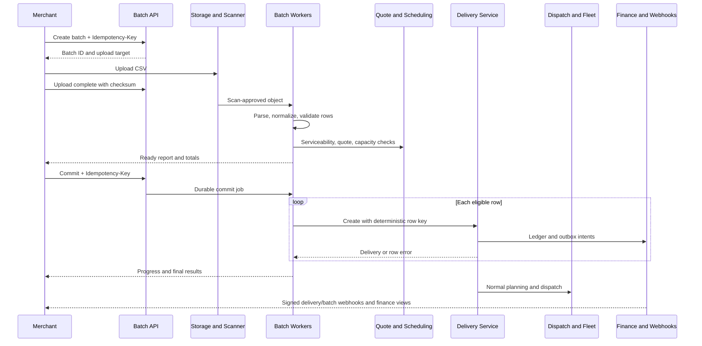
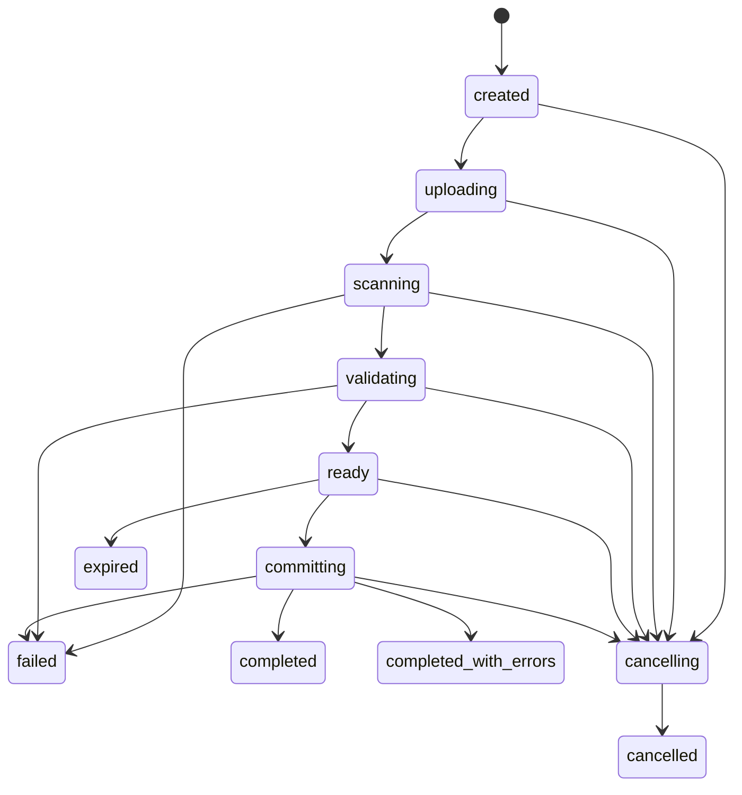
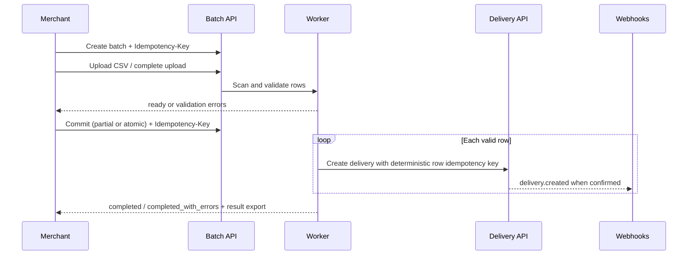

# Mode 03 — Bulk Delivery

**Status:** End-to-end implementation specification  
**Delivery mode:** `bulk_item` for each created delivery  
**Primary phase:** Phase 3, expanded for routing, partners, and multi-city in Phase 4

## 1. Purpose, use cases, and boundaries

Bulk delivery lets a merchant validate, price, review, and create many independent delivery jobs through one asynchronous batch. Supported intake is versioned CSV and bounded JSON. Typical use cases are daily order exports, marketplace fulfillment waves, supermarket dispatch lists, scheduled campaigns, multi-city manifests, migration from a merchant system, and plugin/API backfills.

A batch is an orchestration and reporting aggregate, not a delivery aggregate. Every accepted row invokes the same tenant, quote, delivery lifecycle, idempotency, tracking, proof, COD, dispatch, webhook, and finance contracts as an individually created delivery.

### In scope

- Template/schema discovery, upload intent, direct bounded JSON submission, and source checksum.
- Private object storage, content sniffing, malware scanning, quarantine, parsing, normalization, and staged validation.
- Row-level quote estimation, serviceability, scheduled-window/capacity checks, duplicate detection, and deterministic results.
- Validate-only, partial-commit, and bounded atomic-commit modes.
- Idempotent batch creation, idempotent commit, deterministic row creation, durable checkpoints, cancellation, progress, results, and export.
- Optional planning handoff to route/multi-stop tooling after delivery creation.
- Owned and partner dispatch, multi-city lanes, COD custody, invoicing, earnings, settlement, failures, and returns.

### Out of scope

- General-purpose ETL, inventory import, spreadsheet editing, arbitrary formulas/macros, or permanent file archival.
- Bypassing normal delivery validation or directly setting a delivery status, assignment, quote amount, ledger state, proof, or tracking token.
- Treating all rows as one delivery or one financial transaction.
- Automatic route optimization merely because deliveries share a batch.
- Unbounded synchronous creation.

All file, row, cell, payload, concurrency, quota, retention, timeout, retry, checkpoint, progress, atomicity, pricing-drift, capacity, and alert thresholds are **configurable**, scoped, versioned, and auditable. They must not be hardcoded as product policy.

## 2. Actors and permissions

| Actor | Allowed actions |
|---|---|
| Merchant operator | Download template, upload, map defaults, validate, review, commit, cancel, and export own batches according to role |
| Merchant developer/API key | Submit and inspect batches within explicit scopes |
| Business admin | Configure defaults, schemas, quotas, and separation between uploader and committer |
| Batch worker | Scan, parse, normalize, validate, quote, commit rows, checkpoint, and build results |
| Ops dispatcher | See only committed deliveries and safe source-batch context; plan and dispatch normally |
| Support/platform admin | Diagnose system state with restricted, audited source-file access |
| Rider/partner | Execute only assigned committed deliveries; no batch-level merchant data access |
| Finance operator | Reconcile per-delivery charges, COD, earnings, invoice/settlement source, and batch summaries |

Upload permission does not imply commit permission. Atomic or high-value/COD batches may require a second approver under configurable policy.

## 3. Actor swimlane



## 4. Prerequisite configuration

Before production use, each environment must have:

- Active business, batch API/UI roles/scopes, environment isolation, tenant quota, and upload/commit separation policy.
- Published batch schema version and CSV/JSON column dictionary with required, optional, deprecated, and forbidden fields.
- Allowed intake formats, media types, encodings, delimiter/quote/escape/newline policy, filename rules, and formula neutralization.
- Maximum source size, rows, cells, cell bytes, packages per row, direct JSON size, atomic row limit, concurrent batches, and tenant throughput.
- Private object storage, signed upload/download URL policy, checksum algorithm, content scanner, quarantine, encryption, retention, deletion, and legal-hold integration.
- Branch/default mapping, duplicate `external_order_id` policy, row identity strategy, address/geocoding policy, product/mode availability, pricing, scheduled calendars/capacity, package/COD/risk rules, and multi-city lanes.
- Row and batch idempotency retention, worker concurrency, chunk/checkpoint size, retry/backoff, cancellation polling, progress-event cadence, and result retention.
- Dispatch, owned/partner fleet, proof, tracking, webhooks, ledger, invoice, COD, settlement, return, routing, and notification dependencies.

Configuration and schema versions used for validation are recorded. A commit revalidates or is rejected when commercially or operationally material configuration has changed.

## 5. Input contracts

### 5.1 CSV

The published schema must specify:

- UTF-8 encoding policy, optional byte-order-mark handling, comma delimiter, header row, RFC-compatible quoting/escaped quote behavior, newline handling, and whether blank trailing rows are ignored.
- Exact canonical headers, aliases only where the selected schema version allows them, case/whitespace normalization, duplicate-header rejection, and unknown-column policy.
- Maximum file/row/cell limits and parser resource budget.
- Dates/times as ISO 8601. Local scheduled values require an IANA timezone and ambiguity handling; UTC instants remain canonical.
- Money in explicit decimal input with currency, converted losslessly to integer minor units; locale-dependent number formats are rejected unless a named import profile explicitly supports them.
- Boolean and enum representations, coordinate units/ranges, package list encoding, and metadata limits.
- Formula-leading output cells are neutralized. Input formulas/macros are never executed.

Representative logical columns:

| Group | Fields |
|---|---|
| Identity | `row_key`, `external_order_id`, optional merchant metadata |
| Product | `mode`, service product, priority |
| Branch/pickup | Branch reference or complete pickup address/coordinates/contact/instructions |
| Drop-off | Complete address/coordinates, recipient name/phone/instructions |
| Package | Description, quantity, weight, dimensions, fragile, declared value |
| Schedule | Pickup/delivery start, end, timezone, fold/offset if needed |
| COD | Amount, currency, collection method where supported |
| Planning | Optional route group/wave/depot hints; never trusted assignment or sequence state |

The published version decides required fields. Operational contact and coordinate/geocoding requirements must be explicit, not inferred after commit.

### 5.2 JSON

Bounded direct submission uses a versioned envelope:

- `clientBatchId`, `schemaVersion`, `commitMode`, optional `validateOnly`, defaults, and an ordered `rows` array.
- Each row has stable `rowKey` and the same logical fields as `POST /v1/deliveries`.
- Duplicate object keys, non-finite numbers, excessive nesting, unknown fields under strict schemas, and payloads over configured limits are rejected.
- JSON submission still creates an asynchronous batch; it does not become a synchronous multi-create endpoint.

### 5.3 Defaults and mappings

Defaults are allowlisted, typed, tenant-scoped, and included in the canonical row hash. Explicit row values override defaults unless the schema forbids override. Defaults cannot supply trusted tenant, status, assignment, price, quote ID from another request, actor, event time, or ledger values.

## 6. Data model

### 6.1 `ImportBatch`

| Field | Constraints |
|---|---|
| `id`, `business_id`, `environment` | Opaque ID; tenant/environment boundary |
| `client_batch_id` | Optional merchant reconciliation key; uniqueness policy configurable |
| `source` | `ui`, `api`, `plugin`, `object_storage` |
| `format` | `csv`, `json` |
| `schema_version`, `import_profile_version` | Required immutable validation references |
| `commit_mode` | `validate_only`, `partial_commit`, `atomic_commit` |
| `state` | Authoritative batch state |
| `object_key`, `original_filename`, `media_type` | Private source references; sanitized filename |
| `declared_size`, `observed_size`, `checksum` | Verified before parsing |
| `defaults`, `options_hash` | Validated, canonicalized configuration |
| `validation_snapshot` | Rule, zone, calendar, pricing, and relevant config versions/watermark |
| `total`, `parsed`, `valid`, `invalid`, `quoted`, `pending`, `created`, `failed`, `skipped` | Non-negative counters derived from row outcomes/checkpoints |
| `progress_sequence`, `checkpoint` | Monotonic progress and durable resume location |
| `created_by`, `committed_by`, `cancelled_by` | Actor references |
| `created_at`, `uploaded_at`, `validated_at`, `commit_started_at`, `completed_at`, `expires_at` | UTC timestamps |
| `version` | Optimistic-concurrency integer |

Counters must satisfy documented invariants and be rebuildable from durable row/chunk outcomes.

### 6.2 `ImportObject`

Stores tenant/batch, object key, upload token scope, expected/observed checksum and size, scan state/result/version, quarantine reason, encryption/key reference, retention/deletion/legal-hold state, and access audit link. Source content is never stored in logs or ordinary database diagnostics.

### 6.3 `ImportRow`

| Field | Constraints |
|---|---|
| `id`, `batch_id`, `business_id` | Same tenant; stable internal row ID |
| `row_number`, `row_key` | One-based source row and merchant-stable key; unique per batch |
| `raw_reference` | Restricted source/chunk pointer, not unrestricted duplicated PII |
| `normalized_input` | Encrypted/versioned canonical delivery request |
| `canonical_hash` | Covers all delivery- and quote-material fields plus defaults |
| `external_order_id` | Required normalized merchant reference |
| `validation_state` | `pending`, `valid`, `invalid`, `stale` |
| `quote_snapshot`, `quote_expires_at` | Optional estimate/accepted per-row quote facts |
| `capacity_check` | Scheduled availability result, not an implicit reservation unless policy says so |
| `commit_state` | `not_selected`, `pending`, `creating`, `created`, `failed`, `skipped`, `cancelled` |
| `delivery_id`, `tracking_reference` | Set only on successful create; same tenant |
| `row_idempotency_key` | Deterministic and unique within credential/business scope |
| `attempt_count`, `last_error_class` | Safe worker diagnostics |
| `created_at`, `updated_at`, `version` | Audit/concurrency |

### 6.4 `ImportRowError`

Stores batch/row, stage, field path, stable public error code, safe message parameters, severity, retryability, source column, configuration/schema version, and occurrence sequence. A row may have multiple errors. Raw values, contacts, addresses, tokens, and provider responses are excluded.

### 6.5 `BatchCommit`

Stores batch, commit request hash, selected row set/hash, mode, validation snapshot, pricing approval/tolerance decision, idempotency record, state, actor/approval, start/end timestamps, checkpoint, cancellation flag, and result artifact. One completed equivalent commit is replayed; a changed request under the same key conflicts.

### 6.6 `BatchChunk` and `BatchArtifact`

Chunks support bounded memory and durable work leasing with range, state, lease owner/expiry, attempt, and checkpoint. Artifacts include validation report, result JSON/CSV, and invalid-row export with tenant-private storage, hash, generation state, expiry, and access audit.

## 7. State machines

### 7.1 Batch



`failed` is batch-level and requires a failure class. In partial mode, row errors normally lead to `ready` then `completed_with_errors`, not batch `failed`. A failed batch may be retried only through an explicit guarded retry/revalidation command.

### 7.2 Scan

`pending → scanning → clean | rejected | error_retryable`. Only `clean` may parse. Scanner errors do not imply clean.

### 7.3 Row validation and commit

```text
validation: pending → valid | invalid | stale
commit:     not_selected → pending → creating → created
                                      ↘ failed
                          pending/creating → cancelled
```

A created row is terminal for that batch commit and points to one delivery. Correction creates a new row/batch or uses normal delivery commands; it never rewrites source history.

### 7.4 Delivery

Every created row follows:

```text
draft → quoted → awaiting_dispatch → assigned → rider_arriving_pickup
      → picked_up → in_transit → delivered
```

with the authoritative `cancelled`, `delivery_failed`, and `returned` paths. The batch state cannot advance, regress, cancel, or return a delivery by itself.

## 8. Validation pipeline

### 8.1 Intake and scan

1. Create upload intent idempotently and bind signed target to tenant, batch, object key, media type, checksum, and maximum size.
2. On upload complete, verify object existence, exact size/checksum, ownership, content type by sniffing, and one-time upload intent.
3. Scanner examines content before parser access. Rejected files remain quarantined for configured handling and expose only a safe reason.
4. CSV decompression/archive input is rejected unless an explicitly supported bounded format is published. Macros and spreadsheet binaries are not CSV.

### 8.2 Structural parse

- Stream in bounded chunks; never load an unbounded file into memory.
- Enforce encoding, delimiter, quoting, header count, duplicate/unknown headers, row/cell/byte/nesting limits, and consistent record shape.
- Assign stable source row numbers and row IDs.
- Detect embedded nulls, malformed Unicode, parser ambiguity, and resource-exhaustion attempts.
- Parser failure records the last safe checkpoint and does not create deliveries.

### 8.3 Row normalization

- Trim only fields whose schema permits trimming; preserve meaningful address text.
- Normalize identifiers, phone/country/currency codes, booleans, units, coordinates, money, and timestamps deterministically.
- Apply versioned defaults/mappings, then calculate canonical input hash.
- Preserve source-to-normalized mapping for safe result display without exposing secrets.

### 8.4 Field and domain validation

Each row runs all applicable checks and accumulates safe errors:

- Required values, type, length, enum, decimal precision, currency, coordinate range, phone/contact, package count/weight/dimensions/value, notes, and metadata.
- Branch belongs to the tenant and is active; addresses resolve to active cities/zones.
- Product/mode is enabled. Scheduled rows validate IANA timezone, DST ambiguity, window order, calendar, lead time, cutoff, horizon, and capacity.
- Multi-city rows require enabled origin/destination cities, explicit lane, pricing, dispatch, partner/owned capability, and return policy.
- COD is non-negative, same supported currency, under configured tenant/city/partner/risk limits, and has required contact/proof/custody support.
- `external_order_id` and `row_key` follow configured uniqueness/format policy.
- Prohibited goods and risk controls apply identically to single delivery creation.

### 8.5 Duplicate validation

- Within file: duplicate row key, duplicate external order ID under the tenant's uniqueness policy, and optionally exact canonical duplicate are reported explicitly.
- Against platform: an existing delivery with the same external order ID and same canonical hash may be marked replayable/skipped only under an approved reconciliation policy; a different hash is a conflict.
- Against another active batch: conflict or deterministic ownership follows configured policy. No worker overwrites another batch's delivery.

### 8.6 Quote, schedule, and preflight

- Valid rows call the normal quote/serviceability engine with recorded rule/map/calendar versions.
- Estimates include currency, lines, assumptions, expiry, and safe error. Totals group by currency; currencies are never summed together.
- Scheduled capacity checks state whether they are informational or reserved. A batch validation report must not imply guaranteed capacity without a reservation.
- Preflight may evaluate dispatch/partner capability and route feasibility, but it does not assign a rider or partner.

### 8.7 Ready report

The report includes schema/config snapshot, total/valid/invalid/quoted rows, errors by code/field, estimated amounts by currency, quote expiry, schedule-capacity caveats, duplicate outcomes, and selected commit modes. It provides stable row IDs and does not expose parser/provider internals.

## 9. Commit semantics

### 9.1 Validate-only

No delivery, tracking token, assignment, charge, or COD obligation is created. The batch reaches `ready` and expires under retention policy.

### 9.2 Partial commit

1. Commit request selects all currently valid rows or an explicit stable subset and binds to validation/report hash.
2. Worker processes rows independently through normal quote acceptance and `POST /v1/deliveries` domain service using deterministic row idempotency.
3. Valid successful rows become `created`; validation/business conflicts become row `failed`/`skipped` with stable results.
4. Transient infrastructure failures retry within budget. Exhausted rows fail without undoing already created rows.
5. Final state is `completed` when every selected row created or policy-approved skipped, otherwise `completed_with_errors`.

### 9.3 Atomic commit

Atomic mode is available only under a configured bounded row/complexity limit and compatible dependencies:

1. All selected rows must be valid against a fresh common validation snapshot.
2. All quotes, capacity reservations, duplicate constraints, tenant quotas, and deterministic creation inputs are preflighted.
3. One database transaction creates all deliveries, packages, schedule reservations, tracking tokens, lifecycle events, fee ledger instructions, row links, audit, and outbox records, or creates none.
4. External calls are completed before the transaction as immutable snapshots or deferred through outbox; no network call occurs while holding a long transaction lock.
5. Any row conflict, capacity loss, stale quote/configuration, or database constraint rolls back the full commit.

If the requested atomic batch cannot be guaranteed within configured operational bounds, return `422 atomic_mode_unavailable`; never degrade silently to partial mode.

### 9.4 Pricing and validation drift

Before commit, compare current material configuration and quote expiry to the validation snapshot. Policy chooses one of:

- require complete revalidation;
- refresh quotes and require merchant reconfirmation;
- permit commit within an explicitly configured price/capacity tolerance recorded in the commit.

The platform never silently accepts a materially changed total or unavailable scheduled capacity.

## 10. End-to-end delivery flow after commit

### Quote and create

Each row owns an accepted quote snapshot and delivery creation response. Batch totals are projections, not the financial source of truth.

### Pre-dispatch planning

Created deliveries may be filtered by batch, wave, city, date, branch, or route group. Ops may build routes or run optimization. A batch does not imply one route, same rider, same city, or same service date. Each delivery belongs to at most one active route plan.

### Dispatch

Each delivery enters dispatch according to its mode: immediate rows are eligible at confirmation; scheduled rows release at their schedule version's release time. Candidate eligibility, one-active-assignment, partner fallback, and reassignment rules remain unchanged.

### Pickup, tracking, and delivery

Riders/partners receive the minimum per-job or route-stop data needed. Proof, package custody, offline actions, ETA, public tracking, and lifecycle guards apply per delivery. One row's failure cannot mark sibling rows failed or delivered.

### Finance

- One accepted row creates exactly one quoted-fee ledger transaction/instruction.
- Batch UI totals reconcile to immutable per-delivery entries and group by currency/status.
- COD obligation, collection, custody, merchant payable, and settlement are per delivery.
- Rider/partner earnings derive from assignments/completions, not batch row count alone.
- Invoice/settlement statements can filter by batch but cannot use the batch as a substitute for source ledger entries.

## 11. APIs

| Method | Path | Behavior |
|---|---|---|
| `GET` | `/v1/batch-schemas` | Lists published schema/template versions and limits |
| `POST` | `/v1/batches` | Creates batch/upload intent; requires `Idempotency-Key` |
| `POST` | `/v1/batches:json` | Creates bounded asynchronous JSON batch; requires `Idempotency-Key` |
| `POST` | `/v1/batches/{id}/upload-complete` | Verifies upload and starts scan idempotently |
| `GET` | `/v1/batches/{id}` | State, monotonic progress, counts, versions, safe links |
| `GET` | `/v1/batches/{id}/rows` | Paginated/filterable row outcomes; no unrestricted raw source |
| `GET` | `/v1/batches/{id}/results` | Final summary and signed artifact links |
| `POST` | `/v1/batches/{id}/revalidate` | Starts explicit versioned revalidation |
| `POST` | `/v1/batches/{id}/commit` | Commits selected rows; distinct `Idempotency-Key` |
| `POST` | `/v1/batches/{id}/cancel` | Best-effort guarded cancellation |
| `POST` | `/v1/batches/{id}/retry` | Retries eligible system failures without recreating completed rows |

List endpoints require pagination and stable sort. Large exports are asynchronous artifacts. Responses include batch version, state, counts, retryability, and report/validation hash.

### Error contract

- `409 idempotency_conflict`, `batch_state_conflict`, `batch_version_conflict`, `validation_stale`, `commit_input_changed`, or `external_order_conflict`.
- `413 file_too_large`, `row_limit_exceeded`, `cell_limit_exceeded`, or `json_payload_too_large`.
- `415 unsupported_media_type` or `unsupported_encoding`.
- `422 schema_invalid`, `atomic_mode_unavailable`, `invalid_commit_mode`, `quota_exceeded`, or row/domain validation details.
- `423 scan_pending`/equivalent state response where a caller attempts a forbidden action before scanning completes.
- `503 scanner_unavailable`, `storage_unavailable`, or worker dependency failure when retryable.

## 12. Events and webhooks

Internal events:

- `batch.uploaded`
- `batch.scan_completed` or internal scan rejection event
- `batch.validation_completed`
- `batch.commit_started`
- `batch.progress`
- `batch.completed`
- `batch.completed_with_errors`
- `batch.cancelled`
- `batch.failed`

Batch merchant webhooks must be explicitly added to the versioned public webhook/OpenAPI contract before external use. Payloads include batch/event IDs, state, monotonic sequence, safe counts, schema/report version, and result link; never source rows, recipient PII, full addresses, COD details, or signed download credentials with excessive lifetime.

Created deliveries independently emit approved delivery webhooks. Consumers must not assume delivery events are ordered by source row. All webhooks are HMAC-signed over `timestamp.body`, timestamp checked, at-least-once, deduplicable, retried with configurable backoff, and dead-lettered after configurable budget.

## 13. Progress, results, and cancellation

### Progress

- Counts and percentage are based on durable completed units, not in-memory estimates.
- `progress_sequence` is monotonic. Poll and event consumers ignore older sequences.
- State transitions and final counters are transactionally consistent with row/chunk checkpoints.
- Progress cadence is configurable and coalesced to avoid event storms.
- UI distinguishes scanning, parsing, validating, quoting, awaiting confirmation, committing, cancelling, and result generation.

### Results

Final results provide:

- Total, parsed, valid, invalid, selected, created, failed, skipped, and cancelled rows.
- Amounts grouped by currency and outcome.
- Per-row stable ID, row number/key, external order ID, status, delivery link, quote/price snapshot, error codes/field paths, and retryability.
- Safe downloadable CSV/JSON artifacts with formula-neutralized cells and access auditing.
- Invalid-row correction export that preserves allowed source values and error columns without including internal/security diagnostics.

### Cancellation

- Before commit, cancellation stops upload/scan/validation claims, revokes upload targets, and schedules source cleanup.
- During partial commit, cancellation is best effort: set a durable flag, stop claiming new rows/chunks, let in-flight transactions resolve, and report all created rows. Created deliveries are not cancelled automatically.
- Atomic commit cancellation can succeed only before the transaction begins or after rollback; it cannot interrupt a committed transaction.
- To cancel created deliveries, the merchant invokes normal per-delivery cancellation rules individually or through a separately authorized bulk-action command that reports each result.
- Cancellation requests are idempotent and audited.

## 14. UI requirements

### Merchant batch wizard

1. Download/select schema and template.
2. Select source, mode, defaults, timezone interpretation, and commit policy.
3. Upload with visible size/type/checksum status.
4. Show scan and validation progress.
5. Present error summary, paginated row preview, filters, source-to-normalized values, quote totals by currency, scheduled capacity caveats, and downloadable corrections.
6. Require explicit confirmation of row set, commit mode, totals/expiry, partial effects, and cancellation behavior.
7. Show commit progress and final per-row delivery links/results.

### Delivery and operations

- Delivery list/detail exposes safe batch ID, source row, creator, and immutable source snapshot/version to authorized merchant/support users.
- Ops sees committed deliveries only, with batch/wave filters and planning handoff. It does not depend on raw source file availability.
- Route planner can group selected committed deliveries but must validate city/date/capacity/precedence.

### Admin/support

- Queue depth, oldest work, leases, worker/scanner/storage health, tenant quotas, throughput, cleanup, dead letters, and reconciliation.
- Restricted source access requires reason, step-up authentication where configured, short-lived URL, and audit.

## 15. Partner, multi-city, scheduled, and COD interactions

### Scheduled rows

- Each scheduled row stores UTC window plus IANA timezone and schedule configuration version.
- Validation checks calendar/cutoff/capacity, but capacity is guaranteed only if explicitly reserved.
- Partial commit may succeed for rows with capacity while others fail. Atomic commit reserves all affected buckets or creates none.
- Release and reschedule are per delivery; batch completion does not release work early.

### Partner fleet

- Validation checks product, lane, package, COD, proof, location, event, and capacity capabilities where a partner is required.
- Partner is selected by normal dispatch after creation; source rows cannot force an unauthorized partner or partner rider.
- Partner job/event IDs remain independently idempotent. Partner failure affects only assigned deliveries and may trigger normal fallback/exception handling.
- Partner earnings and COD custody are separate immutable finance/custody records.

### Multi-city

- Every row independently resolves origin/destination city and zone.
- Cross-city work requires explicit enabled lane, pricing, operating calendar, dispatch capacity, partner/owned capability, currency policy, proof, COD, and return path.
- A mixed-city batch partitions planning/queues by lane while preserving one batch report.
- No implicit zero-price, same-timezone, same-currency, or same-partner assumption is allowed.

### COD

- COD amount/currency are validated per row against tenant, city, lane, rider/partner, and risk policy.
- Batch totals group COD by currency and are informational; collection/custody is per delivery.
- Delivery completion requires collection proof or approved exception.
- Duplicate row retries cannot duplicate COD obligations or ledger posting.
- Cash in transit, merchant payable, delivery charges, and rider/partner earnings remain separate; settlement uses reconciled eligible entries only.

## 16. Cancellations, failures, exceptions, and returns

### Batch-level failure

Scan rejection, invalid structure, parser exhaustion protection, quota denial, unrecoverable storage loss, incompatible schema, or internal invariant failure may fail the batch. Failure exposes a stable safe code, retry eligibility, and support reference; it does not create deliveries unless partial commit had already begun and results explicitly identify them.

### Row-level failure

Validation errors, duplicate conflict, expired quote, capacity loss, unsupported lane, COD/risk rejection, or normal delivery-create conflict affect only that row in partial mode. Atomic mode rolls back all rows.

### Delivery execution failures

After creation, failed pickup, recipient unavailable, bad address, damage, unsafe access, partner outage, COD discrepancy, and proof failure use the normal exception case and `delivery_failed` rules. Batch state remains historical and is not reopened.

### Returns

A return is an idempotent linked delivery with its own quote, row-independent source, schedule, assignment, tracking, proof, and ledger effects. It may retain `source_batch_id` for reporting but is not inserted into the original batch result as if it were an imported row. Original delivery history is never rewritten.

## 17. Security, privacy, and retention

- Tenant and environment scope is enforced at upload intent, object key, worker claim, row lookup, artifact, delivery creation, export, and deletion.
- Signed URLs are short-lived and bind operation/object/size/type/checksum. Buckets are private, encrypted, and access logged.
- Scan before parse; content sniff instead of trusting extension. Bound parser CPU, memory, row/cell/nesting, and decompression.
- Neutralize spreadsheet formula injection in exports; never execute formulas/macros or render raw HTML.
- Normalized rows, result payloads, idempotent responses, and artifacts may contain PII and are encrypted with purpose-based access.
- Logs/metrics include batch ID, row number/key fingerprint, schema/config version, safe codes, request/correlation IDs, and delivery ID—not raw contacts, addresses, notes, exact coordinates, file content, API keys, or signed URLs.
- File, normalized row, result, webhook, audit, delivery, finance, proof, and legal-hold retention are separately configurable. Source deletion does not delete legally required delivery/ledger/audit records.
- Exports, support access, commit, cancel, retry, deletion, quota override, and configuration changes are audited.

## 18. Idempotency, retries, and concurrency

### Batch creation

Scope creation key by business, credential, environment, and endpoint. Request hash includes source intent, client batch ID, schema, format, mode, and defaults. Same key/hash replays; changed hash conflicts.

### Upload completion

Deduplicate by batch/object/checksum. A different object or checksum cannot replace a scan-approved source in place; create a new batch/version.

### Commit

Commit uses a distinct key and canonical hash over batch ID/version, validation report hash, selected row set, mode, and approved pricing decision. Concurrent equivalent commits share one record; different commits conflict.

### Row creation

Derive a stable key from tenant, batch, row ID/key, canonical row hash, and create operation version. Reserve before creation. Same row retry returns the stored response; a changed row requires a new row/batch version.

### Workers

- Claim chunks/rows with leases and compare-and-swap state/version.
- Use bounded concurrency per tenant and globally for fairness.
- Checkpoint only durable outcomes; lease expiry permits another worker to resume.
- Retry transient storage, scanner, maps, pricing, database, and outbox failures with configurable exponential backoff/jitter.
- Do not retry user validation, security rejection, or deterministic conflict without revalidation/user action.
- Query idempotency/external order reconciliation after ambiguous timeouts before any new create.
- One unique row-to-delivery link and normal delivery constraints prevent duplicates under worker races.

## 19. Metrics, alerts, and reconciliation

### Metrics

- Batch creation/upload bytes/rows, scan/parse/validation/quote/commit/artifact duration, queue age, and throughput.
- Invalid rate and code/field distribution, duplicate rate, quote expiry/drift, scheduled capacity rejection, multi-city/partner/COD mix.
- Created/failed/skipped/cancelled rows, row retries, idempotency replay/conflict, ambiguous outcomes, atomic rollback, and partial completion.
- Worker utilization, lease expiry, checkpoint lag, memory/CPU guard rejection, scanner/storage/maps/pricing latency/error.
- Result downloads, retention cleanup, support access, and tenant quota utilization.
- Downstream assignment latency, owned/partner split, completion/failure/return, proof/COD/finance reconciliation by batch source.

### Alerts

Configurable alerts cover stuck state/lease, queue SLO, scanner or storage outage, scan rejection anomaly, parser/worker crash loop, high internal row failure, commit without progress, counter invariant mismatch, cleanup lag, quota anomaly, idempotency/duplicate constraint spike, outbox/webhook dead letters, and delivered COD rows lacking finance records.

### Reconciliation

Scheduled jobs compare:

- source object and scan result to parsed chunks;
- batch counters to row/chunk states;
- created rows to exactly one tenant-owned delivery and idempotency response;
- deliveries to lifecycle events, tracking token, quote, fee ledger instruction, and outbox;
- scheduled rows to one active schedule reservation/capacity treatment;
- terminal batch commits to final artifact;
- expired batches to retention/deletion state;
- delivered COD jobs to collection/custody/payable entries.

Repairs use normal idempotent commands and append audit/compensation records; reconciliation never edits historical delivery or ledger facts directly.

## 20. Phased rollout

1. **Foundation:** fixed CSV schema, private signed upload, scan, streaming parse, deterministic validation, validate-only and partial commit, row idempotency, polling progress, result export, selected pilot tenants.
2. **Reliability:** checkpoints/leases, cancellation, stale-validation checks, quotas/fairness, bounded atomic mode, retention cleanup, reconciliation, full operations dashboards.
3. **Public integration:** versioned OpenAPI, bounded JSON mode, batch webhooks after contract approval, sandbox fixtures, schema discovery, plugin adapters.
4. **Scale:** configurable import profiles, large chunked objects, scheduled capacity reservations, route/wave handoff, partner/multi-city planning, advanced throughput isolation.

Feature flags are tenant/environment/schema/format/mode scoped. Shadow validation and dry-run compare normalized results before enabling commit. Rollback disables new uploads/commits while allowing in-flight work to finish or cancel safely and preserving result access.

## 21. Acceptance and test scenarios

### File and payload intake

- Valid CSV with quoted commas/newlines and valid UTF-8 parses deterministically.
- Wrong media type, content mismatch, malformed quoting, duplicate/unknown headers, invalid encoding, oversized file/row/cell, excessive nesting, and checksum mismatch fail safely.
- Scanner rejection prevents parser access; scanner outage remains retryable and never implies clean.
- Formula-leading values in result exports are neutralized.
- Direct JSON duplicate keys, invalid numbers, oversized payload, unknown strict fields, and duplicate row keys are rejected.

### Validation

- Every single-delivery field/domain rule has equivalent row validation and stable field paths.
- One row accumulates multiple safe errors without exposing PII.
- Intra-file duplicate and existing external order same/different-hash cases produce documented outcomes.
- Scheduled DST gap/overlap, cutoff, horizon, capacity, and timezone tests match scheduled-mode behavior.
- Partner capability, COD limit, prohibited package, outside-zone, and missing multi-city lane fail only affected rows.
- Configuration change marks validation stale and forces the configured revalidation/reconfirmation behavior.

### Commit and idempotency

- Same batch-create key/body creates one batch; changed body conflicts.
- Same upload completion/checksum does not rescan incorrectly; changed source cannot replace immutable input.
- Same commit key/request returns one commit; changed selection/mode/report hash conflicts.
- Worker crash at every checkpoint resumes without duplicate delivery, tracking token, fee entry, schedule reservation, COD obligation, or event.
- Ambiguous create timeout reconciles to the existing delivery.

### Partial and atomic modes

- Partial mode creates every eligible row exactly once and preserves every invalid/failed row result.
- One downstream row failure does not roll back prior successful partial rows.
- Atomic mode with one invalid/stale/conflicting/capacity-lost row creates none.
- Successful atomic mode creates all rows and all required internal records in one transaction.
- Unsupported-size/complexity atomic request returns an explicit error and never falls back to partial.
- Multi-currency totals remain separated.

### Progress, results, and cancellation

- Progress sequences and counts never decrease and match durable outcomes after restart.
- Polling and duplicate/out-of-order events converge to the final state.
- Final artifact identifies every source row, delivery link, safe error, and outcome; counts reconcile.
- Cancellation before commit creates no deliveries.
- Cancellation during partial commit stops unclaimed work, retains created deliveries, and reports exact partial effects.
- Atomic cancellation before transaction prevents creation; after commit reports completion.

### Downstream delivery behavior

- Created rows follow the exact authoritative lifecycle and one-active-assignment rule.
- Batch membership neither exposes sibling recipient data nor changes public tracking.
- Route grouping preserves each delivery's status/proof/finance identity.
- Owned/partner assignment race has one winner; duplicate partner events cannot skip/regress lifecycle.
- One failed delivery or return does not alter sibling deliveries or batch history.
- COD collection/custody, delivery charges, rider/partner earnings, invoices, and settlements remain separately and exactly reconcilable.

### Security and operations

- Tenant/environment/API-scope tests deny cross-batch, cross-object, cross-row, cross-delivery, and cross-artifact access.
- Signed URL expiry/scope, storage encryption, scan quarantine, support access, export audit, retention deletion, and legal hold behave as configured.
- Logs, metrics, events, and batch webhooks contain no raw source content or unnecessary PII.
- Scanner, storage, maps, pricing, database, outbox, webhook, partner, and finance outages leave explicit recoverable states.
- Injected counter, row/delivery, schedule, ledger, and artifact inconsistencies are detected by reconciliation and repaired only through idempotent audited commands.
# Mode 03 — Bulk Delivery

**Status:** End-to-end implementation specification  
**Delivery mode / mechanism:** Bulk ingestion creating independent deliveries (`bulk_item` or classified row modes)  
**Primary phase:** Phase 3

## 1. Purpose, use cases, and boundaries

Bulk delivery is a **submission mechanism**, not a separate lifecycle. Merchants upload CSV (or bounded JSON) containing many deliveries. The platform validates each row and creates normal deliveries that each follow quote/create/dispatch/execute/finance independently.

### In scope

- Templates, upload, malware scan, parse, validate, review, commit
- Partial and atomic commit policies
- Deterministic row idempotency and `external_order_id` reconciliation
- Progress, results export, cancellation of uncommitted work
- Mapping rows into on-demand, scheduled, multi-city, or return-linked payloads when columns/policy allow

### Out of scope

- Treating a batch as one physical route automatically
- Bypassing zone, pricing, KYC, COD, or lifecycle rules
- Arbitrary ETL or spreadsheet editing
- Guaranteeing all rows succeed

All file size limits, row limits, retention, quotas, and commit modes are **configurable**.

## 2. Actors

| Actor | Actions |
|---|---|
| Merchant operator | Upload, review errors, commit, export results |
| Merchant developer | API batch create/upload/commit |
| Batch worker | Scan, parse, validate, create deliveries |
| Ops | Handle resulting jobs; not raw uncommitted PII by default |
| Admin/support | Diagnose with audited controlled file access |

## 3. Swimlane



## 4. Data model

### Batch

`id`, tenant/environment, filename, storage key, checksum, schema version, mode (`validate_only|partial_commit|atomic_commit`), state, counts, creator, defaults (branch/city/product), timestamps, expiry.

### Row

One-based row number, normalized payload, `external_order_id`, validation state/errors, canonical request hash, delivery ID, creation outcome.

### Required logical columns

`external_order_id`, pickup and dropoff address/coordinates (or approved geocode workflow), recipient contact, package description/count.

Optional: branch, COD, notes, scheduled windows, weight, fragile, city/lane hints, return parent delivery ID.

## 5. Full flow

### 5.1 Prepare

1. Merchant downloads versioned template.
2. Creates batch metadata with idempotency key.
3. Uploads via signed URL or authenticated stream.
4. Worker verifies checksum, type, size, encoding, malware scan.

### 5.2 Validate

Stage 1: file/header/schema/limits.  
Stage 2: per-row field validation.  
Stage 3: business rules (zones, branch ownership, duplicate `external_order_id`, intra-file duplicates, quote/serviceability where required).

Validation is deterministic against recorded schema/rules versions. Config change before commit requires revalidation.

### 5.3 Commit

- `partial_commit`: create valid rows; report invalid rows.
- `atomic_commit`: create none if any row invalid; only for bounded sizes.
- Each row create uses deterministic idempotency key: `batch_id + row_identity + canonical_hash`.
- Worker checkpoints; restart resumes without duplicates.
- Cancel stops unclaimed work; already created deliveries remain and are reported.

### 5.4 Execution after create

Each created delivery behaves according to its classified timing/geography/topology:

- default on-demand dispatch
- or scheduled release
- or route membership if later attached
- or return job if parent linkage present

Bulk does not skip assignment, proof, webhooks, or finance.

## 6. States

Batch:

`created → uploading → scanning → validating → ready → committing → completed | completed_with_errors`

also `failed`, `cancelling`, `cancelled`, `expired`.

Row: `pending`, `invalid`, `valid`, `creating`, `created`, `skipped`, `error`.

## 7. APIs and events

- `POST /v1/batches`
- `POST /v1/batches/{id}/upload-complete`
- `GET /v1/batches/{id}`
- `GET /v1/batches/{id}/rows`
- `GET /v1/batches/{id}/results`
- `POST /v1/batches/{id}/commit`
- `POST /v1/batches/{id}/cancel`
- Optional bounded `POST /v1/batches:json`

Events: `batch.uploaded`, `batch.validation_completed`, `batch.commit_started`, `batch.progress`, `batch.completed`, `batch.completed_with_errors`, `batch.cancelled`, `batch.failed`.

Delivery webhooks still fire per created delivery.

## 8. Security and PII

- Private encrypted object storage; short-lived upload URLs.
- Scan before parse; CSV injection protections on export.
- Tenant isolation on every batch/row/delivery link.
- Logs avoid full recipient payloads; support file access audited.
- Retention/deletion is configurable and enforced.

## 9. Error semantics

- `413` limits exceeded
- `422` semantic/config invalid
- `409` state/idempotency conflict
- Row errors use stable field codes; multiple errors per row allowed
- Conflicting existing `external_order_id` with different hash is row error, not overwrite

## 10. UI

- Template download, upload wizard, progress, error summary, commit confirmation
- Export invalid rows for correction
- Delivery list filter by batch ID
- Admin queue depth, worker health, quotas

## 11. Observability

Upload volume, invalid rates, commit throughput, duplicate prevention, queue age, scan failures, cleanup lag.

## 12. Acceptance criteria

1. Same create/commit keys never duplicate batches or deliveries.
2. Every accepted row passes the same rules as single `POST /v1/deliveries`.
3. Partial and atomic modes behave as documented.
4. Worker crash/resume preserves exact counts and no duplicates.
5. Users can export every row error and open every created delivery.
6. Files remain tenant-private and retention-compliant.

## 13. Test scenarios

- Happy partial commit with mixed valid/invalid rows
- Atomic reject on one bad row
- Duplicate upload/create key replay
- Duplicate `external_order_id` conflict
- Out-of-zone rows fail independently
- Worker kill mid-commit and resume
- Cancel after some rows created
- Cross-tenant batch ID access denied
- Scheduled columns produce scheduled deliveries when enabled
- Return parent column creates linked return jobs when authorized
