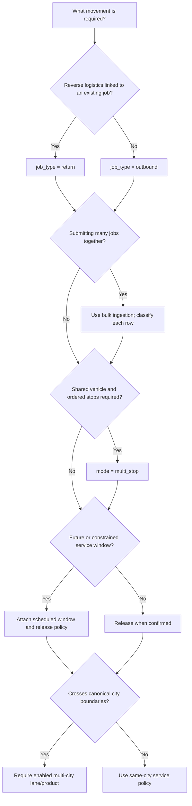

# Delivery Modes — Taxonomy and Shared Contract

**Status:** Authoritative mode taxonomy and shared behavior  
**Scope:** Selection, composition, lifecycle, data, API, event, security, finance, and rollout rules common to every delivery mode.

This document defines how delivery modes differ and interact. Mode-specific documents may add validation and orchestration, but must not weaken the shared lifecycle, tenant isolation, proof, custody, idempotency, ledger, or audit rules.

Related specifications: [Product definition](../product-definition.md), [Delivery workflows](../workflows.md), [Delivery lifecycle](../modules/05-delivery-job-lifecycle.md), [Quoting and pricing](../modules/06-quoting-pricing.md), [Dispatch and assignment](../modules/07-dispatch-assignment.md), [Exceptions and returns](../modules/12-exceptions-returns.md), and [Scheduling and routing](../modules/19-scheduling-multi-stop-routing.md).

## 1. Authoritative taxonomy

| Mode | Authoritative meaning | Unit of execution | Use when |
|---|---|---|---|
| `on_demand` | One delivery requested for dispatch as soon as it is confirmed | One independently quoted and tracked delivery | Pickup should begin as soon as eligible capacity is available |
| `scheduled` | One delivery with a committed pickup and/or delivery window | One delivery plus a timezone-safe service window and release schedule | Work must occur in a future or constrained time window |
| `bulk` | Submission mechanism that validates and creates many independent deliveries | Batch for ingestion; delivery for execution | A merchant creates many jobs together |
| `multi_stop` | One planned route containing ordered pickup/drop-off actions for one or more deliveries | Route and stop plan; each delivery remains independent | Stops share capacity and should be executed as an ordered route |
| `multi_city` | Delivery or route whose operational lane crosses canonical city boundaries | Delivery or route with an enabled inter-city product/lane | Pickup and drop-off are in different supported cities |
| `return` | Reverse-logistics job linked to an original delivery | A new independently quoted, dispatched, tracked, proved, and billed delivery | Goods must move from current custody to an approved return destination |

`bulk` is an ingestion mode, not a lifecycle. `multi_city` is a geography/product characteristic. `scheduled` is a timing characteristic. `multi_stop` is an execution topology. A `return` is a job type. These characteristics may compose as described below.

Canonical persisted values should use:

- `deliveries.mode`: `on_demand`, `scheduled`, `bulk_item`, or `multi_stop`;
- `deliveries.job_type`: `outbound` or `return`;
- `deliveries.parent_delivery_id` and lineage root for returns;
- explicit city/lane references for multi-city work;
- `batch_id`/row reference for bulk-created deliveries;
- `route_id`/stop references for route membership.

Do not encode all combinations into an expanding enum such as `scheduled_bulk_multi_city_return`. Store orthogonal characteristics separately.

## 2. Mode selection decision tree



Selection rules:

1. Choose `return` only when there is an original delivery and approved reverse movement. A corrected first delivery remains outbound.
2. Choose bulk when the concern is submission volume. Every accepted row is still classified and executed independently.
3. Choose multi-stop only when shared route order/capacity is operationally meaningful. Several unrelated on-demand jobs submitted together are bulk, not automatically a route.
4. Attach scheduling when a window constrains release or execution. A merchant's non-binding preference is not a scheduled commitment.
5. Mark multi-city only after canonical city resolution proves that the enabled lane is crossed.
6. If no modifier applies, use on-demand.
7. Unsupported combinations return a stable domain error; never degrade silently to another mode.

All limits, cutoffs, supported combinations, products, lanes, capacity policies, and automatic-selection behavior are **configurable policy values** and must be versioned, scoped, and visible to operators.

## 3. Shared lifecycle

Every delivery, including a bulk row, a route-linked delivery, and a return job, uses the authoritative lifecycle:

```text
draft
  → quoted
  → awaiting_dispatch
  → assigned
  → rider_arriving_pickup
  → picked_up
  → in_transit
  → delivered
```

Exception/terminal states are `cancelled`, `delivery_failed`, and `returned`.

Shared requirements:

- Every accepted transition atomically updates the current status/version, appends an immutable ordered status event, writes audit, and creates applicable outbox records.
- Every transition records server time, actor, optional location, and reason. Required reason/proof depends on transition policy.
- Invalid, skipped, unauthorized, duplicate-as-mutation, or stale transitions return `409` without partial effects.
- At most one active assignment exists per delivery. Assignment and route membership do not replace delivery status.
- Cancellation is allowed only before pickup under the authoritative transition matrix.
- Failure after assignment requires a reason and preserves package custody.
- A return uses a linked return job; the original reaches `returned` only through an authorized rule, normally after return completion.
- Route stop progress may request a delivery transition, but cannot invent or bypass one.

## 4. Shared data rules

Every confirmed delivery stores:

- tenant/business and optional branch references;
- `external_order_id` and immutable creator identity;
- mode, job type, lineage, and optional batch/route/stop references;
- pickup/drop-off structured address and contact snapshots;
- canonical city and selected service-zone/version references;
- package snapshots using explicit weight, quantity, and dimension units;
- accepted quote, currency, fee snapshot, pricing version, and quote assumptions;
- COD amount/method requirements where applicable;
- scheduled UTC boundaries plus original IANA timezone where applicable;
- current status/version and immutable status-event timeline;
- assignment history, tracking token, proof references, exception/attempt references;
- request, correlation, operation, and event identifiers;
- created/updated and derived lifecycle timestamps.

Money uses integer minor units and ISO 4217 currency. Distance uses meters, duration seconds, and weight grams in domain contracts. Activated zone versions, accepted quotes, finalized proof manifests, custody events, status events, and posted ledger entries are immutable.

Address, package, quote, schedule, policy, and route-constraint snapshots must remain explainable after source configuration changes. Retention periods, coordinate precision, required contacts, package limits, prohibited goods, COD limits, and snapshot detail are **configurable policy values**.

## 5. Shared API rules

Common merchant flow:

1. `POST /v1/quotes` validates serviceability, package/mode constraints, timing, route assumptions, COD, and pricing.
2. `POST /v1/deliveries` accepts a tenant-bound unexpired quote and requires `Idempotency-Key`.
3. `GET /v1/deliveries/{deliveryId}` returns the tenant-safe delivery projection and tracking URL.
4. `POST /v1/deliveries/{deliveryId}/cancel` applies cancellation policy.
5. `GET /v1/track/{token}` returns a sanitized public projection.

Mode additions:

- scheduled: service-window discovery and scheduled fields on quote/create;
- bulk: batch upload/validation/confirmation with deterministic per-row idempotency;
- multi-stop: route, stop, optimize, apply-plan, lock, assign, execute, and complete operations;
- multi-city: explicit product/lane selection and cross-city serviceability;
- return: idempotent return authorization/creation and linked-return retrieval.

All writes authenticate, resolve tenant, authorize, validate expected aggregate version, and use documented idempotency or operation IDs. Same idempotency key plus the same canonical request replays the original response; changed content returns `409`. A timeout is an unknown result and must be queried or retried with the same key.

Until an operation and schema are added to the approved OpenAPI contract, this documentation describes required capability rather than a callable public endpoint.

## 6. Shared events and webhooks

Approved merchant lifecycle events are:

- `delivery.created`
- `delivery.assigned`
- `delivery.picked_up`
- `delivery.in_transit`
- `delivery.delivered`
- `delivery.failed`
- `delivery.cancelled`
- `delivery.returned`
- `cod.collected`
- `settlement.completed`

Internal mode orchestration may emit scheduling, batch, route, stop, dispatch, proof, exception, and reconciliation events. Such events are not merchant webhooks unless explicitly approved and versioned in the webhook contract.

Shared event rules:

- domain event intent is written through the transactional outbox;
- payloads include stable event ID, event version, occurrence time, business ID, resource ID, and aggregate version;
- delivery is at least once and may be out of order;
- merchant endpoints verify HMAC over `timestamp.body`, enforce timestamp tolerance, and deduplicate by event ID;
- retries use bounded exponential backoff with jitter; exhausted attempts dead-letter and can be replayed;
- replay preserves the original event ID, payload, and version while creating a new attempt;
- endpoint timeout, retry counts, retention, replay limits, signing overlap, and accepted success codes are **configurable policy values**.

## 7. Shared security and privacy

- All merchant reads/writes are scoped by authenticated `business_id`; resource IDs never grant access.
- Cross-tenant ops access requires explicit permission and audit.
- Riders access only current offers/assignments and only data needed for the current stage.
- Public tracking tokens are high entropy, rate-limited, revocable, non-indexable, and reveal one sanitized delivery.
- Contact, package, COD, proof, exception, KYC, precise location, route, and finance data are purpose-limited and role-gated.
- Raw tracking trails, other route stops, internal notes, pricing internals, ledger accounts, risk signals, and secrets never appear in public tracking.
- Proof and identity media use private storage, encryption, malware scanning, checksums, short-lived upload/download URLs, and access audit.
- Status bodies cannot provide trusted actor, tenant, server event time, or source status.
- Logs redact secrets and unnecessary personal/location data while retaining correlation identifiers.
- Retention, consent, location disclosure, proof visibility, data residency, and legal-hold rules are **configurable policy values** subject to legal approval.

## 8. Shared finance and custody

- The accepted quote is the immutable commercial basis; overrides create explicit adjustment entries.
- Delivery fee, COD custody, merchant payable, rider/partner earnings, refunds, return charges, and settlement are separate ledger concerns.
- Every ledger posting is balanced, immutable, tenant/currency scoped, and deduplicated by source event/operation.
- Delivery status never directly edits a balance.
- COD collection records amount, currency, method, collector, assignment, time, location, proof, and operation ID before guarded completion.
- Physical cash custody and merchant payable are distinct. Every handoff is append-only and proved.
- Settlement freezes eligible entries, uses provider idempotency, reconciles final provider state, and posts compensating—not destructive—entries.
- Cancellation fees, refund eligibility, COD limits, remittance windows, netting, earnings, payout schedules, dispute holds, and return payer rules are **configurable policy values**.

## 9. Compatibility matrix

Legend: **Yes** = supported composition; **Conditional** = requires explicit product/policy and phase capability; **N/A** = same characteristic; **No** = contradictory.

| Base / characteristic | On-demand | Scheduled | Bulk | Multi-stop | Multi-city | Return |
|---|---:|---:|---:|---:|---:|---:|
| On-demand | N/A | No | Yes | Conditional | Conditional | No |
| Scheduled | No | N/A | Yes | Yes | Conditional | Yes |
| Bulk | Yes | Yes | N/A | Conditional | Conditional | Yes |
| Multi-stop | Conditional | Yes | Conditional | N/A | Conditional | Conditional |
| Multi-city | Conditional | Conditional | Conditional | Conditional | N/A | Conditional |
| Return | No | Yes | Yes | Conditional | Conditional | N/A |

Interpretation:

- A job cannot be both immediate on-demand and scheduled; “on-demand route” means an immediately released multi-stop route, not two persisted delivery modes.
- Bulk can contain mixed modes only when batch validation and confirmation expose row-level classifications, prices, and errors.
- Multi-stop may group eligible deliveries while each delivery remains independently billable, trackable, and evented.
- Multi-city requires an enabled lane, service product, pricing rule, capacity, proof/COD policy, and return path.
- Returns can be scheduled, batch-created, routed, or multi-city only when reverse-logistics policy explicitly supports that composition.
- Cross-tenant route pooling is not supported by default and requires a separately approved isolation and commercial model.

## 10. Mode interactions

### Bulk to execution

Batch processing validates all rows first, then confirms selected valid rows. Each row invokes the same quote/create service with a deterministic key derived from tenant, batch, version, and row. Batch retries replay accepted rows. Batch cancellation does not cancel created deliveries unless an explicit per-delivery cancellation command succeeds.

### Scheduled to dispatch

A confirmed scheduled delivery remains independently visible and trackable. A lease-protected scheduler emits one release command at the configured lead time. Dispatch deduplicates by delivery and schedule version. Recovery scans due unreleased work.

### Delivery to route

Route planning references delivery/stop versions and snapshots constraints. Applying a plan is explicit. A delivery belongs to at most one active route plan. Completed stops are immutable; replanning creates a new route version. Failure of one stop does not implicitly fail later stops or unrelated deliveries.

### Multi-city

Coverage resolves each endpoint to canonical cities and zones. Pricing requires an explicit inter-city rule. Dispatch requires capacity enabled for the lane. ETA/routing and returns use the same lane policy. Missing capability means unavailable, never zero-priced or same-city fallback.

### Return lineage

A return authorization creates one active linked child per configured package scope. The return has its own quote, tracking token, assignment, proof, events, ledger entries, and exceptions. Custody must be known before dispatch. Original history is never rewound.

### Reclassification

Mode is commercially material. A requested change after quote requires revalidation and normally a new quote. After confirmation, reclassification is an explicit versioned command allowed only before operational commitment and under **configurable policy**; otherwise cancel and create a new delivery. Never mutate mode after pickup.

## 11. Phased support

| Phase | Mode support |
|---|---|
| Phase 1 — Foundation | On-demand with service-zone quote stub, idempotent creation, manual owned-rider dispatch, lifecycle, status-only tracking, signed webhooks/dry run, and audit |
| Phase 2 — Reliable city operations | Production pricing, automatic owned-rider dispatch, live tracking/ETA, proof, exceptions, linked operational returns, COD ledger, and notifications |
| Phase 3 — Business integrations | Bulk ingestion, integration portal, webhook logs/replay, commerce plugins, branded tracking, postpaid presentation, and merchant return requests |
| Phase 4 — Scale modes | Scheduled windows, multi-stop routes/optimization, multi-city products, partner fleet, advanced returns, and settlement automation |

Phase gates are capability gates. An environment exposes a mode only when its required APIs, UI, workers, policies, observability, finance treatment, support playbook, and test suite are enabled. Feature flags are tenant/city/product scoped and audited. Partial support must be labeled and rejected outside its declared envelope.

## 12. Cross-links

Mode documents:

- [On-demand delivery](./01-on-demand.md)
- [Scheduled delivery](./02-scheduled.md)
- [Bulk delivery](./03-bulk.md)
- [Multi-stop/routes](./04-multi-stop-routes.md)
- [Multi-city delivery](./05-multi-city.md)
- [Returns](./06-returns.md)
- [Cross-mode rules and testing](./07-cross-mode-rules-and-testing.md)
- [Mode API contracts](./08-mode-api-contracts.md)

Core references:

- [Product definition](../product-definition.md)
- [Delivery workflows](../workflows.md)
- [Cities and service zones](../modules/04-cities-service-zones.md)
- [Delivery lifecycle](../modules/05-delivery-job-lifecycle.md)
- [Quoting and pricing](../modules/06-quoting-pricing.md)
- [Dispatch and assignment](../modules/07-dispatch-assignment.md)
- [Rider fleet management](../modules/08-rider-fleet-management.md)
- [Live tracking and ETA](../modules/10-live-tracking-eta.md)
- [Proof of pickup and delivery](../modules/11-proof-of-pickup-delivery.md)
- [Exceptions and returns](../modules/12-exceptions-returns.md)
- [Scheduling and multi-stop routing](../modules/19-scheduling-multi-stop-routing.md)

## 13. Shared acceptance criteria

- Every accepted job has exactly one authoritative delivery lifecycle regardless of ingestion, timing, geography, route, or return lineage.
- Mode selection is deterministic, persisted as orthogonal characteristics, and explained by machine-readable validation.
- Unsupported combinations fail before creation and never fall back silently.
- Quote assumptions, mode, schedule, lane, package, COD, and route-impacting fields are bound against delivery creation.
- Retries cannot duplicate deliveries, batch rows, routes, assignments, proofs, custody records, events, or ledger entries.
- Tenant isolation and audience-specific privacy hold across every mode and interaction.
- Each delivery remains independently addressable, trackable, billable, evented, and reconcilable even when grouped in a batch or route.
- Returns preserve original history and execute through separately tracked linked jobs.
- Configurable policy values are versioned, scoped, audited, and snapshotted where they affect an accepted promise.
- A mode is enabled only after its operational, security, finance, observability, and recovery requirements are implemented and tested.
