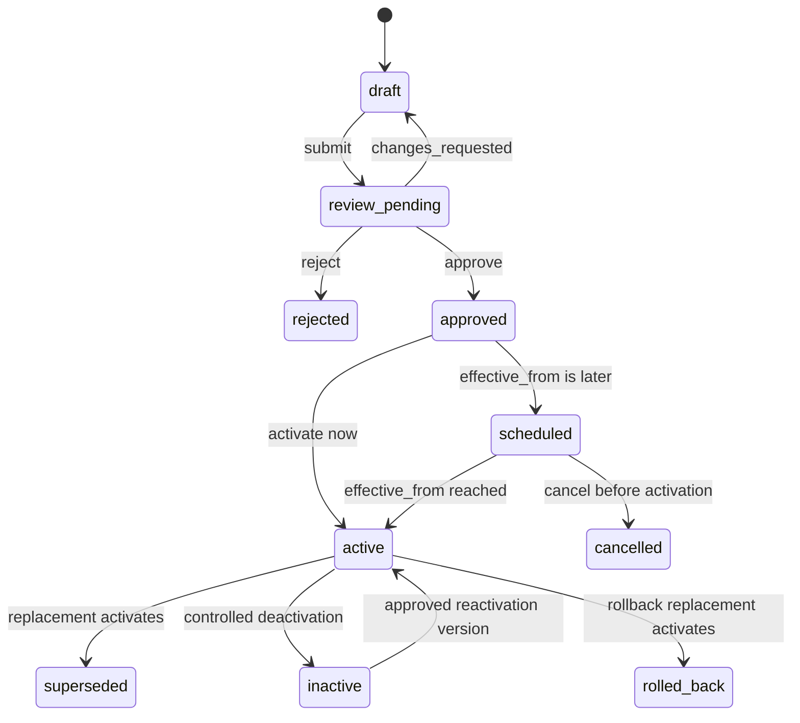
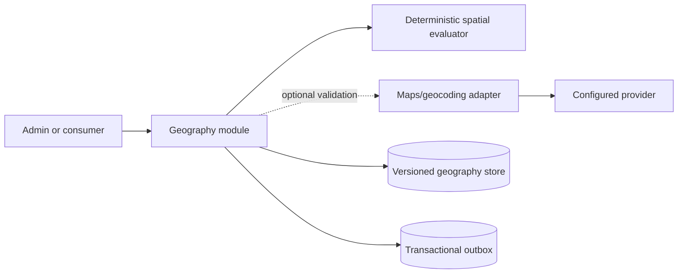

# Module 04 — Cities and Service Zones

**Status:** Phase 1 authoritative implementation specification  
**Scope:** Complete Phase 1 city, service-geography, coverage-evaluation, administration, and integration capability  
**Normative conventions:** [Delivery documentation conventions](../documentation-conventions.md)

## 1. Purpose

This module owns the platform's canonical operational geography and answers, deterministically and explainably, whether a coordinate is eligible for a requested delivery endpoint, product, capability, and evaluation time.

Cities, city aliases, and service zones are platform-managed shared reference data. They are not merchant tenants and do not acquire a `business_id`. Tenant isolation still applies to every merchant request that consumes this data: callers may evaluate only in an authorized business workflow, and results must not expose another business's configuration, activity, or decisions.

Phase 1 includes the complete geography capability described here: canonical city hierarchy, aliases, operational readiness, polygon and multipolygon geometry with holes and exclusions, radius and bounding-box shapes, immutable versioning, review and approval, effective dating, deterministic evaluation, bulk and preview tooling, administration UI, integration contracts, caching, events, audit, migration, and recovery.

## 2. Goals and invariants

The implementation must:

- maintain one canonical identifier for each platform-recognized city while supporting localized names and aliases;
- represent service areas with GeoJSON polygons, multipolygons, holes, exclusion zones, circles, and bounding boxes in WGS84;
- produce the same result for the same normalized request and immutable configuration snapshot;
- resolve overlap, exclusions, boundaries, city mismatches, product eligibility, and endpoint policy without relying on database row order;
- make every decision explainable by city, zone, version, policy version, reason code, and evaluation trace;
- preserve published and effective history; no edit, rollback, deactivation, or import may destroy historical facts;
- let branches, quotes, deliveries, dispatch, batch, scheduled, multi-stop, return, and multi-city workflows pin the geography decisions they used;
- fail closed when authoritative geography cannot be evaluated safely;
- make operational thresholds and commercial policy explicit configuration, never undocumented constants; and
- support safe administration with validation, preview, diff, maker-checker approval, optimistic concurrency, audit, and recovery.

### 2.1 Platform truths

- A city and zone are platform resources. Merchant users and API keys cannot create, modify, publish, activate, or deactivate them.
- A coverage match establishes geographic eligibility only. It does not establish price, capacity, dispatchability, route feasibility, legal permission, partner availability, or an SLA.
- The delivery lifecycle in [Module 05](./05-delivery-job-lifecycle.md) remains authoritative. A geography change never rewrites or automatically transitions an existing delivery.
- Pricing remains owned by [Module 06](./06-quoting-pricing.md). This module returns eligible product/capability context and stable zone references but does not calculate fees.
- Published decisions are immutable and effective-dated. Corrections use superseding versions.
- Supported cities, policies, precision, limits, approval requirements, and numeric thresholds are **Configurable** and require approved values.

## 3. Responsibilities and non-responsibilities

### 3.1 Responsibilities

- Own canonical countries/regions/cities as operational references, city hierarchy links, city aliases, localized display names, timezone, and operational readiness.
- Own stable logical service zones, immutable zone versions, geometry, inclusion/exclusion intent, endpoint applicability, overlap precedence, and product/capability associations.
- Validate, normalize, checksum, preview, publish, schedule, activate, supersede, deactivate, and roll back geography versions.
- Resolve an explicit city ID or approved alias and detect city/coordinate disagreement.
- Evaluate one point or a bounded batch at a requested time against one consistent configuration watermark.
- Return a minimal consumer result and a privileged explainability trace.
- Provide geography snapshots and references to branches, quotes, deliveries, routes, returns, and dispatch.
- Publish internal configuration events through a transactional outbox.
- Maintain audit, diagnostics, import/export, cache invalidation, observability, and recovery procedures.

### 3.2 Non-responsibilities

- Geocoding free-form addresses, reverse-geocoding a point, map tile hosting, route distance/duration, ETA, or route optimization.
- Pricing, surcharges, taxes, product catalog ownership, capacity reservation, rider availability, partner contracts, or fleet assignment.
- Tenant ownership, merchant authorization policy, delivery lifecycle transitions, or address/contact ownership.
- Defining launch markets, operating hours, regulatory conclusions, or numeric limits. This module enforces approved configuration supplied by the owning operational or policy authority.
- Treating postal city text, postal codes, map-provider place IDs, or nearest-city distance as authoritative coverage.

## 4. Terminology

| Term | Definition |
|---|---|
| Canonical city | Stable platform identity for an operational city or market, independent of display name. |
| City version | Immutable, effective-dated city metadata and readiness configuration. |
| Alias | Normalized alternate label mapped to one canonical city within a locale/country/region scope. |
| Logical zone | Stable zone identity used across versions. |
| Zone version | Immutable geometry and policy snapshot for one logical zone. |
| Inclusion zone | Shape that can grant eligibility when all other predicates pass. |
| Exclusion zone | Shape that denies eligibility for its configured scope, even inside an inclusion zone. |
| Zone purpose | Operational intent such as general coverage, pickup, dropoff, dispatch, return, depot, or transfer. |
| Endpoint policy | Versioned rules specifying which endpoint roles must match which zone purposes. |
| Configuration watermark | Identifier/checksum of the complete city/zone/policy snapshot used by an evaluation. |
| Boundary rule | Configured, versioned treatment of a point on a shape edge and precision tolerance. |
| Coverage decision | Immutable result and trace references produced for a consumer workflow. |
| Operational readiness | Explicit gates that determine whether a city may serve a product/capability at an evaluation time. |

## 5. Actors, RBAC, and scope

Permissions are action-specific and may be constrained by assigned country, region, or city. Possessing a broad platform role is not sufficient without the corresponding permission.

| Capability | Platform geography admin | Geography reviewer | Operations admin | Ops dispatcher | Auditor/support | Merchant roles/API keys | Rider | Public visitor |
|---|---:|---:|---:|---:|---:|---:|---:|---:|
| Read canonical city metadata | Yes | Yes | Yes | Assigned scope | Yes | Workflow-safe subset | Assigned-job subset | No |
| Read raw/current geometry | Yes | Yes | Assigned scope | Diagnostic subset | Yes | No | No | No |
| Create city/zone draft | `geography.draft.write` | No | Configurable | No | No | No | No | No |
| Edit draft/import geometry | `geography.draft.write` | No | Configurable | No | No | No | No | No |
| Submit for review | `geography.review.submit` | No | Configurable | No | No | No | No | No | No |
| Approve/reject | No self-approval | `geography.review.decide` | Configurable, distinct actor | No | No | No | No | No |
| Schedule/activate/supersede | `geography.publish.execute` | No | Configurable | No | No | No | No | No |
| Emergency deactivate | Explicit emergency permission | No | Explicit emergency permission | No | No | No | No | No |
| Preview/simulate/diff | Yes | Yes | Yes | Assigned scope | Read-only | No raw trace | No | No |
| Evaluate through business workflow | Yes | Yes | Yes | Yes | Yes | Authorized own tenant | Assigned job only | No |
| Export | Explicit export permission | Configurable | Configurable | No | Audit-safe | No | No | No |
| Read audit/history | Yes | Yes | Yes | Assigned subset | Yes | No | No | No |

High-risk actions—publishing broad geometry, changing exclusions or endpoint policy, activating a city, emergency deactivation, and rollback—must support step-up authentication, a reason, a change/ticket reference, impact preview, and maker-checker approval according to configurable risk rules. The maker cannot approve their own change.

## 6. Canonical city model

### 6.1 Hierarchy and identity

The canonical hierarchy is:

```text
country → region/subdivision (optional) → canonical city → service zones
```

- Country uses an ISO 3166-1 alpha-2 code.
- Region uses the applicable ISO 3166-2 code when available; a platform canonical subdivision code may be used when the source standard does not represent the required operational area.
- A city has one stable opaque ID and a stable machine-readable key. Names are attributes, not identity.
- Parent/related-city links may model metropolitan or operational relationships, but must not imply containment unless an approved geometry or hierarchy rule says so.
- A service zone belongs to exactly one canonical city. A multi-city movement evaluates each endpoint in its own city and then relies on the lane/capability owner.

### 6.2 Names, aliases, and locale

Each city version contains a default display name and localized names keyed by valid BCP 47 locale. `city_aliases` support historical spellings, transliterations, abbreviations, alternate languages, and approved provider labels.

Alias normalization must be deterministic and versioned:

1. apply Unicode normalization;
2. trim and collapse whitespace;
3. apply locale-aware case normalization;
4. normalize approved punctuation variants;
5. do not silently remove semantically meaningful characters; and
6. scope lookup by country and, when supplied, region and locale.

An alias may resolve to only one active canonical city in the same lookup scope and effective interval. Ambiguous input returns `AMBIGUOUS_CITY`; the service must not choose the nearest or most popular city. Provider place IDs are stored as namespaced external references and cannot bypass canonical resolution.

### 6.3 Locale, timezone, and jurisdiction facts

| Attribute | Rule |
|---|---|
| `default_locale` | Valid BCP 47 tag; used only for display fallback. |
| `timezone` | Valid IANA timezone; immutable within a published city version. |
| `country_code` | Required ISO code. |
| `region_code` | Nullable canonical subdivision code. |
| `currency_codes` | Reference facts consumed by product/pricing validation; not price ownership. |
| `center` / `viewport` | Display hints only; never grant coverage. |
| `jurisdiction_profile_ref` | Optional reference to approved policy; this module makes no legal conclusion. |

APIs use UTC instants. Administrative UI renders effective dates in the city's IANA timezone and shows the UTC equivalent, including daylight-saving ambiguity validation.

### 6.4 City lifecycle and operational readiness

A logical city has an administrative state; each published city version has an effective lifecycle.



`active` means administratively effective, not automatically ready for every product. Readiness is computed from versioned gates:

- city is active at `evaluation_at`;
- at least one applicable active inclusion zone exists;
- endpoint policy exists;
- requested product/capability association is enabled;
- required dependencies identified by policy—such as pricing, fleet, lane, calendar, or compliance references—report ready;
- no emergency suspension blocks the requested scope.

Readiness returns per-product/capability status and reasons. It is never represented by one lossy boolean when multiple gates differ.

Deactivation blocks new decisions according to the configured quote-honor and in-flight policy. It does not cancel deliveries, remove snapshots, or rewrite history.

## 7. Service zone model

### 7.1 Shape types

Phase 1 supports:

- GeoJSON `Polygon`;
- GeoJSON `MultiPolygon`;
- interior polygon rings representing holes;
- exclusion zones represented as explicit zone records and/or holes;
- geodesic `radius` shapes defined by WGS84 center and meters; and
- `bounding_box` shapes, including explicitly represented antimeridian crossing.

Every shape is normalized to an internal spatial representation suitable for indexed predicates. Original validated input and canonical normalized GeoJSON are retained for audit and export.

### 7.2 Zone kinds and purposes

| Dimension | Values and semantics |
|---|---|
| `kind` | `inclusion` grants eligibility; `exclusion` denies eligibility within matching scope. |
| `purpose` | `general`, `pickup`, `dropoff`, `dispatch`, `return`, `depot`, `transfer`, or another schema-approved purpose. |
| `endpoint_roles` | Set of endpoint roles to which the version applies. |
| `product_refs` | Products eligible to consume the zone; empty/all semantics must be explicit. |
| `capability_refs` | Capabilities such as on-demand, scheduled, bulk, multi-stop, multi-city endpoint, or return. |
| `subject_scope` | Platform default or approved tenant/product allow/deny association; zone ownership remains platform-level. |
| `priority` | Integer precedence; lower numeric value wins among otherwise eligible inclusion matches. |

Associations enable eligibility only; they do not own pricing, capacity, lane configuration, dispatch policy, or product definitions. A missing required association is a denial with a specific reason, not an inferred default.

### 7.3 Coordinate reference system and axis order

- External geometry and points must use GeoJSON longitude/latitude axis order in WGS84 (`OGC:CRS84`, coordinates `[longitude, latitude]`).
- Latitude must be within `[-90, 90]`; longitude is normalized under the configured canonical representation compatible with `[-180, 180]`.
- GeoJSON's deprecated `crs` member is rejected. Imports declaring another CRS must be transformed by an approved, version-pinned import adapter before this module validates them.
- Distances and area tie-break values use a documented geodesic method on WGS84, identified by `evaluator_version`.
- Storage types must declare SRID 4326 where the database supports it. Geometry/geography conversion must be deliberate and tested.

### 7.4 Geometry validation and normalization

Before a draft can be submitted:

1. parse with a size-, depth-, coordinate-count-, and time-bounded parser;
2. reject non-finite numbers, malformed arrays, unsupported members/types, mixed CRS, empty shapes, duplicate unusable rings, and coordinates outside allowed ranges;
3. close rings if and only if configured import policy permits safe canonical closure; otherwise reject;
4. require each ring to have enough distinct vertices;
5. validate ring orientation and normalize to the canonical orientation;
6. reject self-intersections, invalid nesting, bow ties, spikes below configured tolerance, degenerate rings, zero-area components, and holes outside their owning shell;
7. define how touching rings/components are accepted or rejected under the selected spatial engine;
8. normalize longitude and antimeridian representation without changing the covered surface;
9. remove only configured redundant precision/vertices using a deterministic algorithm; preserve the original input;
10. canonicalize member order, coordinate precision, ring start points, component ordering, and serialization;
11. calculate geodesic area, envelope(s), centroid/display point, complexity statistics, and checksum;
12. compare with city bounds and configured maximum extent, allowing an explicit reviewed exception rather than silent clipping;
13. run overlap/exclusion diagnostics against effective and scheduled versions; and
14. record validator library/version, ruleset version, warnings, errors, and normalized checksum.

Automatic “repair” must not materially alter coverage without showing a before/after diff and requiring explicit acceptance. Invalid production geometry must never be made valid by an opaque database function.

### 7.5 Precision and boundary semantics

Precision policy is immutable and versioned. It defines:

- accepted input decimal precision;
- canonical stored precision;
- spatial-engine predicate and version;
- geodesic algorithm;
- boundary tolerance, if any;
- radius distance comparison;
- polygon/hole edge behavior; and
- batch ordering and result stability.

Recommended semantic default, subject to approval:

- outer inclusion boundaries are included;
- hole and explicit exclusion boundaries are excluded;
- radius boundary is included when distance is equal within the configured numeric policy;
- a point on both an inclusion and exclusion boundary is excluded;
- no arbitrary coordinate “jitter” is added.

The response includes `boundary_relation` as `inside`, `boundary`, `outside`, or `indeterminate`. `indeterminate` fails closed.

### 7.6 Antimeridian and poles

- Polygon and multipolygon normalization must detect segments crossing the antimeridian and split or unwrap them using one documented canonical method.
- Bounding boxes represent antimeridian crossing with an explicit boolean or normalized two-envelope representation; `west > east` must not be interpreted inconsistently.
- Spatial indexes may store two envelopes for an antimeridian-spanning shape.
- Area calculation, containment, visualization, import/export round-trip, and overlap diagnostics must use the same crossing semantics.
- Shapes approaching a pole require explicit validator support and diagnostic review. If the selected spatial stack cannot evaluate a shape deterministically, publication is rejected; runtime must not approximate it.

## 8. Deterministic overlap and endpoint policy

### 8.1 Predicate order

For each endpoint, eligibility predicates are applied in this order:

1. canonical city resolution;
2. city effective state and readiness;
3. configuration watermark selection;
4. active/effective version filtering;
5. subject, product, capability, and endpoint-role filtering;
6. coarse spatial-index candidate filtering;
7. exact containment and boundary evaluation;
8. matching exclusion application;
9. inclusion precedence; and
10. endpoint-policy aggregation across pickup, dropoff, stops, depot, transfer, or return endpoint roles.

### 8.2 Exclusions

An exclusion denies a point only when its city, effective interval, subject scope, product/capability, and endpoint role match the request. Applicable exclusions take precedence over all inclusions. Exclusion priority cannot be used to bypass a matching exclusion.

An exclusion may be overridden only by an explicit, separately permissioned policy relation that is validated and shown in the explainability trace. Absence of such a relation means deny.

### 8.3 Inclusion precedence

When multiple eligible inclusion versions contain the point:

1. lowest numeric `priority`;
2. most specific subject/product/capability/endpoint scope, using the versioned specificity order;
3. smallest canonical geodesic covered area;
4. stable logical `zone_id` lexical order; then
5. immutable `zone_version_id` lexical order.

Equal priorities are allowed only because all remaining tie-breakers are explicit. Publish diagnostics must still flag potentially accidental overlaps. No result may depend on insertion order, planner choice, cache order, or map-rendering order.

### 8.4 Endpoint policies

Endpoint policy is versioned and identifies:

- required roles for a workflow;
- accepted zone purposes per role;
- whether endpoints may use different cities/zones;
- product/capability and lane prerequisites;
- handling of intermediate stops;
- handling of return origin/destination;
- quote-to-confirmation revalidation and quote-honor semantics; and
- response behavior for partially covered batches.

The on-demand baseline normally evaluates pickup and dropoff, but the schema and evaluator accept all documented endpoint roles. No mode may bypass the same city/zone invariants.

## 9. Versioning, approval, and effective dating

### 9.1 Immutability

- Logical city and zone identities are stable.
- Every submitted revision receives a new immutable version ID and canonical checksum.
- A draft may have a mutable editor workspace, but each save that is submitted, reviewed, compared, or referenced is captured as an immutable draft revision.
- Approved, scheduled, active, superseded, inactive, rejected, cancelled, and rollback versions are append-only.
- Metadata corrections create a superseding version or append-only annotation; they do not edit a published row.
- Hard deletion is prohibited for referenced or submitted records.

### 9.2 State transitions

| From | To | Required conditions |
|---|---|---|
| `draft` | `review_pending` | Validation passes; impact report and checksum frozen. |
| `review_pending` | `draft` | Reviewer requests changes; new draft revision required. |
| `review_pending` | `approved` | Distinct authorized approver; checksum unchanged. |
| `review_pending` | `rejected` | Reason required. |
| `approved` | `scheduled` | An unambiguous `effective_from` after the approval instant; dependency checks pass. |
| `approved` | `active` | Immediate activation transaction succeeds. |
| `scheduled` | `active` | Scheduler claims version idempotently at effective instant. |
| `scheduled` | `cancelled` | Before activation; reason and audit required. |
| `active` | `superseded` | Approved replacement activates atomically. |
| `active` | `inactive` | Controlled deactivation policy passes. |
| `active` | `rolled_back` | A new rollback version activates from an approved historical source. |
| `inactive` | `active` | New approved reactivation version; never mutate old interval. |

Rollback means creating and activating a new version whose content is copied from a previously validated version, with a new ID, effective time, actor, reason, and checksum lineage. It does not reopen the historical row.

### 9.3 Effective windows

- `effective_from` is inclusive; `effective_to` is exclusive.
- Windows are UTC instants and are rendered with city timezone context.
- Two active/effective versions of one logical city or zone must not overlap.
- Replacement activation closes the predecessor at exactly the successor's `effective_from` in the same transaction.
- Evaluation by historical `evaluation_at` uses the configuration effective at that instant unless the caller supplies an authorized pinned watermark.
- Scheduled activation re-runs dependency and conflict checks; approval alone does not guarantee activation after intervening changes.

### 9.4 Optimistic concurrency and idempotency

- Draft writes require `If-Match` with a strong ETag derived from aggregate revision and content checksum.
- A stale ETag returns `412 PRECONDITION_FAILED` with current ETag and safe conflict metadata.
- State transitions require expected state/version and return `409 INVALID_STATE_TRANSITION` on races.
- Every administrative write requires an `Idempotency-Key`, scoped to actor/action/target. Same key and same canonical request replays the result; same key with different content returns `409 IDEMPOTENCY_KEY_REUSED`.
- Activation locks the logical city/zone and affected effective window or uses equivalent serializable conflict protection.

## 10. Physical data model

Names are logical and may be adapted to the selected database, but constraints and semantics are mandatory.

### 10.1 `cities`

| Field | Constraint |
|---|---|
| `id` | UUID primary key. |
| `key` | Stable normalized key, globally unique. |
| `administrative_state` | `active`, `inactive`, `archived`; archive is non-destructive. |
| `current_version_id` | Nullable FK to effective city version; transactionally maintained projection. |
| `created_at`, `created_by_actor_id` | Required. |
| `row_version` | Positive monotonic integer. |

### 10.2 `city_versions`

| Field | Constraint |
|---|---|
| `id`, `city_id` | UUID PK; required FK. |
| `version_number` | Positive integer; unique with `city_id`. |
| `state` | Version lifecycle enum. |
| `default_name`, `localized_names` | Required default; localized map schema-validated. |
| `country_code`, `region_code` | Required/nullable canonical codes. |
| `timezone`, `default_locale` | Valid IANA/BCP 47 values. |
| `parent_city_id` | Nullable, cannot create a hierarchy cycle. |
| `display_center`, `display_viewport` | Nullable WGS84 map hints. |
| `readiness_policy_version_id` | Required before activation. |
| `effective_from`, `effective_to` | Required by lifecycle; ordered half-open interval. |
| `content_checksum`, `schema_version` | Required and immutable after submission. |
| `source`, `source_ref` | Manual/import/bootstrap provenance. |
| `created_by`, `submitted_by`, `approved_by`, timestamps | Actor pairs required when corresponding transition occurred; maker differs from approver where required. |
| `supersedes_version_id`, `rollback_of_version_id` | Nullable lineage FKs. |

### 10.3 `city_aliases`

| Field | Constraint |
|---|---|
| `id`, `city_version_id` | Required. |
| `alias`, `normalized_alias` | Original and deterministic normalized value. |
| `locale`, `country_code`, `region_code` | Lookup scope. |
| `alias_type` | `official`, `alternate`, `historical`, `transliteration`, `abbreviation`, `provider`. |
| `provider_namespace`, `provider_place_id` | Both null or both set; unique in namespace/effective interval. |
| `effective_from`, `effective_to` | Half-open interval. |

Prevent overlapping effective aliases that map the same normalized lookup scope to different cities.

### 10.4 `service_zones`

| Field | Constraint |
|---|---|
| `id` | UUID primary key; stable logical identity. |
| `city_id` | Required FK. |
| `key` | Unique within city. |
| `administrative_state` | `active`, `inactive`, `archived`. |
| `current_version_id` | Nullable effective projection. |
| `created_at`, `created_by_actor_id`, `row_version` | Required. |

### 10.5 `service_zone_versions`

| Field | Constraint |
|---|---|
| `id`, `service_zone_id`, `city_id` | Required; city must equal logical zone city. |
| `version_number`, `state` | Positive unique version and lifecycle enum. |
| `name`, `description` | Required name; length-limited safe text. |
| `kind`, `purpose`, `endpoint_roles` | Schema-approved values. |
| `geometry_type` | `polygon`, `multipolygon`, `radius`, `bounding_box`. |
| `geometry` | Valid normalized SRID 4326 geometry; non-empty. |
| `canonical_geojson` | Valid canonical representation. |
| `original_input_ref` | Immutable object/blob reference with provenance. |
| `center`, `radius_meters` | Both present only for radius; positive configured bounds. |
| `bbox_south/north/west/east`, `crosses_antimeridian` | Present only for bounding box; normalized checks. |
| `priority` | Required integer. |
| `area_square_meters`, `envelopes`, `complexity` | Deterministically derived. |
| `precision_policy_version_id`, `endpoint_policy_version_id` | Required before activation. |
| `effective_from`, `effective_to` | Valid half-open interval. |
| `content_checksum`, `geometry_checksum`, `schema_version`, `evaluator_version` | Required. |
| `validation_report_id`, `impact_report_id` | Required before approval. |
| actor/timestamp and lineage fields | Same controls as city versions. |

Database checks enforce shape-specific fields, coordinate ranges, finite values, effective ordering, immutable published columns, and allowed transitions.

### 10.6 Associations and policies

- `zone_product_capabilities`: zone version, product ID, capability key, endpoint role, enable/deny effect, optional subject scope, effective interval.
- `zone_exclusion_relations`: inclusion version, exclusion version, optional explicit override relation, matching scope.
- `city_readiness_policy_versions`: immutable dependency/gate definitions and product/capability results.
- `endpoint_policy_versions`: immutable endpoint aggregation and quote-honor rules.
- `precision_policy_versions`: immutable spatial numeric and boundary semantics.

References are foreign keys when data shares a transaction boundary; otherwise use validated opaque IDs plus owner/version and dependency-check evidence.

### 10.7 Evaluations and snapshots

`coverage_decisions` records:

- decision ID, consumer type/ID, authorized `business_id` where applicable;
- endpoint role, normalized coordinate hash or encrypted/retention-controlled coordinates;
- supplied and resolved city identifiers;
- city version, selected zone/version, matched exclusion/version;
- product, capability, endpoint-policy version, precision-policy version;
- evaluation time, configuration watermark, evaluator version;
- serviceable boolean, stable reason code, boundary relation;
- trace hash, request/correlation ID, created time; and
- optional full privileged trace reference subject to retention policy.

Branch records may cache the current selected zone, but must store decision/version/watermark and revalidate on address change, reactivation, and use according to policy. Quotes and deliveries store immutable endpoint snapshots as required by [Modules 05](./05-delivery-job-lifecycle.md) and [06](./06-quoting-pricing.md). Historical reads never reconstruct a decision from current geometry.

### 10.8 Indexes and integrity

Required indexes include:

- unique `cities(key)`;
- unique `city_versions(city_id, version_number)`;
- effective-window exclusion constraint for published versions of one city;
- alias lookup on `(country_code, region_code, locale, normalized_alias)` with effective interval;
- unique `service_zones(city_id, key)`;
- unique `service_zone_versions(service_zone_id, version_number)`;
- effective-window exclusion constraint for published versions of one logical zone;
- GiST/SP-GiST or equivalent spatial index on normalized geometry/envelopes;
- candidate index on `(city_id, state, effective_from, effective_to, kind, purpose, priority)`;
- association index on product/capability/endpoint/effective interval;
- checksum indexes for deduplication and cache lookup;
- decision indexes on consumer ID, business ID, city/zone version, reason, and created time; and
- outbox indexes on publication state and next-attempt time.

The database must prevent cross-city zone references, overlapping logical-version windows, broken lineage, and mutation of immutable rows. Application validation alone is insufficient.

## 11. Coverage evaluation

### 11.1 Request

A coverage request contains:

- point `{lat, lng}`;
- `evaluation_at` or server current time;
- endpoint role;
- product and capability;
- explicit `city_id` when known;
- optional city label plus country/region/locale hints;
- authorized business/subject scope;
- optional pinned configuration watermark for an authorized historical/replay workflow; and
- trace level authorized for the caller.

### 11.2 City resolution and mismatch behavior

1. If `city_id` is supplied, load that city; a text label is only a consistency hint.
2. If no `city_id` is supplied, resolve an alias only when its scoped mapping is unique.
3. Never infer a city from nearest center, viewport, postal text, or first zone match.
4. Evaluate the point against the resolved city's applicable geometry.
5. If the point is covered only by another city:
   - merchant workflow returns `CITY_COORDINATE_MISMATCH` without disclosing hidden city details;
   - privileged internal trace may identify candidate city IDs;
   - do not silently replace the explicit city.
6. If no canonical city can be resolved, return `CITY_NOT_RESOLVED` or `AMBIGUOUS_CITY`.
7. Multi-city requests resolve every endpoint independently, then pass canonical city/version results to the lane/capability owner.

### 11.3 Pseudocode

```text
evaluateCoverage(request):
  validateCoordinateAndRequest(request)
  at = request.evaluation_at ?? authoritativeServerTime()

  snapshot = loadOneConsistentConfigurationSnapshot(at, request.watermark)
  if snapshot unavailable:
    return deny(CONFIGURATION_UNAVAILABLE)

  cityResolution = resolveCanonicalCity(
    request.city_id,
    request.city_label,
    request.country_code,
    request.region_code,
    request.locale,
    snapshot
  )
  if cityResolution is not unique:
    return deny(cityResolution.reason)

  city = cityResolution.city
  if not city.isActiveAt(at):
    return deny(CITY_INACTIVE, city.version)

  readiness = evaluateReadiness(
    city, request.product, request.capability, request.endpoint_role, at, snapshot
  )
  if not readiness.ready:
    return deny(readiness.reason, city.version, readiness.policy_version)

  candidates = spatialIndexCandidates(
    city.id, request.point, request.product, request.capability,
    request.endpoint_role, at, snapshot
  )

  exactMatches = []
  for candidate in stableSort(candidates):
    relation = exactSpatialRelation(
      candidate.normalized_geometry,
      request.point,
      candidate.precision_policy
    )
    if relation is INDETERMINATE:
      return deny(SPATIAL_EVALUATION_INDETERMINATE)
    if relation satisfies candidate.boundary_rule:
      exactMatches.append(candidate with relation)

  exclusions = exactMatches where kind == EXCLUSION and scopeApplies(request)
  if exclusions is not empty:
    selectedExclusion = deterministicExclusionOrder(exclusions).first
    return deny(EXCLUDED_AREA, city.version, selectedExclusion, trace)

  inclusions = exactMatches where kind == INCLUSION and allEligibilityPredicatesPass
  if inclusions is empty:
    if privilegedCrossCityDiagnosticFindsMatch(request.point, at, snapshot):
      return deny(CITY_COORDINATE_MISMATCH, city.version, trace)
    return deny(OUTSIDE_SERVICE_AREA, city.version, trace)

  selected = sort(
    inclusions,
    priority ASC,
    specificity DESC,
    canonical_area ASC,
    zone_id ASC,
    zone_version_id ASC
  ).first

  return allow(
    city.version,
    selected,
    matched=inclusions,
    policy_versions,
    snapshot.watermark,
    evaluator_version,
    trace
  )
```

Candidate order cannot affect exact results. An indexed query and a full scan over the same snapshot must be property-test equivalent.

### 11.4 Result

```json
{
  "decisionId": "4ca7b9ec-6764-4b9f-a7b1-f3bdf0fb1cf5",
  "serviceable": true,
  "reasonCode": "COVERED",
  "city": {
    "id": "89137f67-cc31-4510-9f0f-070de678707d",
    "version": 7
  },
  "zone": {
    "id": "2fd0911a-d957-469f-b6ea-1090d4d6b116",
    "version": 12,
    "purpose": "general"
  },
  "boundaryRelation": "inside",
  "configurationWatermark": "geo_01J...",
  "evaluatedAt": "2026-07-18T12:00:00Z"
}
```

The minimal response omits raw geometry, other matches, exclusions, internal readiness details, and cross-tenant facts.

### 11.5 Explainability trace

Privileged traces contain:

- normalized input and city-resolution path;
- snapshot watermark and database/cache source;
- candidate counts before and after each filter;
- all matched zone/version IDs;
- exact relation and boundary policy per match;
- applicable exclusion and association predicates;
- precedence tuple for each inclusion;
- readiness and endpoint-policy results;
- evaluator/validator/spatial-library versions; and
- final reason.

Traces are deterministic, correlation-addressable, privacy-controlled, and protected from unrestricted coordinate enumeration.

### 11.6 Point and batch semantics

- Point evaluation is side-effect-free except for configured decision/audit recording.
- Batch evaluation runs against one pinned watermark and returns results in input order with a client row key.
- Batch size, coordinate complexity, timeout, concurrency, and retention are configurable.
- A malformed batch envelope returns request-level `400`; valid rows with domain failures receive row-level results.
- If snapshot consistency is lost, do not mix versions: fail or restart the bounded batch according to internal retry policy.
- Imports and bulk delivery validation consume the same evaluator, not a duplicate spatial implementation.

## 12. API and interface contracts

The paths and schemas in this section are **proposed restricted/internal contracts** required by the admin and platform workflows. They are not asserted to exist in [`openapi.yaml`](../openapi.yaml). Before implementation or external exposure, align the authoritative OpenAPI and [contracts](../contracts.md), including security schemes, standard errors, and schemas.

### 12.1 Existing public workflow integration

| Contracted path | Geography behavior |
|---|---|
| `POST /v1/quotes` | Resolve and evaluate all required endpoints; return tenant-safe eligibility or stable domain errors; persist/pin coverage references. |
| `POST /v1/deliveries` | Revalidate or honor the referenced quote exactly as configured; persist immutable city/zone/policy snapshots. |
| `POST /v1/businesses/{businessId}/branches` | Resolve city and evaluate branch point under branch endpoint policy. |

These public workflows do not expose raw zone geometry or general-purpose coordinate probing.

### 12.2 Proposed internal consumer operations

| Method/path | Purpose |
|---|---|
| `POST /internal/v1/geography/coverage:evaluate` | Evaluate one point. |
| `POST /internal/v1/geography/coverage:evaluateBatch` | Evaluate a bounded batch at one watermark. |
| `GET /internal/v1/geography/cities/{cityId}/readiness` | Product/capability readiness and reasons. |
| `GET /internal/v1/geography/decisions/{decisionId}` | Authorized explainability trace. |

Service-to-service authentication, caller identity, business scope, purpose, product/capability, endpoint role, and correlation ID are mandatory. Internal status does not waive tenant or data-minimization checks.

### 12.3 Proposed admin operations

| Method/path | Purpose |
|---|---|
| `GET /v1/admin/cities` | Filtered, paginated list with readiness and version state. |
| `POST /v1/admin/cities` | Create logical city and initial draft. |
| `GET /v1/admin/cities/{cityId}` | Detail, aliases, readiness, effective/scheduled versions. |
| `POST /v1/admin/cities/{cityId}/versions` | Create city draft version. |
| `GET /v1/admin/cities/{cityId}/versions` | Cursor-paginated immutable history. |
| `POST /v1/admin/cities/{cityId}/versions/{versionId}:submit` | Freeze and submit. |
| `POST .../{versionId}:approve` / `:reject` | Review decision. |
| `POST .../{versionId}:schedule` / `:activate` | Publish at time/now. |
| `POST .../{versionId}:deactivate` / `:rollback` | Controlled replacement action. |
| `GET /v1/admin/cities/{cityId}/service-zones` | Filtered, paginated zone list. |
| `POST /v1/admin/cities/{cityId}/service-zones` | Create logical zone and initial draft. |
| `POST /v1/admin/service-zones/{zoneId}/versions` | Create/import a version. |
| `GET /v1/admin/service-zones/{zoneId}/versions/{versionId}` | Geometry, metadata, validation, lineage. |
| `POST .../{versionId}:validate` | Run canonical validation and diagnostics. |
| `POST .../{versionId}:preview` | Evaluate samples without activation. |
| `POST .../{versionId}:diff` | Compare geometry, policy, and affected subjects. |
| `POST .../{versionId}:submit` / `:approve` / `:reject` | Review workflow. |
| `POST .../{versionId}:schedule` / `:activate` | Effective publication. |
| `POST .../{versionId}:deactivate` / `:rollback` | Controlled replacement action. |
| `POST /v1/admin/geography/imports` | Create safe asynchronous import job. |
| `GET /v1/admin/geography/imports/{importId}` | Per-item validation and status. |
| `POST /v1/admin/geography/exports` | Create permissioned immutable export. |

Path abbreviation above is documentation shorthand only; OpenAPI must contain complete paths.

### 12.4 Example draft request

```http
POST /v1/admin/cities/89137f67-cc31-4510-9f0f-070de678707d/service-zones
Authorization: Bearer <admin-token>
Idempotency-Key: <opaque-key>
Content-Type: application/json

{
  "key": "central-general",
  "draft": {
    "name": "Central service area",
    "kind": "inclusion",
    "purpose": "general",
    "endpointRoles": ["pickup", "dropoff", "return_origin", "return_destination"],
    "priority": 100,
    "geometry": {
      "type": "Polygon",
      "coordinates": [[[38.70, 9.00], [38.80, 9.00], [38.80, 9.10],
                       [38.70, 9.10], [38.70, 9.00]]]
    },
    "productCapabilities": [
      {"productId": "product_opaque", "capability": "on_demand", "effect": "enable"}
    ],
    "precisionPolicyVersionId": "precision_opaque",
    "endpointPolicyVersionId": "endpoint_policy_opaque"
  }
}
```

Example coordinates and priorities are placeholders, not launch configuration.

### 12.5 Pagination, filters, and concurrency

- Lists use opaque cursor pagination with deterministic `(sort_key, id)` ordering.
- Supported filters include country, region, city, state, effective instant, readiness, kind, purpose, product, capability, validation status, and changed-since.
- Responses expose strong `ETag` for single mutable draft resources and snapshot/watermark for lists.
- Updates require `If-Match`; create/transition/import/export writes require `Idempotency-Key`.
- List cursors bind filters, sort, authorization scope, and snapshot to prevent inconsistent traversal.

### 12.6 Errors

All errors use the platform's standardized error envelope with `code`, safe `message`, `field`, `requestId`, and optional safe details.

| Status | Representative codes |
|---:|---|
| `400` | `INVALID_COORDINATE`, `MALFORMED_GEOJSON`, `UNSUPPORTED_CRS`, `INVALID_FILTER` |
| `401` | `AUTHENTICATION_REQUIRED` |
| `403` | `GEOGRAPHY_PERMISSION_DENIED`, `SCOPE_DENIED`, `SELF_APPROVAL_DENIED` |
| `404` | `CITY_NOT_FOUND`, `ZONE_NOT_FOUND`, `VERSION_NOT_FOUND` |
| `409` | `INVALID_STATE_TRANSITION`, `EFFECTIVE_WINDOW_CONFLICT`, `IDEMPOTENCY_KEY_REUSED`, `ALIAS_CONFLICT` |
| `412` | `PRECONDITION_FAILED` |
| `413` | `GEOMETRY_TOO_COMPLEX`, `BATCH_TOO_LARGE` |
| `422` | `INVALID_GEOMETRY`, `AMBIGUOUS_CITY`, `CITY_COORDINATE_MISMATCH`, `OUTSIDE_SERVICE_AREA`, `EXCLUDED_AREA`, `CITY_NOT_READY` |
| `429` | `RATE_LIMITED` |
| `503` | `CONFIGURATION_UNAVAILABLE`, `SPATIAL_EVALUATOR_UNAVAILABLE` |

Unserviceable domain outcomes may be represented as successful coverage results internally. Public quote/create behavior must remain aligned with the standardized contract rather than mixing conventions per endpoint.

### 12.7 Import and export

- Accept only schema-versioned GeoJSON/approved archive formats and content types.
- Upload to quarantine; verify size, digest, archive expansion ratio, entry paths, encoding, structure, and malware policy before parsing.
- Never execute embedded content, fetch remote references, or render unsafe properties as HTML.
- Parse in a resource-limited worker with pinned libraries.
- Stage each city/zone as a draft; imports never activate directly.
- Return row/feature-level errors, warnings, checksums, duplicate detection, and a dry-run impact report.
- Exports contain schema version, CRS declaration, canonical checksums, lineage, policy references, and manifest digest; sensitive audit/tenant data is excluded unless separately authorized.
- Import retries deduplicate by file digest plus declared operation; jobs are resumable and item-idempotent.

## 13. Administration UI

### 13.1 City workflow

1. Search/filter canonical cities and inspect readiness by product/capability.
2. Create a city draft with canonical identity, localized names, aliases, timezone, region, and display viewport.
3. Validate duplicate aliases, hierarchy, timezone, dependency/readiness policy, and impact.
4. Submit, review diff/evidence, approve, schedule or activate.
5. Monitor propagation watermark and downstream readiness.

### 13.2 Map editor

The editor must support:

- draw/edit polygon and multipolygon components;
- create and edit holes and explicit exclusions;
- define radius and bounding-box shapes;
- antimeridian-aware visualization;
- vertex table and keyboard editing;
- snapping/simplification only with visible configured tolerance and reversible preview;
- coordinate search through the approved maps/geocoding adapter;
- layer visibility for current, draft, exclusions, overlaps, city display bounds, branches, and safe aggregated operational points;
- undo/redo within the draft workspace;
- original-versus-normalized geometry view;
- validation errors linked to map feature/ring/vertex; and
- checksum, area, complexity, precision policy, and evaluator version display.

### 13.3 Diff, diagnostics, and simulation

Before submission and activation, show:

- added/removed geographic area;
- symmetric geometry difference and policy/association changes;
- overlaps, gaps, slivers, invalid rings, antimeridian effects, and equal-priority diagnostics;
- affected active branches and aggregate quote/delivery endpoint counts under privacy controls;
- representative boundary probes and user-supplied test points;
- product/capability and endpoint-role matrix;
- old/new decision trace for each sample;
- scheduled-version conflicts and downstream dependency readiness; and
- estimated cache/index/import impact without asserting operational guarantees.

Simulation must run the production evaluator version against a non-active pinned snapshot. It must never write active decisions or mutate production coverage.

### 13.4 Review, publish, and rollback

- The submitter supplies reason, change reference, effective time, expected impact, and recovery choice.
- Reviewer sees immutable checksum and complete diff; approval becomes invalid if content changes.
- Publish control displays timezone and UTC time, affected current version, readiness gates, and propagation status.
- Emergency deactivation requires a scoped reason and explicitly states effects on new quotes, delivery confirmation, dispatch, and in-flight jobs according to policy.
- Rollback creates a new version and previews its current impact.

### 13.5 Accessibility

- All editor actions have keyboard-accessible alternatives.
- Geometry can be inspected and edited through structured coordinate/ring tables, not only by pointer.
- Color is not the sole indicator for inclusion, exclusion, error, or diff.
- Controls have programmatic names, focus order, status announcements, and error summaries.
- Maps provide text summaries and do not trap zoom/keyboard navigation.
- Dense coordinate tables support screen-reader headers, pagination/virtualization compatible with accessibility, and explicit units/axis order.

## 14. Maps and geocoding adapter boundary

This module consumes normalized coordinates and may ask an approved adapter to validate or enrich operator input. It does not own the provider.



Adapter inputs/outputs are provider-neutral:

- geocode or reverse-geocode candidate coordinates;
- normalized provider confidence/category;
- country/region/place hints;
- provider namespace/result ID and observation time; and
- failure class and cache metadata.

Provider output is advisory. It cannot activate geometry, override explicit city mismatch, silently move an operator's point, or become the historical coverage authority. Provider-specific payloads stay outside the geography domain. Calls use bounded timeouts, circuit breaking, privacy-safe logging, and configurable retry/cache policy.

Coverage evaluation from already normalized coordinates must remain available when the maps provider is unavailable.

## 15. Caching, consistency, and invalidation

### 15.1 Cache model

- Cache immutable city/zone/policy versions by ID and checksum.
- Cache effective snapshot manifests by `(evaluation_time_bucket or exact effective boundary, scope, watermark)`.
- Cache decisions only when the key includes normalized point under precision policy, city, product, capability, endpoint role, subject scope, evaluation instant semantics, watermark, and evaluator version.
- Do not share tenant-scoped decision entries across businesses even though geometry is shared.
- Negative results use bounded configurable TTL and the same watermark keying.

### 15.2 Read consistency

- One evaluation reads one snapshot watermark.
- Activation commits version state, predecessor interval closure, current projections, audit, and outbox in one transaction.
- A service may continue serving the previous valid watermark during bounded propagation only if policy allows and the response identifies it. It must not combine old and new records.
- At/after a safety deadline or when an emergency deactivation requires immediate enforcement, stale readers fail closed.
- Quote/delivery confirmation can require a minimum watermark or explicitly apply configured quote-honor policy.

### 15.3 Invalidation

Activation/deactivation events carry aggregate ID, old/new version, effective time, watermark, checksum, and correlation ID. Consumers:

1. deduplicate by event ID;
2. fetch/verify immutable content by checksum;
3. atomically install the new manifest;
4. invalidate affected decision keys;
5. report applied watermark; and
6. retry transient failures with bounded backoff and jitter.

Missed events are repaired by periodic manifest reconciliation. Event order is enforced per aggregate/version; a consumer never moves backward.

## 16. Internal events and workers

Internal event names:

- `geography.city.version_approved`
- `geography.city.activated`
- `geography.city.deactivated`
- `geography.zone.version_approved`
- `geography.zone.activated`
- `geography.zone.superseded`
- `geography.zone.deactivated`
- `geography.snapshot.published`
- `geography.import.completed`
- `geography.readiness.changed`

These are internal events, not approved merchant webhooks.

The state change and outbox row commit atomically. Publisher delivery is at-least-once. Workers use event ID and aggregate/version uniqueness for deduplication, claim work with leases, retry transient failures with configurable policy, dead-letter exhausted work, and expose replay tooling. A dead publisher cannot roll back committed geography; consumers reconcile from the authoritative manifest after recovery.

Scheduled activation workers:

- use authoritative database/server time;
- idempotently claim due versions;
- lock and revalidate dependencies/conflicts;
- activate all related rows atomically;
- emit one snapshot watermark; and
- record retryable versus permanent failure without partially activating a version.

## 17. Cross-module integration

| Consumer | Required integration |
|---|---|
| [Businesses and branches](./03-businesses-branches.md) | Resolve branch city, evaluate coordinates, store decision/version, revalidate address edits/reactivation/use according to policy. Branch remains tenant-owned. |
| [Delivery lifecycle](./05-delivery-job-lifecycle.md) | Store pickup/dropoff city and zone version snapshots by confirmation; geography changes never transition existing jobs. |
| [Quoting and pricing](./06-quoting-pricing.md) | Receive deterministic eligible zone/policy references. Pricing selects rules and owns money. |
| [Dispatch and assignment](./07-dispatch-assignment.md) | Filter candidate riders/fleets using pinned endpoint/dispatch-zone context plus current operational policy; geometry alone does not prove availability. |
| [Public API](./13-public-api-developer-platform.md) | Enforce tenant-safe workflow evaluation, stable errors, abuse controls, and no raw geometry exposure. |
| [Bulk imports](./18-bulk-import-batches.md) | Evaluate every row under a batch watermark and return row-level reasons without mixed configuration. |
| [Scheduling and routing](./19-scheduling-multi-stop-routing.md) | Evaluate depot and every stop role; pin zone versions into route/stop snapshots. |
| [Returns](./12-exceptions-returns.md) | Evaluate return endpoints with return purpose/policy; preserve original and return decisions separately. |
| [Configuration](./29-configuration-feature-flags.md) | Store rollout controls separately; geography versions retain policy references and applied evidence. |
| [Modes](../modes/index.md) | On-demand uses pickup/dropoff baseline; scheduled, bulk, multi-stop, multi-city endpoints, and returns use the same city/zone evaluator and role-aware associations. |

For multi-city, each endpoint resolves independently. This module returns city/version and eligible endpoint zones; [Multi-city](../modes/05-multi-city.md) owns directed lanes and itinerary feasibility.

## 18. Security, privacy, and abuse resistance

- Enforce least privilege and geographic scope on every admin query and mutation.
- Merchant authorization resolves `business_id` from credentials/path and prevents arbitrary subject-scope substitution.
- Raw geometry, diagnostics, branch impact, and configuration history are administrative data; expose the minimum required.
- Coordinates are sensitive operational data. Minimize persistence, apply approved retention, encrypt where required, and avoid raw values in logs/metrics.
- Coverage endpoints require authentication, purpose binding, quotas, per-actor/business rate limits, bounded batch sizes, and anomaly detection for systematic map enumeration.
- Return tenant-safe mismatch and not-found details so callers cannot discover hidden markets, tenants, branches, or internal exclusions.
- Validate all geometry and identifiers server-side; use parameterized spatial queries and bounded execution.
- Render labels/properties as text and sanitize exports to prevent stored XSS, formula injection, path traversal, XML/entity attacks, and archive bombs.
- Pin and inventory spatial/parser/import dependencies; verify artifacts, monitor advisories, test upgrades against a golden corpus, and record validator/evaluator versions.
- Separate upload quarantine, parsing workers, publication permissions, and production activation.
- Prevent self-approval and preserve immutable audit for reads of sensitive exports and all writes/transitions.
- Service identities receive only evaluate/read-version permissions needed for their consumer.
- Backups and replicas receive equivalent access, encryption, and audit controls.

## 19. Failure modes and degraded behavior

| Failure | Required behavior |
|---|---|
| Invalid/malformed coordinate | Reject before spatial query; stable field error. |
| Invalid geometry/import | Keep inactive; report feature/ring/vertex diagnostics. |
| Ambiguous/unknown alias | Fail closed; require canonical city or disambiguating scope. |
| Explicit city does not match coordinate | Deny; never silently substitute. |
| Matching exclusion | Deny with tenant-safe reason. |
| Spatial predicate indeterminate | Deny and alert; do not approximate. |
| Database unavailable | No new coverage approval; consumers fail closed unless an explicitly permitted, checksum-verified immutable snapshot is available. |
| Cache unavailable | Read authoritative store within load-shedding policy; correctness cannot depend on cache. |
| Cache stale/version mismatch | Reject stale manifest or serve only under explicit bounded consistency policy; expose watermark. |
| Activation race | One transaction wins; other receives conflict. |
| Scheduler crash | Lease expires; idempotent worker retries. |
| Outbox publisher unavailable | Activation stays committed; backlog publishes after recovery. |
| Maps/geocoder unavailable | Existing normalized-coordinate evaluation continues; map-assisted authoring reports degraded provider features. |
| Excessive evaluator load | Apply quotas/load shedding; fail closed with retry guidance, never default allow. |
| Broad accidental zone | Emergency deactivate or activate approved rollback version; preserve affected decisions and audit. |
| Corrupt geometry/index | Remove bad replica/cache, rebuild index from checksummed canonical versions, compare full-scan golden probes before return to service. |
| Partial import | No activation; retain per-item staged results and resume safely. |

### 19.1 Recovery runbooks

Runbooks must cover:

- emergency city/zone deactivation and impact communication;
- rollback-version creation, approval, activation, and post-check;
- stalled scheduled activation;
- outbox backlog/replay and consumer watermark reconciliation;
- stale cache isolation and warm-up;
- spatial-index corruption/rebuild with checksum and golden-point verification;
- maps-provider outage;
- accidental alias conflict;
- import quarantine or malicious-file handling; and
- database restore and configuration-watermark verification.

Each runbook names authorization, evidence, decision owner, safe stop conditions, recovery checks, and audit requirements.

### 19.2 Backup and restore

- Back up logical identities, all immutable versions, policies, aliases, associations, audit references, outbox, decision references required by retention, and canonical input objects/manifests.
- Define configurable RPO/RTO and test them; this specification does not invent targets.
- Point-in-time recovery must restore referential consistency among active projections, effective windows, audit, and outbox.
- After restore, rebuild derived spatial indexes/caches from checksummed canonical versions.
- Compare restored active watermark and checksums with signed/independent manifests, run golden coverage probes, reconcile scheduled jobs, and prevent duplicate event publication through idempotent IDs.
- A restored database must not activate a version merely because wall-clock time passed during outage without re-running activation controls.

## 20. Observability and SLO indicators

SLO targets and alert thresholds are configurable and approved by operations. Measure:

### 20.1 Metrics

- coverage request rate, allow/deny/error by reason, endpoint role, city, product, capability, and evaluator version;
- point and batch latency distributions;
- candidate counts, exact-predicate duration, overlap/exclusion matches, boundary results, and indeterminate predicates;
- active snapshot watermark and consumer propagation lag;
- cache hit/miss/stale rejection and manifest reconciliation;
- active city readiness and cities/products with no applicable inclusion;
- validation/import duration, failures, geometry complexity, and warning classes;
- draft/review/approval/activation/rollback counts and age;
- scheduler lag/failure, outbox backlog/retries/dead letters, and worker deduplication;
- city mismatch/ambiguous alias rates; and
- rate-limit and suspected enumeration events.

Metrics labels must avoid unbounded IDs and raw coordinates.

### 20.2 Logs and traces

Structured logs include request/correlation ID, decision ID, authorized business ID when applicable, city/zone version IDs, watermark, evaluator version, reason code, cache/store source, duration, and safe actor/action fields. Do not log unrestricted addresses, geometry bodies, tokens, or full coordinates.

Distributed traces span authorization, city resolution, snapshot load, candidate query, exact evaluation, decision persistence, activation transaction, outbox publication, and consumer invalidation. Sample and redact according to privacy policy.

### 20.3 Alerts and indicators

Alert on configurable indicators:

- evaluation error/indeterminate spikes;
- latency or denial-reason shifts;
- active city/product with missing zones or readiness dependencies;
- watermark divergence or propagation lag;
- stale cache acceptance attempts;
- scheduled activation failure;
- validation behavior change after dependency upgrade;
- outbox backlog/dead letters;
- unusual geometry export/import activity;
- repeated denied admin actions or self-approval attempts; and
- backup/restore test failure.

## 21. Migration, bootstrap, and launch readiness

### 21.1 Bootstrap/import process

1. Approve the canonical country/region/city source, launch records, timezone, aliases, locale, and ownership.
2. Assign stable city and logical zone IDs before downstream references are created.
3. Inventory existing radius/box/polygon data, CRS, precision, provenance, and known quality issues.
4. Transform source geometry through the approved adapter to canonical WGS84.
5. Import into quarantine/staging, preserving original bytes and source digest.
6. Validate and normalize; resolve duplicates, alias conflicts, self-intersections, holes, antimeridian behavior, overlaps, gaps, and broad extents.
7. Configure product/capability associations, endpoint policy, precision policy, exclusions, readiness dependencies, and effective times.
8. Compare source decisions and new evaluator results on an approved golden corpus and sampled operational points.
9. Review impact on active branches, quote fixtures, routes/stops, dispatch scopes, returns, and multi-city endpoints.
10. Obtain maker-checker approval and activate through the normal version workflow.
11. Warm immutable manifests/caches, verify consumer watermark convergence, and run smoke evaluations.
12. Reconcile branch references and store migration decision snapshots without rewriting deliveries or accepted quotes.
13. Retain migration manifest, checksums, mapping tables, validation evidence, approvers, and rollback version.

No bootstrap script may bypass validation, approval, audit, effective dating, or immutable history.

### 21.2 Launch checklist

- Canonical city identity, hierarchy, locale, timezone, aliases, and provider references approved.
- Every launch city has approved inclusion, exclusions, endpoint/precision policies, associations, and readiness gates.
- Geometry and overlap diagnostics have no unresolved blocking errors.
- Boundary, hole, multipolygon, radius, bounding-box, and antimeridian golden probes pass where applicable.
- Branch, quote, create, dispatch, batch, route/stop, return, and multi-city endpoint integrations use the same evaluator.
- OpenAPI/contracts are aligned for implemented public/admin/internal surfaces.
- RBAC, maker-checker, step-up authentication, audit, idempotency, and ETags are verified.
- Cache invalidation, outbox replay, scheduled activation, emergency deactivation, and rollback drills pass.
- Dashboards, alerts, runbooks, backup/restore evidence, and on-call ownership are ready.
- Maps-provider degradation does not prevent normalized-coordinate evaluation.
- Business owners have approved configurable launch values; no placeholder examples are deployed.

## 22. Test strategy and matrix

### 22.1 Unit and deterministic tests

- coordinate, locale, alias, ISO region/country, timezone, effective-window, and state-transition validation;
- canonical GeoJSON serialization and checksum stability;
- shape-specific constraints and cross-city foreign-key guards;
- inclusion precedence and exclusion scope;
- endpoint-policy aggregation and readiness gates;
- idempotency replay/conflict, ETag conflict, and maker-checker controls;
- reason-code and safe-error mapping; and
- snapshot/reference persistence.

### 22.2 Property and fuzz tests

- canonicalization is idempotent;
- import/export/import preserves coverage and checksum under schema rules;
- candidate-index evaluation equals full scan;
- result is invariant under row/candidate/component ordering;
- equivalent longitude representations produce configured equivalent results;
- no NaN/infinity/parser crash or unbounded recursion;
- random valid polygons preserve containment under normalization;
- random invalid rings are rejected deterministically;
- precedence is total for every match set; and
- evaluation under one watermark never returns mixed version references.

### 22.3 Spatial boundary corpus

Test inside, outside, exact edge, vertex, tolerance-adjacent points, hole inside/edge/vertex, explicit exclusion inside/edge, touching polygons, overlapping inclusions, equal priority, smallest-area tie, multipolygon islands, nested rings, narrow slivers, degenerate rings, self-intersection, radius center/inside/exact distance/outside, ordinary/crossing bounding boxes, antimeridian points on both sides, longitude endpoints, high-latitude shapes, and unsupported polar cases.

Tests run against every supported spatial engine/library version and compare approved golden results.

### 22.4 Contract and integration tests

- public quote, delivery, and branch schemas/errors align with OpenAPI;
- internal point/batch contracts enforce caller/business/purpose scope;
- admin list/detail/filter/cursor/ETag/idempotency/state transitions;
- map adapter advisory failure and timeout;
- pricing receives stable zone references but geography does not calculate money;
- delivery snapshots remain unchanged after supersede/deactivate;
- dispatch candidate filtering uses pinned geography context;
- batch rows share one watermark;
- all endpoint roles across documented modes are evaluated;
- outbox, cache invalidation, reconciliation, and readiness events; and
- import/export manifest and provenance.

### 22.5 Concurrency tests

- two draft updates with the same ETag;
- submit versus edit;
- approve versus content replacement;
- concurrent immediate/scheduled activation;
- activation versus deactivation/rollback;
- evaluator reads during atomic version swap;
- duplicate scheduler leases and outbox delivery;
- cache consumer receives duplicate/out-of-order events; and
- batch evaluation spans an activation boundary without mixing snapshots.

### 22.6 Security and privacy tests

- cross-tenant workflow access and subject-scope injection;
- merchant/admin/rider/public raw-geometry access;
- geographic-scope privilege enforcement and self-approval;
- IDOR on city/zone/version/decision/import/export IDs;
- coordinate enumeration rate limiting and tenant-safe errors;
- malicious GeoJSON, deep nesting, huge numbers, archive bombs, path traversal, formula injection, stored XSS, content-type confusion, and remote-reference rejection;
- spatial query injection and complexity denial of service;
- log/trace/metric redaction;
- expired/revoked admin sessions and step-up requirements; and
- dependency/artifact integrity controls.

### 22.7 Performance and load tests

Use approved representative city/zone counts and geometry complexity rather than invented targets. Measure point/batch latency, index selectivity, CPU/memory, cache behavior, activation/invalidation propagation, concurrent imports, cold start, full-scan fallback diagnostics, and load-shedding correctness. Verify that overload denies safely and does not leak tenant data.

### 22.8 Recovery tests

- database/cache/maps-provider/outbox-worker outages;
- scheduler crash before/after activation commit;
- dead-letter replay and duplicate delivery;
- stale/corrupt cache manifest;
- spatial-index rebuild from canonical geometry;
- point-in-time restore with scheduled versions;
- rollback after broad accidental geometry;
- lost-event reconciliation; and
- backup restore with checksum, golden probe, and watermark verification.

## 23. Acceptance criteria

Phase 1 is accepted only when all of the following are demonstrated:

1. Platform-authorized actors can create canonical cities with hierarchy, aliases, locale, timezone, country/region, and versioned readiness; merchants cannot mutate them.
2. Platform-authorized actors can author/import, validate, preview, diff, review, approve, schedule, activate, supersede, deactivate, and roll back polygons, multipolygons, holes, exclusions, radius shapes, and bounding boxes.
3. WGS84/axis order, antimeridian handling, precision, normalization, checksum, boundary, and invalid-geometry behavior are documented in versioned policies and pass the golden corpus.
4. Published/effective versions and decisions are immutable; rollback creates a new version; historical quotes/deliveries remain explainable after any change.
5. Effective windows cannot overlap for one logical aggregate, activation swaps versions atomically, and stale concurrent writes/transitions fail with defined ETag/version errors.
6. The same normalized request, evaluation instant, evaluator version, and watermark always returns the same city, selected zone/version, boundary relation, serviceability, and reason.
7. Applicable exclusions always deny; overlapping inclusions resolve by the complete deterministic precedence tuple without database-order dependence.
8. Explicit city mismatch, ambiguous aliases, indeterminate spatial evaluation, unavailable authoritative configuration, and unready cities fail closed with stable tenant-safe reasons.
9. Point and batch evaluation share one implementation; batches use one watermark and return deterministic per-row results.
10. Branches, quotes, deliveries, dispatch, bulk, scheduled, multi-stop, multi-city endpoints, and returns consume/pin appropriate city/zone/policy references without transferring pricing or lifecycle ownership.
11. Delivery confirmation follows the configured quote-honor/revalidation policy and never silently applies current geography in place of the accepted snapshot.
12. Admin and internal contracts support idempotency, cursor pagination, filters, ETags, optimistic concurrency, standard errors, import/export, preview, and explainability; implemented public contracts are aligned in OpenAPI.
13. The map editor provides accessible non-map alternatives, geometry validation, overlap/gap diagnostics, simulations, impact analysis, approval, propagation status, and rollback.
14. Activation, audit, and outbox commit atomically; consumers deduplicate, retry, reconcile, and converge on the published watermark without combining snapshots.
15. Cache loss does not change correctness, stale manifests are detected, and fail-closed/degraded behavior matches approved consistency policy.
16. Tenant boundaries, least privilege, maker-checker, step-up controls, coordinate privacy, abuse prevention, safe imports, dependency pinning, and audit pass security tests.
17. Metrics, privacy-safe logs, distributed traces, configurable SLO indicators, alerts, runbooks, and ownership cover evaluation, publication, propagation, and failures.
18. Migration preserves source provenance, checksums, stable mappings, historical references, and validation/approval evidence; no bootstrap path bypasses controls.
19. Emergency deactivation, rollback, stale-cache recovery, outbox replay, index rebuild, and point-in-time restore are exercised successfully.
20. Every numeric threshold and policy choice listed below has an approved, versioned value; examples are not deployed as defaults.

## 24. Open configurable policy decisions

The implementation must expose and version these decisions; owners must approve values before launch:

- supported countries, regions, cities, aliases, locales, timezones, and hierarchy policy;
- city activation/readiness dependencies and emergency suspension effects;
- zone purposes, endpoint roles, product/capability associations, and subject-scope semantics;
- endpoint coverage requirements for each workflow/mode;
- quote revalidation, expiry, deactivation honor, and in-flight behavior;
- priority ranges, specificity order, overlap warning/blocking rules, and exclusion override authorization;
- outer/hole/exclusion/radius boundary semantics and numeric tolerance;
- accepted/stored coordinate precision, simplification rules, geodesic algorithm, spatial engine, and evaluator version;
- maximum geometry bytes, features, components, rings, vertices, area/extent, batch size, import expansion, and processing time;
- allowed antimeridian/polar geometry policy and approved transformation adapter;
- effective-time lead time, scheduling horizon, approval count, high-risk classification, and emergency workflow;
- cache TTLs, negative caching, propagation budget, stale-read allowance, and fail-closed deadline;
- maps-adapter providers, timeout/retry/cache/confidence policy, and permitted authoring enrichment;
- rate limits, enumeration detection, decision/trace retention, coordinate redaction/encryption, and export controls;
- outbox retry/backoff/dead-letter/reconciliation policy;
- backup frequency, retention, RPO/RTO, restore-test cadence, and evidence owner;
- SLO targets, alert thresholds, performance envelopes, and launch load profile; and
- launch datasets, golden probes, migration tolerance, rollback criteria, and operational owners.

These are configuration obligations, not permission to omit the corresponding Phase 1 capability.
