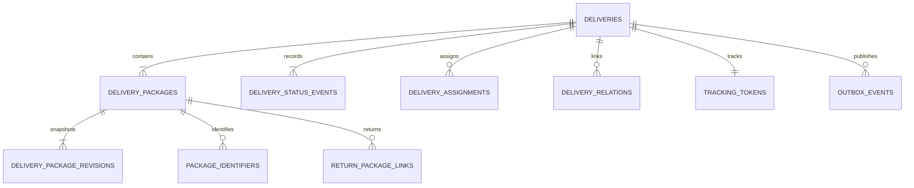
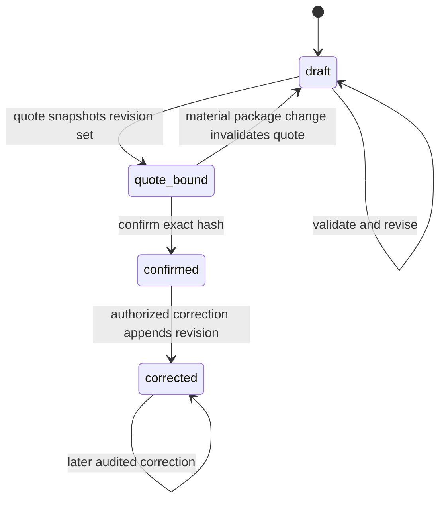
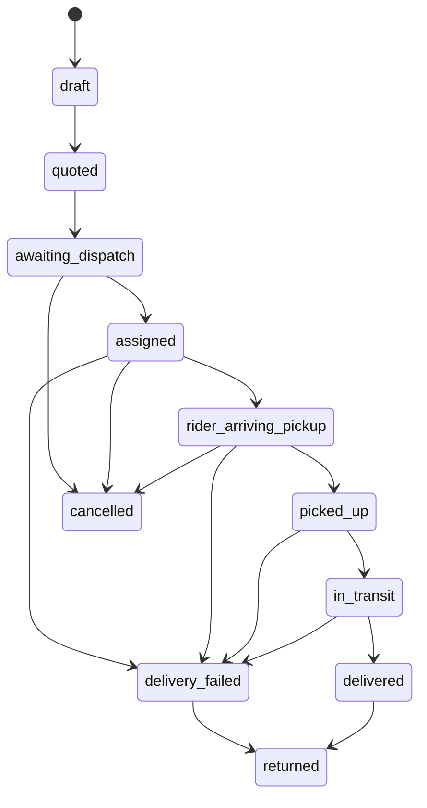

# Module 05 — Delivery Job Lifecycle

**Status:** Authoritative lifecycle specification; package create-input contract aligned, remaining package operations require contract approval  
**Scope:** Delivery aggregate, package snapshots, lifecycle, assignments, tracking identity, idempotent creation, and delivery-domain events  
**Normative conventions:** [Delivery documentation conventions](../documentation-conventions.md)  
**Authoritative references:** [Delivery contracts](../contracts.md), [cross-mode rules](../modes/07-cross-mode-rules-and-testing.md), [returns](../modes/06-returns.md), and [Phase 1 geography](./04-cities-service-zones.md)

## 1. Purpose

This module owns a delivery job from draft and quote through confirmation, dispatch, pickup, transit, completion, cancellation, failure, and return finalization. It owns:

- the authoritative delivery state machine and current-state projection;
- immutable status and assignment history;
- immutable confirmed endpoint, package, service, quote, and configuration snapshots;
- idempotent delivery creation;
- one public tracking identity per delivery;
- package facts needed by quoting, dispatch, proof, custody, risk, and returns; and
- transactional delivery-domain events.

The package model is deliberately explicit. One `delivery_packages` row represents **one physical handling unit**: one box, bag, envelope, crate, pallet, or other parcel that can be labelled, scanned, loaded, handed over, lost, damaged, or returned independently. `item_count` describes items inside that handling unit; it never means multiple separately handled parcels. If three boxes are handed to a rider, the delivery has three package rows even when the boxes are identical.

The words “small” and “big” are unsuitable as unversioned operational facts. The API may accept a canonical declared class such as `small`, `medium`, `large`, or `oversized`, but the enabled class set and its thresholds are configurable, versioned, and owner-approved. “Big” is display language only and is not a precise API value.

## 2. Authority, compatibility, and non-invention

### 2.1 Normative levels

1. The lifecycle and return semantics already approved in [contracts](../contracts.md) and [returns mode](../modes/06-returns.md) are normative now.
2. The detailed package tables, responses, errors, identifiers, and correction commands in this document are the **normative proposed module contract**. They become public API commitments only after approval and alignment with [`openapi.yaml`](../openapi.yaml), the data dictionary, generated clients, and consumer tests.
3. The checked-in OpenAPI now defines a non-empty `packages` array and the aligned package create-input shape: physical-unit key/form, canonical integer weight and dimensions, declared size/value, contents, handling, goods declaration, privacy flag, bounded-reference extension points, and no ambiguous parcel quantity.
4. The checked-in data dictionary now records package identity and immutable revision field groups. Public package response, identifier, scan, discrepancy, correction, and revision-history operations remain proposed until their OpenAPI schemas and authorization contracts are approved.

Implementations must reject unknown or unsupported package fields explicitly; they must never accept and discard them. Internal persistence may implement the richer model before public exposure only behind a documented contract/version gate.

### 2.2 Configurable decisions

Package class values, thresholds, maximum counts and measurements, allowed forms/categories, required declarations, label formats, metadata limits, quote-honor behavior, rider visibility, proof requirements, retention, and correction approval are configurable and versioned. Operations, product, pricing, fleet, risk, security/privacy, and legal owners approve values in their respective domains. This document invents no numeric threshold, price, retention period, prohibited-goods list, or legal conclusion.

## 3. Responsibilities and boundaries

### 3.1 Responsibilities

- Create, confirm, read, and cancel tenant-owned deliveries.
- Enforce lifecycle transitions and transition guards.
- Snapshot pickup/drop-off, canonical geography decisions, package facts, service dimensions, accepted quote binding, and policy versions.
- Preserve package identity and package-to-return lineage.
- Maintain assignment history and authorize rider lifecycle actions from the active assignment.
- Compute reproducible aggregate package metrics from confirmed package snapshots.
- Publish internal events and approved merchant webhooks through the transactional outbox.
- Expose sanitized public tracking.
- Reconcile current projections with immutable history.

### 3.2 Non-responsibilities

- Authentication, RBAC, tenant provisioning, API keys, and rate-limit ownership.
- City/zone geometry or coverage computation. [Module 04](./04-cities-service-zones.md) owns canonical city/zone versions, endpoint policy, and deterministic coverage decisions.
- Price calculation, volumetric divisor selection, billable-weight formula, taxes, fees, ledger entries, refunds, COD settlement, rider earnings, or invoices.
- Vehicle definitions, vehicle capacity limits, rider readiness, dispatch ranking, or route optimization.
- Dangerous/prohibited/restricted-goods legal classification. This module records declarations and policy outcomes; approved legal/risk policy decides eligibility.
- Proof media storage. This module stores opaque proof references and package scope.
- Merchant order/catalog truth, inventory, product return entitlement, or commerce-plugin state.

## 4. Actors and permissions

| Actor | Allowed lifecycle/package actions |
|---|---|
| Business owner/admin/dispatcher | Quote, create, read, and cancel own-tenant deliveries where allowed; edit own draft package declarations |
| Business viewer | Read own-tenant delivery and permitted package facts |
| Business finance | Read authorized monetary/package value facts; no lifecycle mutation by implication |
| `ops_dispatcher` | Cross-tenant operational read under explicit scope; assign/reassign; fail/cancel/finalize return where policy permits; request audited package correction |
| Rider | Read minimum package handling facts for an active assignment; scan/observe/report discrepancies; perform rider-authorized transitions |
| Restricted risk/safety actor | Review restricted-goods and sensitive-package exceptions under named permission |
| System | Validate, classify, aggregate, create idempotently, apply approved automation, reconcile, and publish events |
| Partner actor, when enabled | Read and act only on explicitly assigned package scope through partner controls |
| Public tracking visitor | Read one sanitized delivery through one valid tracking token; no sensitive contents or package identifiers |

A role does not grant a transition by itself. The transition table, tenant scope, active assignment, expected version, package state, proof/custody policy, and feature gates all apply.

## 5. Delivery aggregate and invariants

### 5.1 Aggregate invariants

1. Every tenant-owned row includes or derives `business_id`; cross-tenant foreign keys are forbidden.
2. `deliveries.status` is a projection; `delivery_status_events` is immutable authority.
3. Every accepted transition appends exactly one status event and atomically updates status, version, derived timestamps, audit, and outbox.
4. A confirmed delivery has at least one confirmed physical package.
5. Each physical handling unit has exactly one current package identity within a delivery and immutable confirmed revisions.
6. Confirmed endpoint, package, service, quote-binding, and geography snapshots are never edited in place.
7. A delivery has at most one active assignment.
8. Server time, persisted actor identity, tenant, source state, and aggregate version are authoritative.
9. Money uses integer minor units plus ISO 4217 currency; physical measures use integer grams and millimetres. Binary floating point is not persisted for either.
10. Return movement is a new linked delivery with its own lifecycle. The original never traverses backward.

### 5.2 Aggregate diagram



## 6. Physical data model

Logical names may be adapted to the selected database. Constraints and semantics are mandatory.

### 6.1 `deliveries`

| Field | Type | Requirement and constraint |
|---|---|---|
| `id` | UUID/opaque ID | Primary key |
| `business_id` | UUID | Required tenant key; present in every tenant-scoped unique/FK path |
| `branch_id` | UUID nullable | Same tenant; snapshot source only |
| `external_order_id` | bounded string | Required, normalized only for configured uniqueness; preserve accepted display value |
| `job_type` | enum | `outbound` or `return`; immutable after confirmation |
| `parent_delivery_id` | UUID nullable | Required for return; same tenant; immutable |
| `lineage_root_delivery_id` | UUID | Self for root outbound, inherited by return; immutable |
| `lineage_depth` | integer | Derived, bounded by configurable safe limit |
| service dimensions | enums/references | Timing, execution, geography, direction per [cross-mode rules](../modes/07-cross-mode-rules-and-testing.md); immutable after confirmation except approved amendment |
| `legacy_mode` | enum nullable | Compatibility projection only; not an independent workflow engine |
| `status` | lifecycle enum | Required current projection |
| `version` | positive integer | Required optimistic-concurrency version |
| `quote_id`, `quote_input_hash` | opaque ID/hash nullable | Required according to confirmation policy |
| `currency` | ISO 4217 nullable | Required whenever money is present |
| `quoted_fee_minor`, `cod_amount_minor` | integer nullable | Non-negative; source/ownership remains pricing/COD |
| pickup/drop-off snapshots | structured encrypted data | Required by confirmation |
| geography snapshot refs | IDs/versions/watermark | Required by confirmation; each endpoint independently resolved |
| package aggregate fields | integers/enum/version | Derived from the bound package revision set |
| lifecycle timestamps | UTC timestamps nullable | Derived from first accepted matching event |
| creator/channel/provenance | actor and request refs | Required |
| `created_at`, `updated_at` | UTC timestamps | Required |

Address snapshots include accepted structured address/contact input and canonical city/zone decision references. A later geography activation, branch edit, or alias change never rewrites them and never transitions a delivery.

### 6.2 `delivery_packages`: identity row

This row identifies one physical handling unit across its immutable revisions.

| Field | Type | Requirement and constraint |
|---|---|---|
| `id` | UUID/opaque ID | Primary key; stable package identity |
| `business_id` | UUID | Required tenant key |
| `delivery_id` | UUID | Required; composite FK `(business_id, delivery_id)` |
| `package_sequence` | positive integer | Required; stable display/order number, unique per delivery |
| `merchant_package_reference` | bounded string nullable | Merchant correlation value; tenant/delivery-scoped uniqueness policy is configurable |
| `current_revision_id` | UUID | Required projection to latest permitted revision |
| `confirmed_revision_id` | UUID nullable | Set at confirmation; immutable pointer to accepted snapshot |
| `state` | enum | `draft`, `confirmed`, `corrected`, `voided_draft`; confirmed packages are never deleted |
| `created_by_actor_type/id` | actor reference | Required |
| `created_at`, `updated_at` | UTC timestamps | Required |
| `row_version` | positive integer | Required optimistic concurrency |

No `quantity` field represents parcels. If a merchant has multiple separately handled units, it submits multiple package objects. A draft package may be removed before confirmation; this is recorded in draft audit where required. A confirmed package cannot be deleted or reused in another delivery.

### 6.3 `delivery_package_revisions`: immutable facts

Each save may update a mutable draft workspace, but quote-bound, confirmed, corrected, scanned, or externally referenced content is captured as an immutable revision.

#### Identity, description, and classification

| Field | Type | R/C/D | Constraint and meaning |
|---|---|---:|---|
| `id`, `business_id`, `package_id`, `delivery_id` | UUIDs | R | Same-tenant immutable revision identity |
| `revision_number` | positive integer | R | Unique per package |
| `revision_reason` | enum | R | `draft_save`, `quote_snapshot`, `confirmation`, `correction`, `ops_adjustment`, or approved extension |
| `merchant_package_reference_snapshot` | string nullable | C | Accepted reference snapshot |
| `description` | bounded string nullable | C | Operationally useful, minimized, treated as potentially sensitive |
| `contents_category_code` | controlled string nullable | C | Versioned policy taxonomy; not free-form legal classification |
| `item_count` | positive integer nullable | C | Number of contents inside this single handling unit |
| `package_form` | controlled enum/string | R | Versioned canonical type such as envelope, bag, box, tube, crate, pallet, other; enabled values configurable |
| `container_code` | controlled string nullable | C | Merchant/platform container taxonomy reference |
| `declared_size_class` | controlled string nullable | C | Caller declaration from active canonical class set |
| `system_size_class` | controlled string nullable | D | Classifier result under stored profile/version |
| `effective_size_class` | controlled string | D | Policy-selected class used for eligibility; reason/source retained |
| `size_classification_status` | enum | R | `classified`, `unclassified_missing_measurements`, `unclassified_no_profile`, `review_required` |

`small`, `medium`, `large`, and `oversized` are illustrative canonical labels, not a hardcoded complete set. A profile may use another approved set. `big` must be rejected as a size-class API value unless an approved profile explicitly defines that exact canonical code.

#### Physical measurements and derived metrics

| Field | Type | R/C/D | Constraint and meaning |
|---|---|---:|---|
| `weight_grams` | integer nullable | C | Positive when known; exact zero is invalid for a physical package |
| `weight_source` | enum nullable | C | `merchant_declared`, `operator_measured`, `rider_observed`, `partner_reported`, `system_imported` |
| `length_mm`, `width_mm`, `height_mm` | integers nullable | C | All three present or all absent; positive when present |
| `dimension_source` | enum nullable | C | Source taxonomy as above |
| `dimension_orientation` | enum | R | `normalized_descending` for canonical storage |
| `longest_side_mm` | integer nullable | D | Maximum normalized dimension |
| `middle_side_mm`, `shortest_side_mm` | integers nullable | D | Remaining normalized dimensions |
| `volume_cubic_mm` | arbitrary-precision integer nullable | D | Checked multiplication of all dimensions |
| `girth_mm` | arbitrary-precision integer nullable | D | Profile-defined formula result; formula/version stored |
| `volumetric_weight_grams` | integer nullable | D | Pricing-owned result/reference, not independently invented here |
| `billable_weight_grams` | integer nullable | D | Pricing-owned accepted result/reference |
| `measurement_status` | enum | R | `complete`, `weight_only`, `dimensions_only`, `unknown`, `unmeasurable`, `review_required` |
| `measurement_note` | bounded protected string nullable | C | Required only for configured unknown/unmeasurable exception |

Canonical orientation sorts measured sides descending before persistence: `length_mm >= width_mm >= height_mm`. Input labels do not assert physical “length”; rotation of a rectangular parcel therefore produces one canonical tuple. If orientation itself matters, `keep_upright` and handling instructions express it. Non-rectangular forms use the smallest approved bounding dimensions under the measurement profile; the profile owns the method.

Unknown is not zero. Missing `weight_grams` means not supplied/known; missing all dimensions means not supplied/known. `unmeasurable` requires an approved reason and review path. A system must not infer measurements from size class alone.

Derived multiplication and formulas use arbitrary-precision or checked integer arithmetic. Overflow, non-integer conversion, non-finite input, and unit ambiguity fail validation. Decimal kg/cm inputs, if accepted by a compatibility adapter, are converted using a documented decimal rule and rejected when conversion would lose disallowed precision; no binary float participates.

#### Size profile and ownership

| Field | Type | Requirement |
|---|---|---|
| `size_profile_id`, `size_profile_version` | opaque ID/version nullable | Required when a system/effective class is produced |
| `size_profile_snapshot_hash` | hash nullable | Binds canonical class set, thresholds, predicates, and algorithm |
| `size_classifier_version` | string nullable | Required for system classification |
| `size_classification_inputs_hash` | hash nullable | Hash of normalized facts used |
| `size_classification_reason_codes` | array of controlled codes | Explains class/unclassified/review result |
| `volumetric_policy_ref/version` | opaque ref nullable | Owned by pricing/product; required when volumetric result used |
| `billable_weight_result_ref` | opaque ref nullable | Quote/pricing result binding |

This module owns canonical measurements and reproducible derived geometry. Pricing owns volumetric divisor/rounding, weight comparison, chargeable/billable weight, and fee effect. Product/fleet policy owns class thresholds and eligibility predicates. Dispatch consumes the immutable effective class and measurements but does not reclassify them.

#### Value, handling, declarations, and privacy

| Field | Type | Requirement and constraint |
|---|---|---|
| `declared_value_minor` | integer nullable | Non-negative; currency required when present |
| `declared_value_currency` | ISO 4217 nullable | Present iff value present; does not establish insurance or compensation |
| `fragile`, `liquid`, `perishable`, `keep_upright` | boolean | Required explicit booleans, defaulted only by documented request normalization |
| `stackability` | enum | `stackable`, `not_stackable`, `unknown` |
| `temperature_requirement` | enum/string | `none`, `profile_required`, or approved profile code; no invented ranges |
| `temperature_profile_ref/version` | opaque ref nullable | Required for controlled-temperature service |
| `tamper_requirement` | enum | `none`, `tamper_evident`, `restricted_access`, or approved extension |
| `seal_required` | boolean | Explicit |
| `seal_identifier` | protected string nullable | Required according to seal policy; revisions/events preserve changes |
| `special_handling_codes` | bounded unique array | Controlled, versioned codes |
| `special_handling_note` | bounded protected string nullable | Minimized; never substitutes for a required code |
| `goods_declaration_status` | enum | `not_declared`, `declared_clear`, `contains_restricted`, `contains_dangerous`, `unknown`, `review_required` |
| `goods_declaration_codes` | bounded unique array | Controlled policy taxonomy |
| `declaration_policy_ref/version` | opaque ref | Required by confirmation |
| `declarant_actor/channel/time` | provenance | Required when declaration supplied |
| `policy_eligibility_result` | enum | `eligible`, `ineligible`, `review_required` |
| `policy_reason_codes` | bounded array | Stable reasons; not a legal conclusion |
| `sensitive_contents` | boolean | Minimizes audience visibility |
| `privacy_classification` | controlled enum | Drives access/redaction; versioned policy |

`declared_clear` means the declarant answered the configured questions; it is not a warranty by the platform and not a legal determination. Dangerous, prohibited, restricted, import/export, temperature, food, pharmaceutical, biological, and similar rules are jurisdiction/service configurable and require legal/risk approval. The lifecycle module only blocks or routes review according to the returned policy result.

#### Identifiers, references, metadata, and provenance

| Field | Type | Requirement and constraint |
|---|---|---|
| `platform_package_code` | opaque string | System-generated, unique; public exposure prohibited |
| `label_template_ref/version` | opaque ref nullable | Label service boundary |
| `label_artifact_ref` | opaque ref nullable | No binary label data in lifecycle rows |
| `primary_barcode_value_hash` | hash nullable | Lookup-safe protected representation |
| `primary_barcode_last4/display` | redacted string nullable | Optional operational display |
| `custom_references` | bounded map/array | Approved key syntax, value length, entry count, and total bytes; no secrets |
| `metadata` | bounded JSON object | Schema/version, depth, key count, scalar types, and total bytes constrained; no executable content |
| `source_channel`, `source_schema_version` | controlled strings | Required provenance |
| `normalized_content_hash` | cryptographic hash | Required for quote/idempotency binding |
| `created_at`, `created_by_actor` | UTC/actor | Required |
| `supersedes_revision_id` | UUID nullable | Required for correction lineage |

Barcode and scan aliases belong in `package_identifiers` so multiple identifiers can coexist without rewriting the package snapshot:

| Field | Constraint |
|---|---|
| `id`, `business_id`, `package_id` | Required; same tenant |
| `identifier_type`, `issuer_namespace` | Controlled and required |
| `value_hash`, `encrypted_value_ref` | Protected lookup/storage; raw values excluded from logs |
| `status` | `active`, `replaced`, `revoked` |
| `valid_from`, `valid_to`, actor/reason | Append-only validity history |

Uniqueness is at minimum `(business_id, issuer_namespace, identifier_type, value_hash)` for active identifiers. A collision across tenants must not leak existence.

Proof photos, signatures, scans, condition images, and documents are owned by proof/custody modules or private object storage. Package records contain only scoped opaque references, checksum/media metadata where authorized, and purpose. General package APIs and webhooks never inline binary artifacts or unrestricted signed URLs.

### 6.4 Aggregate package metrics

At quote snapshot and confirmation, compute and persist:

- `package_count`;
- `known_weight_package_count` and `unknown_weight_package_count`;
- `total_actual_weight_grams` only when every required package weight is known, otherwise null plus completeness status;
- `total_volume_cubic_mm` only when every required dimension tuple is known, otherwise null plus completeness status;
- `maximum_longest_side_mm`, maximum girth under the selected profile, and maximum effective size class;
- counts by effective size class, package form, and handling code;
- `contains_fragile`, `contains_liquid`, `contains_perishable`, `contains_temperature_controlled`, `contains_non_stackable`, `contains_restricted_review`;
- pricing-owned total billable weight/reference when returned by the accepted quote; and
- `package_set_hash`, package revision IDs, profile versions, and completeness flags.

Totals use checked integers and derive from the exact ordered revision set. Unknown values never become zero and never disappear from eligibility. Aggregates are projections and must be reproducible; package revisions remain authority.

Vehicle/capacity eligibility is a separate decision owned by fleet/dispatch/route modules. This module supplies immutable package facts and aggregate metrics. The consumer selects a versioned capacity profile, checks per-package and aggregate constraints, records decision/profile references, and returns stable reasons. A size class alone must not be treated as proof that a package fits.

### 6.5 Other lifecycle tables

#### `delivery_status_events`

Required fields: `id`, `business_id`, `delivery_id`, unique increasing `sequence`, nullable initial `from_status`, `status`, server `occurred_at`, actor type/ID, optional paired location, reason code/text, assignment ID, request/correlation/operation IDs, aggregate version, and `created_at`. Rows are append-only.

#### `delivery_assignments`

Required fields: ID, tenant/delivery, assignee type, owned rider or partner references according to type, state, source, assigned actor/reason, effective interval, and row version. A partial unique index or equivalent transaction enforces at most one reserved/active assignment. Reassignment closes one row and creates another.

#### `delivery_relations` and `return_package_links`

- `delivery_relations` stores typed, same-tenant `return_of`, `replacement_for`, `exchange_pair`, or `retry_of` relations with cycle checks.
- `return_package_links` maps original confirmed package/revision to the return package/revision and authorized item scope where partial item returns are enabled.
- Parent/root links and original package links are immutable.
- At most one active return exists for overlapping authorized package scope unless a terminal prior return is explicitly superseded.

#### `tracking_tokens`

Store tenant/delivery, a unique high-entropy token hash, purpose, issue/revoke/expiry facts, and audit provenance. Expiry/rotation policy is configurable. Raw tokens are shown only through the authorized creation flow.

#### `idempotency_records`

Unique `(business_id, credential_scope, operation, key)`, with canonical request hash, state, response status/body/reference, resource ID, and configurable expiry. Package order and every normalized package field participate in the hash; server-derived IDs/times do not.

### 6.6 Required constraints and indexes

- Composite tenant FKs for deliveries, packages, revisions, identifiers, assignments, events, and relations.
- Unique `(business_id, delivery_id, package_sequence)`.
- Unique `(package_id, revision_number)` and immutable revision rows.
- Unique active package identifier per tenant/issuer/type/hash.
- Unique `(business_id, delivery_id, status_event.sequence)`.
- At most one active assignment.
- At most one confirmed revision pointer per package identity; confirmed pointer cannot change.
- Checks for positive integer measurements/item count, all-or-none dimensions, normalized dimension order, paired value/currency, valid enum/profile combinations, bounded JSON, and ordered effective intervals.
- Indexes for tenant delivery list/status/time, external reference, package merchant reference, identifier hash, package class/form/handling review queues, lineage root/parent, active assignment, outbox availability, and reconciliation scans.
- Database triggers/permissions or equivalent controls prevent update/delete of confirmed revisions and append-only history.

## 7. Package lifecycle and mutation semantics



### 7.1 Draft

Before confirmation, an authorized merchant may add, revise, reorder, or remove physical package units. Every mutation requires the delivery/package expected version. Any material change recomputes package hashes, classification, aggregate metrics, serviceability, capacity eligibility, and quote validity.

Material fields include package count/identity, measurements, effective class inputs, form, contents category, item count, declared value/currency, handling flags, declarations, service-relevant identifiers, and package scope. Presentation-only changes may be non-material only when a versioned policy explicitly says so.

### 7.2 Confirmation

Confirmation freezes:

- exact package IDs and immutable revision IDs;
- normalized package-set hash and aggregate metrics;
- declared/system/effective classes and profile versions;
- measurement/declaration/handling policy snapshots;
- quote package-input hash and pricing result references; and
- geography/service/configuration snapshots.

No post-confirm write may mutate this accepted snapshot.

### 7.3 Post-confirm discrepancy and correction

Observed differences are facts, not silent edits:

1. Record a package scan, measurement, inspection, or discrepancy event with actor, source time, server time, assignment, package identifier, evidence reference, and observed values.
2. Evaluate whether the difference is within an approved non-material tolerance or requires review. Tolerances are configurable; none are invented here.
3. If material, block the affected next action when policy requires, open an exception, and request reclassification/requote/capacity review.
4. An authorized correction appends a new revision linked to the confirmed revision, records reason/evidence/approver, and updates a current operational projection.
5. The original confirmed revision remains the commercial and historical snapshot. Pricing decides adjustment/requote; dispatch decides reassignment; finance decides any posting.

After pickup, package identity/count correction additionally requires custody-safe handling and cannot remove a package from history. A newly discovered separately handled parcel becomes an explicit package through a restricted adjustment flow, not `item_count += 1`.

## 8. Package validation and classification pipeline

```mermaid
flowchart LR
  A[Raw request] --> B[Shape and limit validation]
  B --> C[Unit and text normalization]
  C --> D[Cross-field validation]
  D --> E[Declarations and policy]
  E --> F[Derived integer metrics]
  F --> G[Versioned size classification]
  G --> H[Service and capacity eligibility]
  H --> I[Package-set hash]
  I --> J[Quote or confirmation snapshot]
```



1. **Envelope:** Require a configured non-empty package list; reject duplicate client package keys, unknown properties according to schema policy, oversized payloads, excessive nesting, and malformed types.
2. **Cardinality:** Create one normalized package per physical handling unit. Reject ambiguous `quantity` parcel grouping in the proposed contract.
3. **Identifiers/text:** Normalize controlled codes; validate merchant references; trim bounded descriptions without changing meaningful content; reject control characters and unsafe metadata.
4. **Units:** Accept canonical integer grams/mm. Compatibility decimal kg must use exact decimal parsing and documented conversion.
5. **Cross-fields:** Enforce all-or-none dimensions, positive measures, value/currency pairing, temperature profile when required, seal ID when policy requires, and declarations/provenance.
6. **Orientation:** Sort dimensions into descending canonical tuple and retain input source; do not fabricate missing dimensions.
7. **Derived facts:** Compute longest/middle/shortest side, checked volume, and profile-defined girth.
8. **Policy:** Evaluate dangerous/restricted/prohibited declaration policy without making independent legal conclusions.
9. **Classification:** Apply exactly one effective size profile/version. Store result, inputs hash, and reason. A declared class conflicting with system class follows versioned policy: reject, accept system authority, or route review; never silently choose.
10. **Eligibility:** Call product/fleet/geography/quote owners with immutable facts. Geography evaluates endpoint roles under one watermark and does not infer package eligibility.
11. **Hash:** Canonicalize package order and every material field. Bind the package set to idempotency, quote, and confirmation.
12. **Revalidation:** At create/confirm, use the configured quote-honor rule. If relevant package, profile, geography, or policy facts changed, either honor the pinned approved snapshot or return a stale/requote result; never mix versions.

## 9. Proposed package API contract

### 9.1 JSON Schema-style request

The checked-in OpenAPI represents this create-input shape. The JSON Schema-style form below remains the detailed normative explanation; approved OpenAPI limits and generated contract tests are authoritative for external clients.

```json
{
  "$id": "ProposedDeliveryPackageInput",
  "type": "object",
  "additionalProperties": false,
  "required": [
    "clientPackageKey",
    "form",
    "handling",
    "goodsDeclaration"
  ],
  "properties": {
    "clientPackageKey": {"type": "string", "minLength": 1},
    "merchantPackageReference": {"type": "string"},
    "description": {"type": "string"},
    "contentsCategoryCode": {"type": "string"},
    "itemCount": {"type": "integer", "minimum": 1},
    "form": {"type": "string"},
    "containerCode": {"type": "string"},
    "declaredSizeClass": {"type": "string"},
    "weightGrams": {"type": "integer", "minimum": 1},
    "dimensionsMm": {
      "type": "object",
      "additionalProperties": false,
      "required": ["length", "width", "height"],
      "properties": {
        "length": {"type": "integer", "minimum": 1},
        "width": {"type": "integer", "minimum": 1},
        "height": {"type": "integer", "minimum": 1}
      }
    },
    "measurementStatus": {
      "enum": ["complete", "weight_only", "dimensions_only", "unknown", "unmeasurable"]
    },
    "declaredValue": {
      "type": "object",
      "additionalProperties": false,
      "required": ["amountMinor", "currency"],
      "properties": {
        "amountMinor": {"type": "integer", "minimum": 0},
        "currency": {"type": "string", "pattern": "^[A-Z]{3}$"}
      }
    },
    "handling": {
      "type": "object",
      "additionalProperties": false,
      "required": [
        "fragile", "liquid", "perishable", "keepUpright",
        "stackability", "sealRequired", "tamperRequirement"
      ],
      "properties": {
        "fragile": {"type": "boolean"},
        "liquid": {"type": "boolean"},
        "perishable": {"type": "boolean"},
        "keepUpright": {"type": "boolean"},
        "stackability": {"enum": ["stackable", "not_stackable", "unknown"]},
        "temperatureProfileCode": {"type": "string"},
        "sealRequired": {"type": "boolean"},
        "sealIdentifier": {"type": "string"},
        "tamperRequirement": {"type": "string"},
        "specialHandlingCodes": {
          "type": "array", "uniqueItems": true, "items": {"type": "string"}
        },
        "specialHandlingNote": {"type": "string"}
      }
    },
    "goodsDeclaration": {
      "type": "object",
      "additionalProperties": false,
      "required": ["status", "codes"],
      "properties": {
        "status": {
          "enum": [
            "not_declared", "declared_clear", "contains_restricted",
            "contains_dangerous", "unknown"
          ]
        },
        "codes": {"type": "array", "uniqueItems": true, "items": {"type": "string"}}
      }
    },
    "sensitiveContents": {"type": "boolean"},
    "customReferences": {"type": "object"},
    "metadata": {"type": "object"}
  }
}
```

Actual `maxItems`, string lengths, map limits, and measurement maxima must be present in approved OpenAPI/configuration; they are intentionally not fabricated here.

### 9.2 Request example

Example values illustrate shape and units, not package thresholds or launch policy:

```json
{
  "businessId": "11111111-1111-4111-8111-111111111111",
  "externalOrderId": "merchant-order-placeholder",
  "pickup": {"line1": "Pickup placeholder", "city": "Canonical city label", "lat": 0.0, "lng": 0.0},
  "dropoff": {"line1": "Drop-off placeholder", "city": "Canonical city label", "lat": 0.0, "lng": 0.0},
  "packages": [
    {
      "clientPackageKey": "parcel-1",
      "merchantPackageReference": "merchant-parcel-A",
      "description": "Clothing",
      "contentsCategoryCode": "apparel",
      "itemCount": 2,
      "form": "box",
      "declaredSizeClass": "medium",
      "weightGrams": 2400,
      "dimensionsMm": {"length": 420, "width": 310, "height": 180},
      "declaredValue": {"amountMinor": 12500, "currency": "ETB"},
      "handling": {
        "fragile": false,
        "liquid": false,
        "perishable": false,
        "keepUpright": false,
        "stackability": "stackable",
        "sealRequired": true,
        "sealIdentifier": "seal-placeholder",
        "tamperRequirement": "tamper_evident",
        "specialHandlingCodes": []
      },
      "goodsDeclaration": {"status": "declared_clear", "codes": []},
      "sensitiveContents": false,
      "customReferences": {"warehouseBin": "placeholder"}
    }
  ]
}
```

### 9.3 Response example

```json
{
  "id": "22222222-2222-4222-8222-222222222222",
  "status": "awaiting_dispatch",
  "version": 3,
  "packageSummary": {
    "packageCount": 1,
    "totalActualWeightGrams": 2400,
    "measurementCompleteness": "complete",
    "maximumEffectiveSizeClass": "medium",
    "packageSetHash": "sha256:placeholder"
  },
  "packages": [
    {
      "id": "33333333-3333-4333-8333-333333333333",
      "sequence": 1,
      "merchantPackageReference": "merchant-parcel-A",
      "form": "box",
      "itemCount": 2,
      "declaredSizeClass": "medium",
      "systemSizeClass": "medium",
      "effectiveSizeClass": "medium",
      "sizeProfile": {"id": "size-profile-placeholder", "version": 4},
      "weightGrams": 2400,
      "dimensionsMm": {"length": 420, "width": 310, "height": 180},
      "derived": {
        "longestSideMm": 420,
        "volumeCubicMm": 23436000,
        "girthMm": null
      },
      "handling": {
        "fragile": false,
        "liquid": false,
        "perishable": false,
        "keepUpright": false,
        "stackability": "stackable",
        "sealRequired": true
      },
      "goodsPolicyResult": {"status": "eligible", "reasonCodes": []},
      "revision": 2,
      "confirmed": true
    }
  ]
}
```

Null derived values mean unavailable/not applicable under the selected profile, never zero.

### 9.4 Stable package errors

| HTTP | Code | Meaning |
|---:|---|---|
| `400` | `PACKAGE_SCHEMA_INVALID` | Malformed type/envelope |
| `409` | `PACKAGE_VERSION_CONFLICT` | Stale delivery/package expected version |
| `409` | `IDEMPOTENCY_KEY_REUSED` | Same key, different canonical package/request hash |
| `409` | `QUOTE_PACKAGE_MISMATCH` | Confirmation package set differs from bound quote |
| `409` | `PACKAGE_CONFIRMED_IMMUTABLE` | Direct mutation attempted after confirmation |
| `422` | `PACKAGE_COUNT_INVALID` | Empty/excess count under active policy |
| `422` | `PACKAGE_QUANTITY_GROUPING_UNSUPPORTED` | Ambiguous separately handled parcel grouping |
| `422` | `PACKAGE_WEIGHT_INVALID` | Missing/invalid/out-of-policy weight |
| `422` | `PACKAGE_DIMENSIONS_INVALID` | Partial, non-positive, overflow, or out-of-policy dimensions |
| `422` | `PACKAGE_SIZE_CLASS_UNKNOWN` | Value absent from active canonical set; includes unrecognized `big` |
| `422` | `PACKAGE_SIZE_CLASS_MISMATCH` | Declared/system conflict requires rejection |
| `422` | `PACKAGE_MEASUREMENT_REQUIRED` | Product/policy requires facts currently unknown |
| `422` | `PACKAGE_DECLARATION_REQUIRED` | Required declaration incomplete |
| `422` | `PACKAGE_RESTRICTED` | Approved policy says ineligible |
| `422` | `PACKAGE_REVIEW_REQUIRED` | Safety/risk/measurement review required |
| `422` | `PACKAGE_IDENTIFIER_DUPLICATE` | Active identifier conflicts in tenant scope |
| `422` | `PACKAGE_METADATA_INVALID` | Key/value/depth/size/schema limit failed |
| `422` | `PACKAGE_CAPACITY_INELIGIBLE` | No selected service/vehicle profile can accept facts |
| `503` | `PACKAGE_POLICY_UNAVAILABLE` | Authoritative profile/policy cannot be evaluated safely |

Errors include safe `field`, `packageIndex` or client key, `requestId`, active policy/profile reference where disclosable, and current aggregate version for conflicts. Tenant-safe denial must not reveal another tenant's identifiers.

## 10. Authoritative lifecycle

### 10.1 State machine



The only happy path is:

`draft → quoted → awaiting_dispatch → assigned → rider_arriving_pickup → picked_up → in_transit → delivered`

### 10.2 Transition table

| From | To | Authorized actor | Required guards |
|---|---|---|---|
| `draft` | `quoted` | System/merchant | Valid package set; coverage and quote result pinned |
| `quoted` | `awaiting_dispatch` | Merchant/system confirmation | Exact quote/package hash; confirmation policy; immutable snapshots |
| `awaiting_dispatch` | `assigned` | Dispatcher/system | Eligible assignee; one active assignment; capacity decision valid |
| `assigned` | `rider_arriving_pickup` | Active rider | Active assignment and expected version |
| `rider_arriving_pickup` | `picked_up` | Active rider | Package count/identity and configured pickup proof/custody checks |
| `picked_up` | `in_transit` | Active rider | Active assignment; custody retained |
| `in_transit` | `delivered` | Active rider | Configured delivery proof/COD/custody guards |
| `awaiting_dispatch`, `assigned`, `rider_arriving_pickup` | `cancelled` | Merchant/ops | Cancellation policy allows; before pickup |
| `assigned`, `rider_arriving_pickup`, `picked_up`, `in_transit` | `delivery_failed` | Active rider/ops | Stable reason required; package/custody outcome recorded |
| `delivery_failed`, `delivered` | `returned` | Authorized ops | Approved original-finalization criteria, normally completed linked return |

All other transitions return `409`. Reapplying current state as a mutation, skipping states, cancellation after pickup, and terminal reactivation are forbidden.

### 10.3 Linked-return semantics

A physical return is a new `job_type=return` delivery with immutable `parent_delivery_id`, root lineage, package links, pickup based on verified current custody, approved destination snapshot, its own quote, assignment, tracking token, proof, lifecycle, events, and financial source references.

A return job uses the normal happy path and ends `delivered` at its approved return destination; it does not enter `returned` merely because its direction is return. Requesting, authorizing, creating, failing, or cancelling a return does not mark the original `returned`. Only configured authorized completion may transition the original from `delivery_failed|delivered` to `returned`. Original endpoints, packages, proofs, events, and financial history remain unchanged.

## 11. Commands, transactions, and concurrency

### 11.1 Transition transaction

Within one database transaction:

1. Resolve tenant and load delivery by `(business_id, id)`.
2. Lock the aggregate or compare expected `version`.
3. Authorize actor and active assignment.
4. Validate transition, package/proof/custody/COD guards, and feature policy.
5. Append next status event.
6. Update status projection, version, and derived timestamp.
7. Close/update assignment projection when applicable.
8. Insert package/custody references required by the command.
9. Insert audit and transactional outbox rows.
10. Commit once.

Exactly one concurrent command may win. Losers return `409` with safe current status/version and create no event, audit effect, or outbox duplicate.

### 11.2 Assignment and reassignment

- Phase 1 supports manual owned-rider assignment; later automation does not change lifecycle authority.
- Assignment from `awaiting_dispatch` atomically creates an active assignment and `assigned` transition.
- Eligibility consumes active rider/fleet, geography, package, vehicle/capacity, service, and policy decisions.
- Before pickup, reassignment closes the prior assignment and creates another without a lifecycle status change.
- After pickup, reassignment is denied unless an approved exception records explicit package custody handoff.
- A replaced rider loses read/mutation rights immediately.

### 11.3 Creation idempotency and quote binding

`POST /v1/deliveries` requires `Idempotency-Key`:

1. Normalize the full request, including ordered physical packages and all material fields.
2. Resolve controlled defaults/profile versions before computing the canonical hash, while excluding server IDs/timestamps.
3. Reserve key in tenant/credential/operation scope.
4. Same key/hash replays exact status/body/resource.
5. Same key/different hash returns `409 IDEMPOTENCY_KEY_REUSED`.
6. Concurrent duplicates create one delivery.

The quote stores a package-set hash and exact revision/profile assumptions. Create/confirm revalidates branch, package, geography, service, capacity, and quote according to the approved honor policy. Material drift returns stable stale/mismatch/requote errors or applies the pinned approved snapshot; it never silently reprices or reclassifies under mixed versions.

Idempotency retention and key/payload limits are configurable platform policy and must be published to clients.

## 12. API surface

### 12.1 Currently contracted paths

| Method | Path | Behavior |
|---|---|---|
| `POST` | `/v1/quotes` | Quote workflow; current OpenAPI lacks request/response schema |
| `POST` | `/v1/deliveries` | Idempotent creation; current package item is minimal |
| `GET` | `/v1/deliveries/{deliveryId}` | Tenant/ops read; current OpenAPI lacks response schema |
| `POST` | `/v1/deliveries/{deliveryId}/cancel` | Contracted cancellation path; schema incomplete |
| `POST` | `/v1/ops/deliveries/{deliveryId}/assign` | Manual ops assignment |
| `GET` | `/v1/riders/me/jobs` | Assignment-scoped rider list |
| `POST` | `/v1/riders/jobs/{deliveryId}/status` | Active rider transition |
| `GET` | `/v1/track/{token}` | Sanitized public projection |

### 12.2 Proposed additive operations

These require OpenAPI/contract approval before public use:

| Method | Path | Purpose |
|---|---|---|
| `POST` | `/v1/delivery-drafts/{id}/packages` | Add one physical draft package with expected delivery version |
| `PATCH` | `/v1/delivery-drafts/{id}/packages/{packageId}` | Revise draft package; invalidates material quote binding |
| `DELETE` | `/v1/delivery-drafts/{id}/packages/{packageId}` | Remove draft package only |
| `POST` | `/v1/ops/deliveries/{id}/package-observations` | Append scan/measurement/discrepancy |
| `POST` | `/v1/ops/deliveries/{id}/package-corrections` | Append authorized corrected revision |
| `GET` | `/v1/deliveries/{id}/package-history` | Permissioned immutable revision/observation history |

Mutations require idempotency where duplicate effects are possible and expected aggregate/package versions. Rider offline operations use stable client operation IDs.

## 13. Events, audit, and webhooks

### 13.1 Internal events

Internal events may include:

- `delivery.package.draft_changed`;
- `delivery.package.classified`;
- `delivery.package.observation_recorded`;
- `delivery.package.discrepancy_detected`;
- `delivery.package.correction_recorded`;
- `delivery.created`, status-transition, assignment, and reconciliation events.

Names are internal contracts and must be catalogued/versioned before use across services.

### 13.2 Approved merchant webhook names

Only these approved names are emitted externally from this lifecycle:

`delivery.created`, `delivery.assigned`, `delivery.picked_up`, `delivery.in_transit`, `delivery.delivered`, `delivery.failed`, `delivery.cancelled`, and `delivery.returned`.

There is no approved package-specific merchant webhook in the checked-in contract. Package facts may be additive, minimized fields in a versioned delivery payload only after schema approval. Do not invent `delivery.package.*` public events.

Outbox intent commits with the domain transaction. Delivery is at least once with stable event IDs, tenant endpoint routing, HMAC of `timestamp.body`, bounded configurable retries/backoff, and dead letter. Consumers deduplicate. Worker failure never rolls back delivery state.

### 13.3 Audit

Audit creation, quote binding, confirmation, every package revision/classification/observation/correction, identifier issue/revoke, assignment/reassignment, transition, cancellation, failure, return link/finalization, token revoke, sensitive package read/export, and override. Audit contains references/hashes and reason, not unrestricted contents or secrets.

## 14. User interfaces and accessibility

### 14.1 Merchant package entry

- Start with “How many separately handled packages?” and create one card/row per unit.
- Offer size presets from the active canonical profile with definitions and units; also provide exact weight and dimensions.
- Label presets as declarations, show the system classification after validation, and explain mismatches/review.
- Never offer “big” as a vague canonical value. Display an approved class label and profile explanation.
- Permit copy-from-previous for convenience while preserving distinct package identities.
- Show form/container, contents category, item count, value/currency, all handling flags, declarations, and privacy guidance.
- Show canonicalized dimensions and units before quote/confirmation.
- Summarize package count, known/unknown measures, effective classes, handling restrictions, quote impact, and service eligibility.
- Material edits clearly invalidate/revalidate the quote.

### 14.2 Operations

Display confirmed snapshot beside current observations; do not overwrite one with the other. Provide scan lookup, discrepancy reason/evidence, remeasure/reclassify, review, correction, requote, capacity reassessment, and custody-safe escalation. Dangerous/restricted and sensitive contents use restricted queues and redacted list views.

### 14.3 Rider/partner

Show only assigned delivery package count, sequence, safe scan code, size/form, approximate/necessary measurements, and handling instructions needed for safe work. Hide declared value, detailed contents, merchant metadata, risk notes, and identifiers unless purpose and policy require them. Pickup confirms each physical unit; mismatch cannot be bypassed by changing item count.

### 14.4 Accessibility

- Every package card has a programmatic name such as “Package 2 of 3”.
- Presets, exact fields, handling toggles, declarations, errors, and review status are keyboard operable.
- Inputs expose units in labels and accessible descriptions; errors identify package and field.
- Validation summary links to fields and uses text/icons, not color alone.
- Dynamic add/remove/reclassification and quote invalidation use polite status announcements and predictable focus.
- Tables have headers; scanning has a manual code-entry alternative; images are never the only proof of package state.

The server remains authoritative if UI state becomes stale.

## 15. Security, tenant isolation, and privacy

- Resolve tenant from authenticated context; do not trust body `businessId` alone.
- Every package lookup includes tenant/delivery scope; cache, identifier, idempotency, queue, search, export, and webhook keys retain tenant context.
- Public tracking excludes package descriptions/categories, values, barcodes, seals, declarations, metadata, exact measurements when unnecessary, and risk/internal notes.
- Riders/partners receive least-purpose data only while assignment is active.
- Descriptions, contents, values, photos, seal/barcode values, and custom metadata may be sensitive. Encrypt/protect, minimize, redact logs, and apply owner-approved retention/legal holds.
- Metadata/custom references reject secrets, credentials, executable markup, prototype-polluting keys, excessive depth, and unbounded cardinality.
- Barcode/identifier endpoints are rate-limited and non-disclosing; raw identifiers never become metrics labels.
- Restricted-goods declarations and policy outcomes are not public accusations or legal findings.
- Cross-tenant ops actions require explicit permission, affected-tenant context, reason/step-up where configured, and immutable audit.

## 16. Failure, recovery, and reconciliation

| Failure | Required behavior |
|---|---|
| Policy/profile unavailable | Fail closed for quote/confirmation when required; do not guess class |
| Quote/package drift | Return mismatch/stale result or apply exact approved pinned policy |
| Duplicate create timeout | Retry same idempotency key; replay committed outcome |
| Concurrent draft edits | One expected-version write wins; other refreshes |
| Scan/measurement mismatch | Append observation, preserve confirmed snapshot, route configured review |
| Assignment capacity becomes invalid | Do not mutate package; dispatch/ops re-evaluates and records action |
| Transition transaction fails | No partial status/event/outbox/audit |
| Outbox worker fails | Domain commit remains; worker retries/reconciles |
| Return saga partially succeeds | Reconcile existing authorization/child/link; never create duplicate child |
| Database restore | Rebuild projections from immutable history and verify hashes/tenant links |

Scheduled reconciliation detects:

- status projection/event divergence or sequence gaps;
- confirmed delivery without confirmed package revision;
- package pointer/hash/aggregate mismatch;
- invalid tenant FK, duplicate sequence/identifier, or multiple active assignments;
- quote package hash or profile mismatch;
- unknown measurement incorrectly represented as zero;
- current correction lacking immutable predecessor/evidence;
- delivered/picked-up package count inconsistent with required proof/custody;
- orphan/overlapping return package links, wrong roots, or lineage cycles;
- outbox/audit missing for committed effects; and
- tracking token or public projection exposing disallowed package facts.

Repairs use idempotent commands or projection rebuilds. They never edit status, confirmed package, proof, custody, audit, or financial history.

Recovery runbooks cover idempotency unknown outcomes, package-policy outage, incorrect profile activation, mass reclassification impact analysis, outbox backlog, assignment/capacity mismatch, identifier collision, return-link partial saga, projection rebuild, and point-in-time restore. Numeric recovery objectives are configurable.

## 17. Observability

Metrics include:

- delivery create/replay/conflict and transition accept/deny;
- jobs by status/age, assignment latency, pickup/delivery duration;
- package count and measurement-completeness distributions;
- declared/system class agreement, unclassified/review rates, profile version usage;
- invalid dimensions/weights, overflow prevention, declaration review/ineligibility;
- quote-package drift, requote, correction, discrepancy, and capacity-ineligibility rates;
- return lineage/package-scope conflicts;
- outbox lag/retry/dead letter and projection reconciliation defects.

Use bounded labels such as status, controlled reason, class code, profile version, city, and channel. Do not label by package ID, barcode, merchant reference, description, or raw metadata.

Logs/traces correlate tenant, delivery, package/revision, quote, assignment, profile, policy, request, operation, correlation, and event IDs. Sensitive contents, raw contacts, identifiers, notes, coordinates, declarations, and tokens are redacted. Alerts and SLO thresholds are configurable.

## 18. Cross-module ownership

| Module | Owns / integration boundary |
|---|---|
| [Cities/service zones](./04-cities-service-zones.md) | Canonical endpoint city/zone/policy decisions and watermark; this module pins results and never weakens advanced Phase 1 geography |
| [Quoting/pricing](./06-quoting-pricing.md) | Volumetric/billable weight policy, package price effect, money, quote expiry/honor; consumes package snapshot |
| [Dispatch/assignment](./07-dispatch-assignment.md) | Rider/fleet eligibility, capacity profile and assignment strategy; consumes package facts |
| Rider/fleet modules | Vehicle/capacity definitions and readiness |
| Proof module | Media, OTP/signature, package-scoped proof policy/artifacts |
| Exceptions/returns | Exceptions, custody resolution, return authorization and orchestration; calls lifecycle commands |
| Tracking/ETA | Live location/ETA; consumes sanitized delivery projection |
| API/idempotency | Public schema publication, credentials, quotas, idempotency platform controls |
| Webhooks/outbox | Endpoint administration and delivery worker; lifecycle creates outbox intent |
| Finance/COD/ledger | Monetary authority and immutable postings; package declared value is input evidence only |
| Configuration/flags | Typed, scoped, versioned policy/profile resolution |
| Audit/observability | Platform audit storage, telemetry standards, retention controls |

## 19. Migration and rollout

1. Approve canonical package schema, class/profile ownership, controlled taxonomies, required declarations, and limits.
2. Add package identity/revision/identifier structures and tenant constraints additively.
3. Preserve legacy `description`, `weightKg`, and `fragile` as source facts. Convert kg only through exact decimal conversion; quarantine invalid/ambiguous values.
4. Create one package identity per proven legacy package array element. Do not split a legacy quantity into physical units without evidence.
5. Mark absent measurements/classes/declarations as unknown/unclassified, never zero, `small`, or clear.
6. Backfill immutable revisions, package-set hashes, aggregate completeness, and source schema/version in bounded tenant-scoped jobs.
7. Run shadow classification using approved profiles; do not change accepted price, assignment, or history.
8. Compare old/new reads and quote inputs; reconcile discrepancies.
9. Complete package response, identifier, discrepancy, correction, and revision-history OpenAPI schemas/errors plus client migration guidance before exposing those operations publicly.
10. Gate enforcement by tenant/product/version; rollback disables new enforcement while retaining accepted snapshots.

Migration never fabricates package size, legal declaration, dimensions, item count, value, or handling requirements. Ambiguous records remain explicit unknowns or enter review.

## 20. Test matrix

All configurable boundaries are tested below, at, and above the active approved value. Fixtures record schema, app, profile, policy, geography watermark, pricing, and configuration versions.

### 20.1 Unit, property, and boundary

- One row per physical unit; `item_count` never changes package cardinality.
- Positive grams/mm, all-or-none dimensions, exact decimal compatibility conversion, no binary-float drift.
- Dimension permutation always normalizes to one descending tuple.
- Checked volume/girth calculations reject overflow and match profile formulas.
- Unknown/unmeasured remains null with explicit status, never zero.
- Declared/system/effective class decision is deterministic for one profile snapshot.
- Generate values around every configured weight, side, volume, girth, and class boundary.
- Profile class ordering/threshold predicates are total or return review; no accidental gaps/overlap.
- Canonical serialization/hash is stable and changes for every material package fact.
- Metadata/custom-reference limits, unsafe keys, deep JSON, Unicode, and hostile text are rejected safely.

### 20.2 Contract and quote binding

- Current OpenAPI compatibility tests prove only supported legacy fields are public.
- Proposed schema tests cover required/conditional fields, `additionalProperties`, codes, units, and safe errors.
- Quote and create with exact package hash succeeds.
- Added/removed/reordered/materially changed package causes configured mismatch/requote behavior.
- Profile/geography/configuration activation between quote and create yields one coherent pinned/honor/stale result, never mixed versions.
- Same idempotency key and normalized package content replays; changed field/order conflicts.
- Decimal compatibility and canonical integer requests hash consistently only under documented normalization.

### 20.3 Lifecycle, package, and returns

- Every allowed transition succeeds only with listed actor/guards; every other pair returns `409`.
- Pickup proof confirms all required physical package identities/count.
- Package discrepancy appends observation and cannot rewrite confirmed revision.
- Post-confirm correction preserves predecessor, quote snapshot, actor, reason, evidence, and audit.
- Reassignment invalidates stale rider rights; post-pickup handoff requires custody evidence.
- Return creates distinct child/package identities with immutable original links and normal lifecycle.
- Return request/authorization/creation/failure/cancellation does not mark original returned.
- Completed linked return permits original finalization only under configured authorized rule.
- Cross-tenant, cyclic, wrong-root, excessive-depth, and overlapping active return scopes fail.

### 20.4 Concurrency and idempotency

- Two package draft writes with one version: one wins.
- Two confirm commands: one confirmed snapshot/event/outbox result.
- Confirmation racing material package edit serializes; no quote/hash split.
- Two dispatchers assign: one active assignment.
- Replaced rider racing status action cannot mutate after replacement.
- Duplicate offline scans/observations deduplicate by operation ID.
- Correction racing transition produces one policy-valid serial outcome.
- Return completion racing original finalization produces one `returned` event/webhook.

### 20.5 Tenant, security, and privacy

- Tenant A cannot read/search/scan/correct/export Tenant B packages or infer identifier collision.
- Same merchant reference/idempotency key/barcode namespace value in separate tenants remains isolated as policy allows.
- Rider/partner/public payloads omit value, sensitive contents, declarations, metadata, private proof, and excess identifiers.
- Revoked/replaced assignment immediately loses package access.
- Ops restricted-content access requires named permission and audit.
- Metadata XSS, injection, prototype pollution, secrets, archive/object references, and log-forging payloads are contained.
- Public token reveals one sanitized delivery and no linked return/package history.

### 20.6 Load, resilience, and recovery

- High configured package counts and concurrent creates remain bounded and tenant-fair.
- Classification/aggregate calculation cannot overflow or cause unbounded CPU/memory.
- Policy/pricing/geography timeout follows fail-closed/pinned policy without partial resource.
- Database failure at every transition transaction step leaves no partial effects.
- Outbox restart redelivers stable IDs without duplicate domain transitions.
- Restore/rebuild reproduces package hashes, aggregates, statuses, assignments, lineage, and outbox position.
- Shadow migration preserves source facts and quarantines ambiguity.
- Reconciliation detects and safely repairs projections without editing immutable history.

## 21. Acceptance criteria

1. The lifecycle accepts only the documented transitions, actors, and guards and atomically writes status, event, projection, audit, and outbox.
2. One `delivery_packages` row represents one physical handling unit; parcel grouping through quantity is rejected, and `item_count` means contents only.
3. Confirmed deliveries have immutable package identities/revisions, package-set hash, aggregate metrics, class/profile snapshots, and explicit unknown semantics.
4. Weight and dimensions use integer grams/mm, canonical orientation, checked derived metrics, and no binary floats.
5. Declared, system, and effective size classes are distinct, versioned, explainable, and use an approved canonical set; vague `big` is not accepted implicitly.
6. Volumetric/billable weight and price remain pricing-owned; vehicle/capacity eligibility remains fleet/dispatch-owned.
7. Package form, contents, count, value, handling, declaration, identifiers, proof boundaries, metadata, and privacy fields follow the table-level contract and constraints.
8. Dangerous/restricted policy records declarations and owner-approved outcomes without claiming independent legal determination.
9. Draft changes revalidate and materially invalidate quote binding; post-confirm observations/corrections append history and never rewrite acceptance.
10. Idempotency hashes include every material normalized package fact; replay/conflict and concurrent creation produce one delivery.
11. Quote/create revalidation uses one coherent package, geography, profile, and policy snapshot and preserves Module 04 geography authority.
12. Assignment and transition concurrency preserve one active assignment and one serial lifecycle result.
13. Every physical return is a distinct linked job; original/package history remains unchanged and original `returned` finalization follows approved completion semantics.
14. APIs distinguish checked-in support from proposed additions and return stable machine-readable package errors.
15. Merchant, ops, rider, partner, and public UIs expose only purpose-appropriate package facts and meet the stated accessibility behavior.
16. Tenant isolation, privacy, restricted-content controls, audit, telemetry redaction, recovery, migration, and the complete test matrix pass.
17. No numeric limit, threshold, price, retention, or legal/business policy ships from an illustrative value in this document; every such value has an approved versioned owner.
