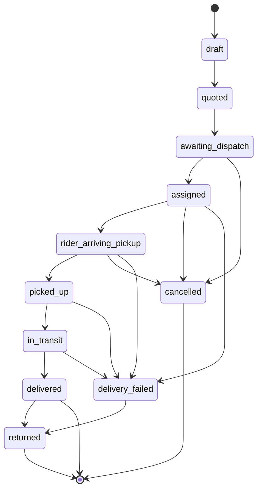
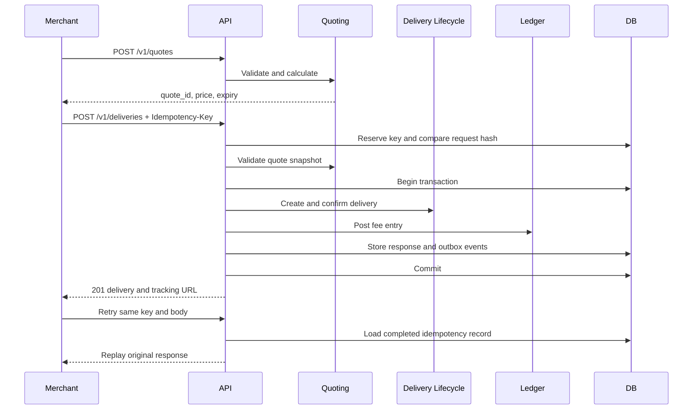
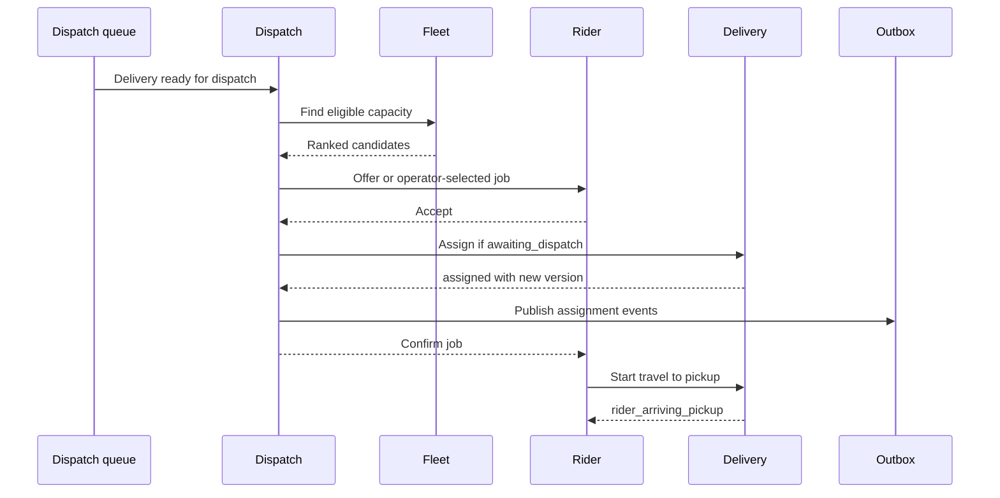
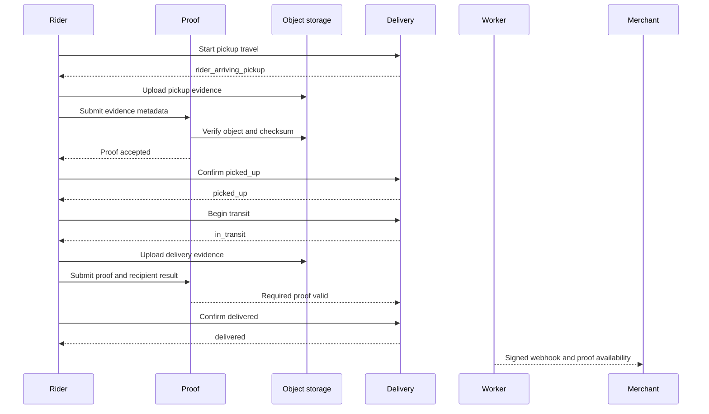
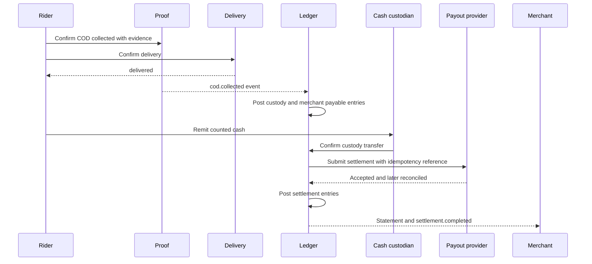
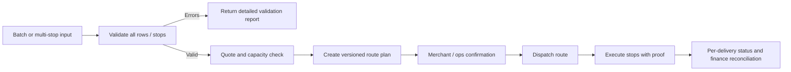
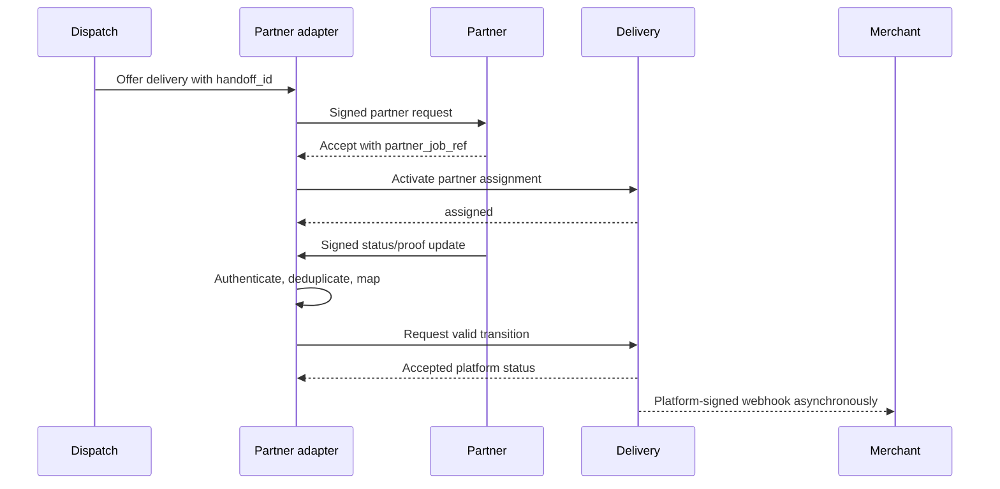
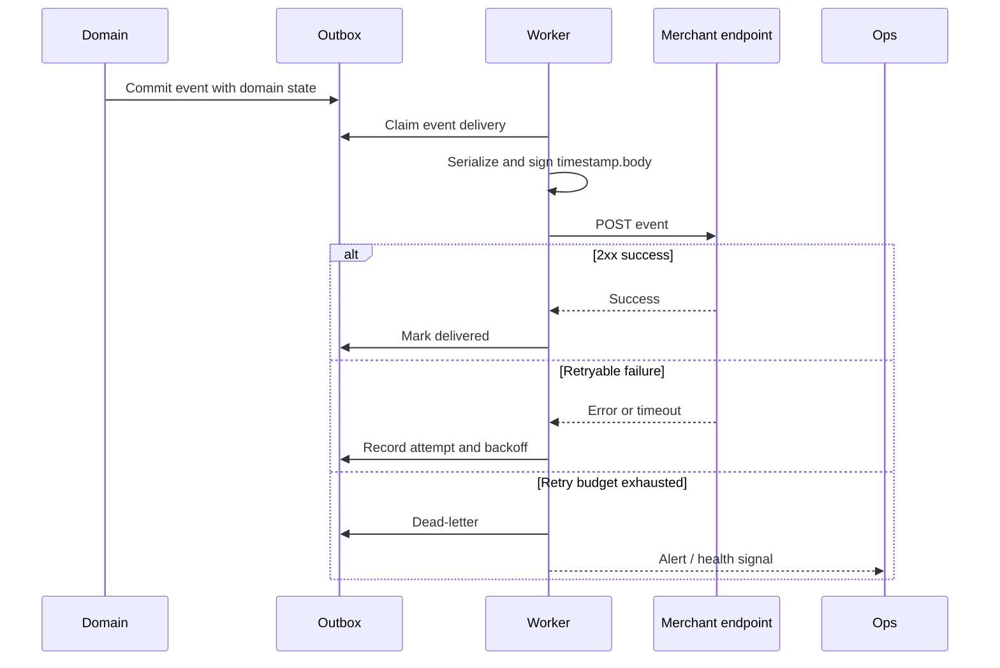
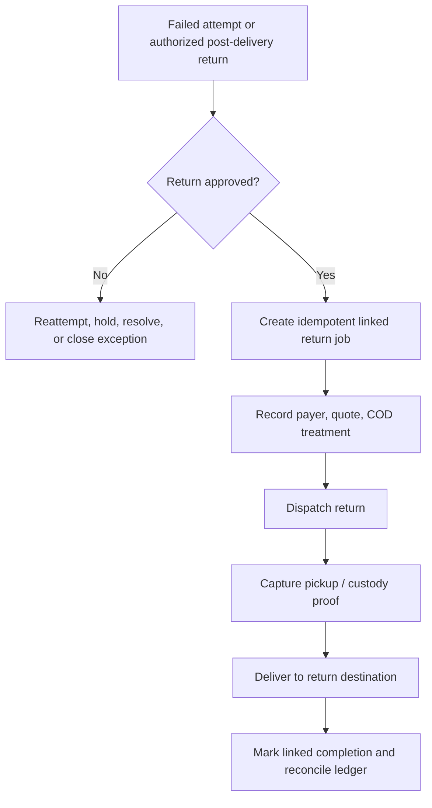

# Delivery Workflows

**Status:** Target behavior  
**Scope:** Happy paths, exceptions, retries, and operational recovery for Delivery-as-a-Service.

These workflows apply the boundaries in [Architecture](./architecture.md), the authoritative state machine, idempotency, webhooks, and ledger rules in [Delivery Contracts](./contracts.md), and the public operations in [OpenAPI](./openapi.yaml). The relevant merchant, rider, operations, partner, and tracking screens are catalogued in [Application Interfaces](./app-interfaces.md); phased availability is defined in [Product Definition](./product-definition.md).

---

## 1. Shared workflow rules

### 1.1 Delivery lifecycle

The transition matrix in [Delivery Contracts](./contracts.md#1-status-state-machine) is authoritative. Every accepted transition appends a status event with actor, time, optional location, and reason, updates the current status/version atomically, and emits an outbox event. Invalid or stale transitions return `409`.

### 1.2 Command envelope and retries

- Authenticate the user/API key, resolve the tenant, authorize the role, then load data in that tenant scope.
- Client retries reuse the same idempotency key where the endpoint supports it. A timeout is an unknown result, not permission to create a new logical operation.
- Background jobs and partner/webhook messages carry a unique event/message ID and are processed at least once.
- External side effects happen after the source transaction commits. Their failure does not roll back a delivery transition.
- Operators resolve exceptional work through explicit commands. Direct database edits are not a workflow.
- Times are UTC in storage. Scheduled windows additionally retain their IANA time zone.

## 2. Quote, create, and idempotency

Related modules: [Quoting & pricing](./modules/06-quoting-pricing.md), [Public API & developer platform](./modules/13-public-api-developer-platform.md), [API keys, idempotency & rate limits](./modules/14-api-keys-idempotency-rate-limits.md), and [Billing & ledger](./modules/21-billing-ledger.md).

### 2.1 Happy path

1. The merchant submits pickup, drop-off, package, mode, service window, and COD details to `POST /v1/quotes`.
2. Quoting validates tenant/branch, coordinates, zone coverage, mode constraints, package limits, and COD policy.
3. Quoting calculates a price breakdown and returns a tenant-bound quote ID, currency, assumptions, and expiry. The quote is an offer snapshot; later pricing-rule edits do not mutate it.
4. The merchant submits `POST /v1/deliveries` with the quote reference, `external_order_id`, and a new `Idempotency-Key`.
5. The platform reserves the idempotency key and hashes the canonical request.
6. In one transaction it validates the quote is unexpired and matches immutable request fields, creates the delivery/package/address snapshots, creates a tracking token, transitions `draft → quoted → awaiting_dispatch`, posts the required delivery-fee ledger stub/entry, stores the response against the idempotency record, and writes outbox events.
7. The API returns `201` with delivery ID, accepted price, status, and tracking URL.
8. A retry with the same key and identical canonical body returns the original status code and response without duplicating the delivery, ledger entry, tracking token, or events.

### 2.2 Exceptions and recovery

| Condition | Required behavior |
|---|---|
| Address is outside coverage or coordinates are invalid | Reject quote with a validation/serviceability error; create no delivery. Return field/zone detail safe for the merchant. |
| Package, mode, COD amount, or service window violates policy | Reject quote with the violated limit and supported alternatives. |
| Quote expires before create | Reject create; merchant requests a new quote. Do not silently reprice an accepted request. |
| Create body differs from quote assumptions | Reject with conflict/validation details identifying changed immutable fields. |
| Same idempotency key, same body, first request still processing | Return a deterministic processing response or wait briefly and replay; never execute a second create. |
| Same idempotency key, different body | Return `409`; retain the original key/body binding. |
| Client times out after commit | The retry replays the committed response. |
| Process fails before transaction commit | Roll back delivery, ledger, response, and outbox together; the key may be safely retried according to idempotency-record recovery policy. |
| Process commits but worker is unavailable | Return success; outbox workers publish later. |
| Duplicate `external_order_id` | Apply the tenant's declared duplicate-order policy. Prefer conflict with the existing delivery reference; idempotency remains the create guarantee. |
| Merchant cancels before assignment | Validate cancellation policy, append `cancelled`, release scheduling/dispatch work, and emit the cancellation event. |

## 3. Dispatch and assignment

Related modules: [Dispatch & assignment](./modules/07-dispatch-assignment.md), [Rider & fleet management](./modules/08-rider-fleet-management.md), and [Cities & service zones](./modules/04-cities-service-zones.md).

### 3.1 Manual and automatic happy path

1. A confirmed delivery enters `awaiting_dispatch`. Scheduled work enters the dispatch pool only at its configured release time.
2. Dispatch filters candidates by city/zone, fleet or partner eligibility, availability, capacity, vehicle/package constraints, active workload, and required service window.
3. **Manual path:** an authorized dispatcher selects an eligible rider in the operations console and submits the assignment command.
4. **Automatic path:** Dispatch ranks candidates, creates a time-bounded offer, and sends it to one or more riders according to the configured strategy. An acceptance atomically wins the assignment.
5. The command checks delivery and candidate versions and ensures there is no active assignment.
6. Dispatch stores assignment history and changes the delivery `awaiting_dispatch → assigned` in the coordinated transaction.
7. The rider receives the job. Merchant/tracking projections and `delivery.assigned` webhook update asynchronously.
8. The rider starts travel to pickup, changing `assigned → rider_arriving_pickup`.

### 3.2 Exceptions and recovery

| Condition | Required behavior |
|---|---|
| No eligible rider | Keep `awaiting_dispatch`, record reason/next attempt, retry with bounded backoff, and alert ops before the service window is at risk. |
| Rider declines or offer expires | Close the offer without changing delivery status and continue to the next candidate. |
| Two riders accept concurrently | A unique active-assignment constraint/version check selects one winner; the loser receives a no-longer-available response. |
| Selected rider goes offline before acceptance | Invalidate the offer and rerank. |
| Rider cannot proceed after assignment but before pickup | Dispatcher releases/reassigns with a reason. Preserve assignment history; delivery returns to dispatchable handling according to policy. |
| Merchant cancels while an offer is open | Cancel delivery, expire offers, and notify rider/partner. A later acceptance is rejected as stale. |
| Stale dispatcher screen assigns an already-assigned job | Return `409` with current assignment; do not overwrite. |
| Delivery nears or misses its service window | Raise an operational exception, notify merchant according to policy, and require an explicit continue/reschedule/cancel decision. |
| Partner selected instead of owned rider | Enter the partner handoff workflow in section 8; `assigned` is not final until the platform has an accepted active partner assignment. |

## 4. Pickup and delivery proof

Related modules: [Rider & fleet management](./modules/08-rider-fleet-management.md), [Live tracking & ETA](./modules/10-live-tracking-eta.md), and [Support & disputes](./modules/26-support-disputes.md).

### 4.1 Happy path

1. The assigned rider starts travel and arrives at pickup.
2. Rider verifies pickup identity/package count and captures required evidence: photo, signature, OTP, barcode, notes, or combinations configured by tenant/service.
3. Media uploads to a private, short-lived upload target. The Proof module confirms object presence, metadata, checksum, actor, location, and capture time.
4. Only after required proof is valid does Delivery accept `rider_arriving_pickup → picked_up`. It then accepts `picked_up → in_transit` when travel begins.
5. At drop-off, rider verifies recipient and records COD collection if applicable before final delivery confirmation.
6. Rider captures required delivery proof. Proof metadata is committed and linked to the delivery.
7. Delivery accepts `in_transit → delivered`; outbox events trigger tracking, merchant webhook, notification, finance, earnings, and media-processing consumers.
8. Merchant and authorized recipient views receive a safe proof summary or time-limited evidence URL.

### 4.2 Exceptions and recovery

| Condition | Required behavior |
|---|---|
| Upload succeeds but metadata command fails | Client retries metadata with the same proof operation ID. Orphan-object cleanup removes unlinked uploads after a retention window. |
| Metadata commits but media processing fails | Keep evidence quarantined/pending, retry processing, and flag proof for ops if delivery policy requires review. |
| Required proof is absent or malformed | Reject `picked_up`/`delivered`; explain the missing requirement to the rider. |
| Device is temporarily offline | Store encrypted pending action locally with capture time and operation ID. Sync in order when online; server validates assignment and status version. Offline completion is not authoritative until accepted. |
| Duplicate status/proof submission | Return the already-accepted result when operation ID and content match; conflict on changed content. |
| Pickup package count/damage mismatch | Do not confirm pickup. Open an exception with evidence and merchant/ops decision: amend where allowed, cancel, or continue with acknowledged variance. |
| Sender unavailable | Wait/retry within policy, then record failed pickup reason. Ops reschedules, reassigns, cancels, or marks `delivery_failed` as permitted. |
| Recipient unavailable/refuses delivery | Capture attempt evidence and reason; do not mark delivered. Ops schedules reattempt or initiates return. |
| Wrong recipient, suspected fraud, or unsafe location | Stop handover, open a high-priority exception, protect contact data, and await ops instruction. |
| Location differs materially from expected site | Require reason/override or geofence-approved exception; preserve actual capture coordinates. |
| Proof later disputed | Preserve original immutable evidence and access audit. Add review findings; never replace the original proof. |

## 5. COD custody and settlement

COD accounting distinguishes the physical custody event from the later merchant settlement. Delivery status alone never edits a balance. Ledger behavior follows [Delivery Contracts](./contracts.md#3-ledger-rules).

Related modules: [Billing & ledger](./modules/21-billing-ledger.md), [COD & cash custody](./modules/22-cod-cash-custody.md), [Invoicing, settlements & payouts](./modules/23-invoicing-settlements-payouts.md), and [Fraud & risk controls](./modules/30-fraud-risk-controls.md).

### 5.1 Happy path

1. At handover, rider confirms the expected COD amount and collection method. Cash COD requires an amount/count confirmation; digital collection requires a verified provider reference.
2. Proof records the collection assertion with rider, delivery, amount, currency, time, and location. The operation is idempotent.
3. Delivery is marked `delivered` only when required delivery proof and COD collection conditions pass.
4. Finance consumes `cod.collected`/delivery events once and posts balanced immutable entries representing cash in rider/partner custody and the merchant COD payable. Rider/partner earnings and delivery charges are separate entries.
5. Rider remits cash at an approved handover point or partner includes it in reconciliation. A counted handover transfers custody with both actors' confirmation.
6. A settlement run selects eligible merchant payables, nets only explicitly allowed fees, freezes the included entry set, and creates a payout instruction.
7. Provider acceptance stores its idempotency/reference; reconciliation confirms final success.
8. Finance posts settlement entries reversing the merchant payable, records the payout reference, emits `settlement.completed`, and exposes a statement linked to deliveries and ledger entries.

### 5.2 Exceptions and recovery

| Condition | Required behavior |
|---|---|
| Recipient pays less/more than expected | Do not silently alter COD. Reject completion or open an authorized variance exception with merchant decision. |
| Rider marks delivered without COD evidence | Reject transition when COD is required. |
| Duplicate collection event | Deduplicate by delivery/collection operation; never double-post ledger entries. |
| Rider reports lost/stolen cash | Freeze affected custody amount from settlement, open an audited incident, and post only approved adjustment/receivable entries. |
| Cash handover count differs | Both parties record expected and counted values; open discrepancy case. Do not rewrite collection history. |
| Payout request times out | Retry with the same provider idempotency reference, then query provider status before issuing any new payout. |
| Provider rejects payout | Keep payable unsettled, record failure reason, correct merchant payout details, and retry through a new controlled attempt. |
| Provider says success but callback is absent | Reconciliation queries provider and posts settlement only after verified final status. |
| Settlement webhook/event duplicates | Consumers deduplicate by settlement/event ID. |
| Delivery is disputed or returned after COD collection | Place affected payable on hold where policy allows; resolve using explicit reversal/refund/adjustment entries linked to originals. |
| Ledger imbalance | Fail the posting transaction, alert finance/engineering, and quarantine the source event for replay after correction. |

## 6. Scheduled deliveries

Related modules: [Scheduling, multi-stop & routing](./modules/19-scheduling-multi-stop-routing.md), [Cities & service zones](./modules/04-cities-service-zones.md), and [Dispatch & assignment](./modules/07-dispatch-assignment.md).

### 6.1 Happy path

1. Quote validates the requested local service window, time zone, lead time, zone hours, and capacity policy.
2. Create stores both UTC boundaries and the original local window/time zone.
3. Scheduling keeps the delivery confirmed but unreleased until the configured dispatch lead time.
4. A lease-protected scheduler emits one release command. Dispatch assigns capacity to meet the pickup window.
5. Normal assignment, pickup, transit, and delivery workflows follow.

### 6.2 Exceptions

- Invalid or daylight-saving ambiguous local time is rejected or returned for explicit disambiguation.
- Capacity no longer exists before release: raise an at-risk exception, retry alternatives, and notify ops/merchant before the window.
- Merchant reschedules before the cutoff: revalidate/requote if required, version the old and new window, cancel old release jobs, and schedule one new release.
- Reschedule after assignment: require ops/rider acknowledgement and preserve assignment history.
- Scheduler runs twice: release command deduplicates by delivery and schedule version.
- Scheduler is down past release time: recovery scans due unreleased work and prioritizes it; lateness is observable.

## 7. Bulk and multi-stop workflows

Related modules: [Bulk import & batches](./modules/18-bulk-import-batches.md), [Scheduling, multi-stop & routing](./modules/19-scheduling-multi-stop-routing.md), and [Quoting & pricing](./modules/06-quoting-pricing.md).

### 7.1 Bulk happy path

1. Merchant uploads CSV or submits a batch with a client batch ID.
2. The platform stores the source securely, parses it asynchronously, and validates every row without creating deliveries.
3. Merchant receives a validation report containing stable row IDs, normalized values, per-row errors, estimated quotes, and totals.
4. Merchant confirms valid rows. Each row invokes the same tenant-scoped quote/create service as a single API request with a deterministic idempotency key derived from tenant, batch, and row.
5. Batch progress reports accepted, failed, and pending rows. Retrying the batch cannot duplicate accepted deliveries.

### 7.2 Bulk exceptions

- File type, size, malware scan, or row limit fails: reject before parsing.
- Some rows are invalid: preserve row-level errors; merchant may confirm only valid rows or upload a corrected version.
- Pricing expires between validation and confirmation: reprice and require confirmation if totals change beyond policy.
- Worker crashes mid-batch: resume uncompleted rows; completed row idempotency records replay.
- Merchant submits the same client batch ID with different content: return conflict.
- Cancellation is row/delivery scoped unless the entire batch is still unconfirmed.

### 7.3 Multi-stop happy path

1. Merchant defines ordered or optimizable stops, each with address, action, package linkage, contact, service time, and optional window.
2. Routing validates serviceability, precedence (pickup before related drop-off), capacity, time windows, and maximum stops.
3. Optimizer produces a versioned route plan with sequence, distance, ETA assumptions, and unserviceable reasons. Merchant/ops accepts the plan.
4. Dispatch assigns the route to eligible capacity. The rider receives only the current/next necessary stop details.
5. Each stop records arrival, proof, outcome, package custody change, and departure. Route progress is derived from stop outcomes; each linked delivery retains its own authoritative lifecycle.
6. Reoptimization creates a new plan version and never changes completed stops.

### 7.4 Multi-stop exceptions

- A stop fails: record reason/proof and apply configured continue-or-halt policy. Never mark later stops complete implicitly.
- Package intended for a failed stop remains in rider custody and must be routed to reattempt, return, or approved handoff.
- A new urgent stop is inserted: validate capacity/windows, produce a new plan version, and obtain rider acknowledgement.
- Rider/device loses connectivity: preserve local ordered stop operations and reconcile by operation ID/version when online.
- Route becomes infeasible due to traffic, vehicle failure, or closure: alert ops and reoptimize remaining stops while freezing completed history.
- One delivery is cancelled: remove only its unexecuted actions and replan; handle already-picked-up package through returns.

## 8. Partner fleet handoff

Related modules: [Partner fleet management](./modules/09-partner-fleet-management.md), [Dispatch & assignment](./modules/07-dispatch-assignment.md), and [Invoicing, settlements & payouts](./modules/23-invoicing-settlements-payouts.md).

### 8.1 Happy path

1. Dispatch selects an eligible partner by service area, capability, capacity, SLA, and commercial rules.
2. Integrations creates a handoff with a platform handoff ID, delivery version, minimum required delivery data, callback credentials, and acceptance expiry.
3. The platform sends the offer using the partner adapter and records each attempt.
4. Partner accepts idempotently and returns its job reference. Dispatch activates one partner assignment and Delivery enters `assigned`.
5. Partner assigns its internal rider. The platform stores an opaque partner-rider reference and safe display data.
6. Partner publishes versioned status/proof/location updates signed with its credentials. The adapter authenticates, deduplicates, maps, and validates each update through platform modules.
7. Platform lifecycle, proof, tracking, webhook, and ledger records remain authoritative. Partner earnings are posted to partner payable accounts.
8. Completion and later settlement reconcile by platform delivery ID, handoff ID, partner job reference, and statement line.

### 8.2 Exceptions and recovery

| Condition | Required behavior |
|---|---|
| Partner declines or acceptance expires | Close handoff and return work to dispatch for another partner/owned rider. |
| Request times out | Query by handoff ID or retry with the same ID; do not create a second partner job blindly. |
| Two partners accept due to race | One active-assignment constraint chooses the valid winner; cancel/retract the losing handoff and alert if partner already dispatched. |
| Partner sends duplicate/out-of-order status | Deduplicate message ID and enforce aggregate transition/version. Acknowledge duplicates; reject or hold impossible order. |
| Partner reports a platform-invalid transition | Do not mutate lifecycle. Return a contract error and open ops exception if not recoverable. |
| Signature or tenant mapping fails | Reject without revealing delivery data; audit and alert repeated failures. |
| Partner is unreachable after pickup | Escalate operationally; do not reassign physical custody without a confirmed handoff. Preserve last known status/location. |
| Partner proof does not meet platform policy | Keep completion pending, request corrected proof, or route to authorized ops review. |
| Partner reference collides | Reject and require a unique reference within partner scope. |
| Partner and platform settlement disagree | Hold disputed statement lines and reconcile immutable delivery/ledger/handoff references. |

## 9. Webhook delivery and replay

Related modules: [Webhooks, outbox & retries](./modules/15-webhooks-outbox-retries.md), [Public API & developer platform](./modules/13-public-api-developer-platform.md), and [Notifications & communications](./modules/17-notifications-communications.md).

### 9.1 Normal delivery

1. A committed domain event creates/feeds a tenant-scoped webhook event.
2. Integrations selects active endpoints subscribed to that event and creates one webhook-delivery record per endpoint.
3. Worker serializes a versioned payload with event ID, occurrence time, business ID, delivery/resource ID, and data snapshot.
4. Worker computes `X-DaaS-Signature: sha256=<hmac>` over `timestamp.body`, sends `X-DaaS-Timestamp`, and POSTs JSON.
5. Any configured success status marks the attempt delivered. Timeout, network failure, rate limit, or retryable status schedules exponential backoff with jitter.
6. After the retry limit/age, the delivery moves to dead-letter state and appears in webhook logs/health views.
7. Merchant deduplicates by event ID and may verify resource state with the API.

### 9.2 Replay

1. Authorized merchant admin or platform ops selects a failed event/delivery or bounded event range.
2. Platform checks tenant scope, endpoint ownership, retention, replay limits, and permission; the action is audited.
3. Replay creates a new delivery attempt referencing the original event and endpoint. The domain event ID and payload version remain stable; replay metadata/attempt ID is new.
4. Worker signs with the endpoint's current active secret unless an explicit secret-rotation overlap policy applies.
5. Outcome is recorded independently from the original attempts.

### 9.3 Exceptions and recovery

| Condition | Required behavior |
|---|---|
| Endpoint responds `429` or `5xx` | Retry with bounded exponential backoff and honor safe `Retry-After`. |
| Endpoint responds permanent `4xx` | Record diagnostics; retry only statuses declared retryable, otherwise dead-letter early. |
| DNS/TLS/timeout failure | Treat as retryable; cap connection/body time and response size. |
| Endpoint redirects | Reject or follow only a strict safe policy; never leak signed payloads to an unapproved host. |
| Secret rotates while attempts are pending | Use defined active-secret policy and expose secret/version metadata sufficient for merchant verification. |
| Duplicate delivery reaches merchant | Expected under at-least-once semantics; merchant deduplicates by event ID. |
| Events arrive out of order | Payload includes occurrence time and aggregate version; merchant ignores stale state or fetches current resource. |
| Replay requested for another tenant | Reject without resource disclosure and audit the attempt. |
| Replay storm threatens capacity | Rate-limit per tenant/endpoint and isolate replay queue from current operational events. |
| Payload contract changes | Keep event name/version explicit; replay the stored original payload rather than regenerating it from current state. |

## 10. Returns

A return is preferably a linked delivery job because it has its own quote, addresses, assignment, custody, proof, charge, and SLA. The original delivery may transition to `returned` only under the rules in [Delivery Contracts](./contracts.md#1-status-state-machine); the linked return job provides execution detail.

Related modules: [Support & disputes](./modules/26-support-disputes.md), [COD & cash custody](./modules/22-cod-cash-custody.md), [Billing & ledger](./modules/21-billing-ledger.md), and [Rider & fleet management](./modules/08-rider-fleet-management.md).

### 10.1 Return after failed delivery

1. Rider records the failed attempt with reason and evidence; Delivery enters `delivery_failed`.
2. Ops/merchant selects reattempt, hold, alternate recipient/address where policy permits, or return-to-origin.
3. For return, the platform creates an idempotent return job linked to the original, with pickup at current custody location and destination at approved origin/return center.
4. Pricing/fee responsibility is recorded explicitly. Dispatch assigns the return using normal rules.
5. Rider/partner executes pickup/transfer and return proof. Package custody remains traceable throughout.
6. On completed return, the return job reaches `delivered` to its return destination and the original reaches `returned`.
7. Finance posts return charge, COD reversal/refund/hold, and earnings as separate immutable entries. Merchant receives return events and references.

### 10.2 Return after delivered

1. Merchant/ops opens a return authorization linked to the delivered job and specifies items, reason, destination, payer, and collection window.
2. The platform validates return eligibility and creates a new reverse-logistics delivery; it never rewinds the original delivered timeline.
3. Pickup from recipient requires item/package verification and proof.
4. Normal dispatch and execution deliver the item to merchant/return center.
5. Original delivery receives the `returned` terminal marker only when product policy intends it to represent completed reverse logistics; otherwise the linked return's completion is the record.

### 10.3 Exceptions and recovery

| Condition | Required behavior |
|---|---|
| Duplicate return request | Idempotency/link constraint returns the existing return; no duplicate pickup. |
| Item is no longer in rider custody | Identify current custodian explicitly before dispatching return. |
| Merchant changes return destination | Revalidate serviceability, price, and route; version the instruction and notify assigned capacity. |
| Recipient refuses return pickup or item differs | Record attempt proof and mismatch; do not mark picked up. Route to merchant/ops decision. |
| Return is lost/damaged | Open a custody incident with evidence; preserve the return lifecycle and use explicit financial adjustments. |
| COD was collected before return | Hold/unwind merchant payable only through approved ledger entries; distinguish recipient refund from merchant settlement. |
| Original webhook delivered before return decision | Emit new failure/return events; never rewrite or retract historical webhook events. |
| Return completes but original update fails | Retry the idempotent linkage/finalization command. Reconciliation reports linked jobs whose terminal states disagree. |
| Cross-partner return handoff | Record each custody transfer and proof; do not assume the original partner owns the return. |

## 11. Cross-workflow reconciliation

Scheduled reconciliation detects and queues explicit repairs for:

- idempotency records stuck in `processing`;
- deliveries whose current status does not match the latest ordered status event;
- dispatchable deliveries without an active attempt, and active assignments on terminal deliveries;
- accepted proof metadata with missing/quarantined objects;
- delivered COD jobs without exactly one valid collection posting;
- cash custody older than the allowed remittance window;
- settlement provider references without final ledger treatment;
- outbox events unpublished beyond target age;
- webhook attempts stuck past lease/retry time;
- partner handoffs accepted without an active platform assignment;
- completed return jobs whose original delivery/link has not been finalized;
- tracking projections lagging the authoritative delivery version.

Reconciliation does not mutate history opportunistically. It issues the same idempotent commands used by normal workflows, creates compensating ledger entries when approved, records every operator override in Audit, and alerts when human judgment is required.
